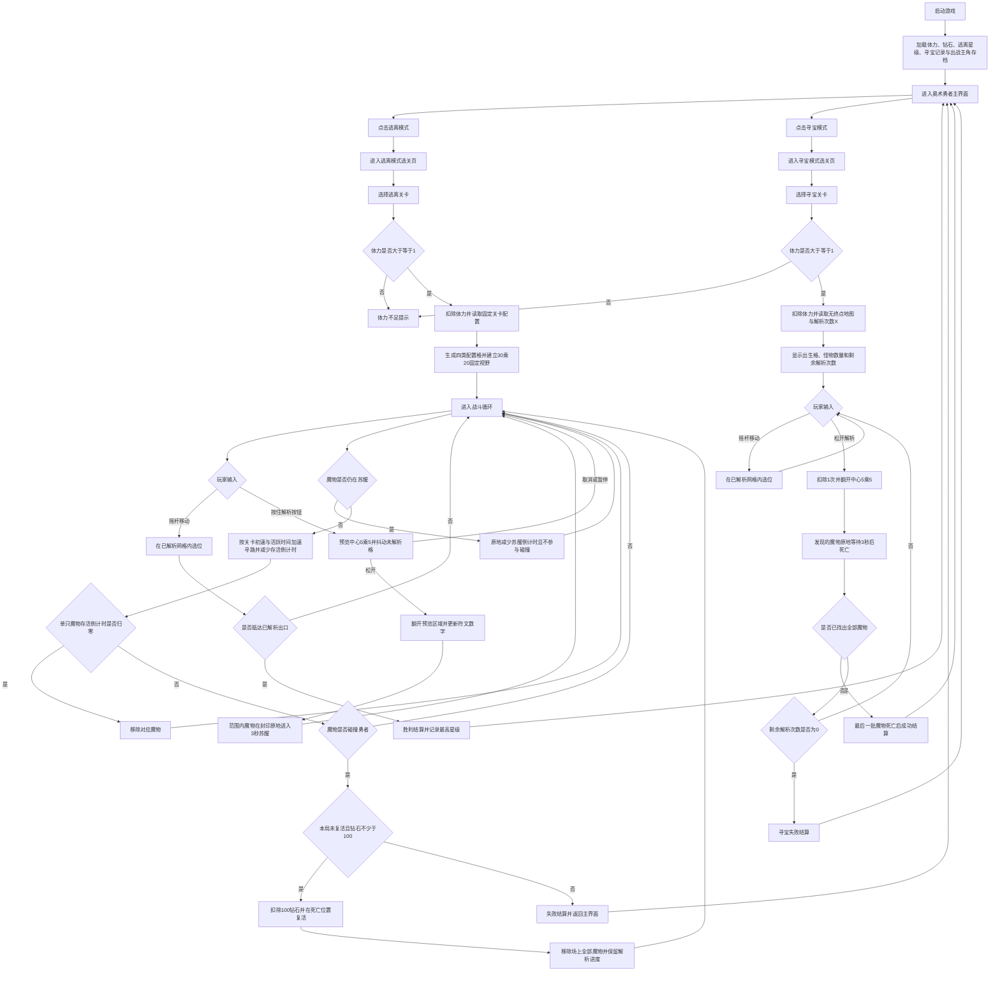

# 奥术勇者_策划案

## 一、产品定位

### 游戏定位

《奥术勇者》是一款横屏网格推理游戏，固定分为“逃离模式”和“寻宝模式”。玩家通过范围解析逐步打开地图，根据地砖上的符文数字判断沉睡魔物的位置；逃离模式强调躲避追击并抵达终点，寻宝模式强调在有限解析次数内找出全部魔物。两个模式均采用选关制，并在主界面提供彼此独立的入口。

1. **选位**：在已打开区域内寻找下一次解析的安全位置。
2. **范围解析**：一次打开以勇者为中心的 5×5 网格，并读取新出现的符文信息。
3. **限时追逃**：魔物苏醒后持续追击，玩家在倒计时结束前利用现有通路存活。

## 二、核心玩法与操作机制

### 基础操作框架

游戏采用“左侧虚拟摇杆 + 右侧解析按钮”的横屏双区操作模式。战斗视野固定显示 30×20 格，镜头始终以勇者为中心自动跟随，不提供手动平移视口；格子的逻辑像素尺寸读取关卡配置并按设备等比缩放。

- **左侧虚拟摇杆**：控制奥术勇者在已解析的安全网格和破损封印格上移动；逃离模式还可进入终点格。输入响应延迟目标小于 50ms。勇者不能通过移动、碰撞或其他方式进入未探索地砖。
- **右侧解析按钮**：按住时预览以勇者当前格为中心的 5×5 区域，范围内尚未解析的格子持续轻微抖动；松开按钮时翻开预览区域。靠近地图边界时按有效坐标裁切。
- **解析取消**：触发系统级 `pointercancel`、切入后台或弹出暂停界面时，立即清除预览且不执行解析。
- **解析冷却**：松开并完成解析后进入 0.6 秒冷却。范围内没有新地砖时按钮置灰。
- **唯一开图规则**：除默认可见的出生格外，所有地砖只能通过解析按钮翻开。
- **终点指引**：终点位于 30×20 视野之外时，在视野边缘显示朝向终点的金色箭头和剩余格数；终点进入视野后隐藏箭头。

### 奥术符文推理

每个未探索地砖只可能包含安全地面或沉睡魔物封印；逃离模式额外包含终点。执行解析时，5×5 范围内的全部未探索地砖同时翻开；安全地砖显示一个 0 至 8 的符文数字，代表其周围八格内仍未被惊动的魔物封印数量。

- 数字为 0 时只显示空符文，不继续向外连锁翻开。
- 同一次解析命中的所有魔物封印同时破裂，并分别生成对应魔物。
- 魔物封印被惊动后，会从“封印层”移除，原地变为可通行的破损封印格。
- 与该封印相邻的所有已显示符文数字立即减 1，并播放符文重排动画。
- 已经在场上移动的魔物不再计入符文数字，确保数字始终准确表示剩余的隐藏封印。
- 逃离模式的终点不会计入符文数字；终点被解析后永久高亮。寻宝模式不生成终点。

### 核心创新机制：魔物寿命倒计时

解析命中封印后，魔物在封印原地出现并进入 3 秒苏醒倒计时。苏醒期间魔物不移动、不参与碰撞；倒计时结束后开始追击，并启动存活倒计时。

每只魔物拥有独立的存活倒计时：

- 存活倒计时从 3 秒苏醒结束的瞬间开始，按真实战斗时间连续减少。
- 游戏暂停或切入后台时，倒计时暂停；恢复战斗后继续。
- 倒计时归零时，魔物自动消散并从场上移除。
- 魔物找不到路径时停留在原地，倒计时继续。
- 玩家没有普通攻击或额外战斗技能，只能依靠移动与路线选择存活至倒计时结束。

魔物剩余存活时间公式：

$RemainingLifetime = max(0, SpawnLifetime - ActiveBattleElapsedTime)$

魔物从完成苏醒开始累计活跃时间，追击速度持续增长。关卡最终追击速度公式：

$FinalChaseSPD = BaseChaseSPD \times LevelMonsterSpdMultiplier \times (1 + ActiveElapsedTime \times SpdAccelerationPerSec)$

### 单局核心循环

逃离模式单局循环：从主界面进入逃离模式选关页 → 选择关卡并消耗体力 → 读取固定布局并显示出生格 → 移动选位 → 解析中心 5×5 → 读取符文并规划路线 → 解析命中封印后躲避追击 → 继续移动与解析 → 找到并抵达终点。

### 寻宝模式

主界面提供独立入口“寻宝模式”。点击后必须先进入寻宝模式选关页，再由玩家选择关卡；该模式沿用当前出战勇者、移动规则、5×5 解析范围、符文数字和固定 30×20 视野，但不生成终点，也不使用终点箭头。

- 每关通过 `analysis_limit_count=X` 配置本局解析次数上限，进入关卡时显示“剩余解析 X”。
- 每次成功翻开至少 1 个新格子时扣除 1 次；范围内没有新格子时解析按钮置灰且不扣次数。
- 解析按钮显示剩余次数；剩余次数为 0 时永久禁用。
- 玩家必须在 X 次解析内翻出关卡配置的全部怪物点。
- 怪物点被翻开后，魔物只在原地显示 3 秒死亡倒计时，不移动、不追击、不参与碰撞；倒计时归零后消失。
- 最后一次解析找出全部怪物时，优先判定成功；待最后一批已发现魔物完成 3 秒死亡表现后进入成功结算。
- 解析次数耗尽且仍有隐藏怪物时立即失败。
- 寻宝模式不提供复活、不计算逃离模式星级，只记录是否通关和通关时剩余解析次数。

寻宝模式单局循环：从主界面进入寻宝模式选关页 → 选择关卡并消耗体力 → 读取固定布局 → 显示出生格和剩余解析次数 → 移动选位 → 消耗 1 次解析翻开中心 5×5 → 根据符文继续定位 → 已发现魔物原地等待 3 秒后死亡 → 找出全部魔物或耗尽解析次数。

### 逃离模式胜负与评星

- **胜利条件**：解析出口并控制勇者抵达出口网格。
- **失败条件**：勇者与追击魔物发生碰撞。玩家可选择复活或结束本局。
- **3 星**：未触发任何魔物，且未复活。
- **2 星**：至少触发 1 只魔物，且未复活。
- **1 星**：至少触发 1 只魔物，且使用过复活。
- **复活规则**：每局最多复活 1 次，固定消耗 100 钻石；勇者在死亡位置原地复活，复活时立即移除场上全部魔物。保留解析进度、封印破裂状态和单局用时，被移除的魔物不再重新生成。

### 资源循环

- **体力**：进入关卡消耗 1 点，上限 30，每 6 分钟恢复 1 点。
- **钻石**：本地封档初始 300，复活固定消耗 100；本版本不提供额外获取入口。

### 数据存档

本地存档记录体力、恢复时间戳、钻石、逃离关卡最高星级、寻宝关卡通关状态、寻宝历史最多剩余解析次数、两种模式各自的关卡解锁进度、当前出战主角和新手引导进度。进入关卡后保存一次单局快照；主动退出或进程被关闭均视为当局失败，但不会回滚已存在的关卡记录。

## 三、关卡与敌人行为设计

### 地图生成原则

- 所有关卡采用策划配置的出生点、怪物点与障碍墙，不使用完全随机撒点；只有逃离关卡配置终点。
- 需要配置的特殊格子固定为出生点、终点、怪物点、障碍墙四类；寻宝关卡不使用终点，未配置坐标按普通地面处理。
- 单屏固定显示 30×20 格，关卡地图允许大于单屏，格子逻辑尺寸读取 `cell_size_px`。
- 逃离关卡的出生格周围 3×3 和首次 5×5 解析范围内不得生成魔物封印。
- 逃离关卡从起点到终点必须存在至少一条不触发封印的理论安全路线。
- 逃离关卡至少保留一条宽度为 3 格的追逐环路，保证最大体型角色和魔物可以移动。
- 关卡可包含单格窄道、环形大厅、分叉回廊和单向秘门，但必须经过连通性校验。
- 逃离关卡通过 `monster_spd_multiplier` 调整全部魔物初始追击速度，并通过 `monster_spd_acceleration_per_sec` 调整存活期间的持续加速率。

### 逃离模式魔物寻路规则

- 使用 A* 在已解析可通行网格中追击勇者。
- 魔物追击速度由基础移速、当前关卡移速倍率与活跃时间加速倍率共同计算，直至倒计时归零。
- 找不到通往勇者的路径时停留在当前格，路径重新连通后继续追击。
- 多只魔物会把其他魔物视为软障碍，并尝试选择次优路径，减少完全重叠。
- `body_size_grid` 同时表示角色或魔物的 N×N 占格体型和最低通道宽度，只允许 1、2、3。
- 勇者与魔物的占格区域相交时触发失败。

## 四、视听表现与美术风格

### 整体基调

美术采用“哥特秘法遗迹 + 像素岩彩”的横屏像素风，场景为失控奥术侵蚀的古代学院地下遗迹。

- 未探索区域：近黑色虚空，边缘有低亮度墨蓝雾纹。
- 已解析地砖：灰青石板、铜质嵌线和细小金色符文。
- 数字符文：0 至 8 使用不同形态的几何符号，不只依赖颜色传达信息。
- 警戒色：朱红用于封印破裂与危险反馈。
- 解析色：青绿用于解析范围与冷却反馈，金色用于出口和胜利反馈。
- 魔物：使用碎裂石材、暗色织物、秘银骨架与发光核心。

### 音频设计

- **关卡 BGM**：全程使用同一首低频钟声、风洞环境音与克制弦乐脉冲构成的循环音乐，不根据场上魔物数量切换曲目或混音状态。
- **按住解析**：analysis_preview_loop.wav，松开或取消时停止。
- **解析地砖**：stone_rune_open.wav。
- **符文数字变化**：rune_recount.wav。
- **封印破裂**：seal_break.wav。
- **魔物消散**：arcane_fade.wav。
- **解析准备完成**：analysis_ready.wav。

## 五、核心界面与 AI 生成提示词

### 1. 主界面

#### 高保真界面生成提示词

Masterpiece, production-ready horizontal mobile game home screen, 16:9 landscape. Exact game title in Chinese: "奥术勇者". Theme: gothic arcane academy ruins rendered in sharp pixel art with aged bronze, dark cyan stone, vermilion accents and gold runes. Center: the selected full-body hero with name, integer movement speed and body size shown only as 1格, 2格 or 3格. Top-left: stamina "体力 20/30". Top-right: settings. Bottom commands: two equally clear primary mode entries "逃离模式" and "寻宝模式", plus a secondary "选择勇者" command. Each mode entry opens its own level-selection screen; do not show a generic level-selection button. Accurate Chinese and no overlapping UI. Output complete interface, clean background, and a pure-white UI sprite sheet.

#### 线框图

```Plaintext
+----------------------------------------------------------+
| [体力 20/30]                                      [设置] |
|                                                          |
|                        奥术勇者                           |
|                [当前勇者：奥术勇者]                      |
|                    移速 4 · 体型 2格                    |
|                                                          |
|              [逃离模式]  [寻宝模式]  [选择勇者]         |
+----------------------------------------------------------+
```

### 2. 逃离模式战斗界面

#### 高保真界面生成提示词

Masterpiece, production-ready 16:9 landscape mobile battle UI in sharp gothic arcane pixel art. Show a top-down rune grid, an arcane warrior and pursuing constructs. Depict the held-analysis state: unrevealed tiles inside the 5 by 5 area centered on the hero shake by alternating pixel offsets and use a jade outline. Top-left: level and run timer. Top-center: monster chips showing "苏醒 2.4s" or remaining lifetime. Top-right: pause. Bottom-left: virtual joystick. Bottom-center: exploration percentage. Bottom-right: one button labeled "按住解析" with held and cooldown states. Accurate Chinese and no overlapping controls. Output complete battle screen, clean grid background and a pure-white UI sprite sheet.

#### 线框图

```Plaintext
+----------------------------------------------------------+
| 第1层 [01:45]                                     [暂停] |
+----------------------------------------------------------+
| 魔物计时：巨像 苏醒2.4s | 魔影 存活08.4s                 |
|----------------------------------------------------------|
| [?][?][?][?][1][1][0][.]                                 |
| [?][2][.][.][勇][.][.][.]                                 |
| [?][1][.][破][魔][.][出][.]                               |
| [?][1][1][1][.][.][.][.]                                 |
|                                                          |
| [虚拟摇杆]                                     [按住解析]|
+----------------------------------------------------------+
```

### 2.1 寻宝模式战斗界面

#### 高保真界面生成提示词

Production-ready treasure-mode battle UI for "奥术勇者", horizontal 16:9, sharp gothic arcane pixel art. Show a top-down 30 by 20 rune grid with no exit tile and no exit arrow. Top-left: mode title "寻宝模式" and found count "怪物 3/5". Top-center: compact chips for discovered monsters showing an in-place death countdown such as "消散 2.4s". Top-right: pause. Bottom-left: virtual joystick. Bottom-center: exploration percentage. Bottom-right: analysis button with a large remaining-use counter "解析 4/8". A discovered monster remains stationary on its revealed tile, does not chase, and uses a clear three-second vanishing animation. Accurate Chinese, no spell controls, no revive control, no overlapping UI. Output complete screen and separated control states on pure white.

#### 线框图

```Plaintext
+----------------------------------------------------------+
| 寻宝模式 · 怪物 3/5                              [暂停] |
|             已发现：魔影 消散 2.4s                      |
|----------------------------------------------------------|
| [?][?][?][1][.][.][.][.]                                 |
| [?][2][.][怪][勇][.][.][.]                                |
| [?][1][.][.][.][.][.][.]                                 |
|                                                          |
| [虚拟摇杆]            已解析 42%              [解析 4/8] |
+----------------------------------------------------------+
```

### 3. 两种模式选关界面

#### 高保真界面生成提示词

Create two separate production-ready horizontal mobile level-selection screens for "奥术勇者" in sharp gothic arcane pixel art. Screen A title: "逃离模式", with escape-level nodes, 1-to-3-star records and locked states. Screen B title: "寻宝模式", with treasure-level nodes, clear records and best remaining-analysis counts. Both screens have a back arrow, stamina readout and one selected-level detail row with an "进入关卡" command. Do not combine both modes into tabs or one shared level list. Accurate Chinese, no overlapping nodes. Output both complete screens and separated node/button states on pure white.

#### 逃离模式线框图

```Plaintext
+----------------------------------------------------------+
| [返回]                 逃离模式                           |
|----------------------------------------------------------|
|   [01 ★★★] ---- [02 ★★☆] ---- [03 ★☆☆] ---- [04 锁] |
|                                                          |
|                                              [进入关卡]  |
+----------------------------------------------------------+
```

#### 寻宝模式线框图

```Plaintext
+----------------------------------------------------------+
| [返回]                 寻宝模式                           |
|----------------------------------------------------------|
|   [01 已通关·余2] ---- [02 未通关] ---- [03 锁]         |
|                                                          |
| 解析上限 8 · 怪物 5                         [进入关卡]   |
+----------------------------------------------------------+
```

### 4. 勇者选择界面

#### 高保真界面生成提示词

Production-ready hero selection screen for "奥术勇者", horizontal 16:9, sharp gothic arcane pixel art. Show five hero portraits in one horizontal roster. The selected hero appears full-body on the left; the right side shows exactly two values: integer movement speed and body size displayed only as 1格, 2格 or 3格. Top-left: back. Center: "选择勇者". Bottom-right: "设为出战". Accurate Chinese and no overlapping UI. Output complete screen, clean background and a sprite sheet containing portraits, selection states and buttons.

#### 线框图

```Plaintext
+----------------------------------------------------------+
| [返回]                  选择勇者                          |
|----------------------------------------------------------|
| [C001] [C002] [C003] [C004] [C005]                       |
|                                                          |
|      [星界旅者立绘]       星界旅者                        |
|                           移速：5 格/秒                   |
|                           体型：1格                       |
|                                             [设为出战]   |
+----------------------------------------------------------+
```

### 5. 暂停界面

#### 高保真界面生成提示词

Production-ready pause overlay for a horizontal gothic arcane pixel-art game. Preserve the frozen game grid behind a 75% dark mask. Center one compact carved bronze panel titled "暂停", with three vertically aligned controls: "继续", sound toggle with familiar speaker icon, and "退出本局". Show current progress "已解析 42%" and active pursuers "2" as a quiet status row. Accurate Chinese, no nested panels, no advertising button, no fake glyphs. Output complete overlay and separated panel/button sprite sheet on pure white.

#### 线框图

```Plaintext
+----------------------------------------------------------+
|                                                          |
|                +--------------------+                    |
|                |       暂停         |                    |
|                |                    |                    |
|                |      [继续]        |                    |
|                |    [退出本局]      |                    |
|                +--------------------+                    |
+----------------------------------------------------------+
```

### 6. 失败界面

#### 高保真界面生成提示词

Production-ready defeat overlay for "奥术勇者", horizontal 16:9, gothic arcane pixel art. Freeze the battlefield under a restrained vermilion-black mask. Compact central bronze panel titled "探索失败". Show failure reason "被噬能魔影触碰", elapsed time and exploration percentage. Commands: dominant "重新挑战" and secondary "返回主界面". Accurate Chinese, no fake text or overlapping ornament. Output complete overlay and separated panel/button states on pure white.

#### 线框图

```Plaintext
+----------------------------------------------------------+
|                                                          |
|               +----------------------+                   |
|               |       探索失败       |                   |
|               |                     |                    |
|               | [重新挑战] [返回主页] |                   |
|               +----------------------+                   |
+----------------------------------------------------------+
```

### 7. 通关结算界面

#### 高保真界面生成提示词

Production-ready victory result overlay for "奥术勇者", horizontal 16:9, sharp pixel art with aged bronze, dark cyan stone and warm gold arcane light. Title "遗迹净化完成". Show three celestial rune stars, completion time, exploration percentage, number of naturally dispersed monsters and maximum simultaneous pursuers. Bottom commands: "返回主界面" and dominant "下一层". No currency reward, no double-reward advertisement button. Accurate Chinese, no fake glyphs, no excessive particles. Output complete overlay and pure-white sprite sheet with 1/2/3-star states and button states.

#### 线框图

```Plaintext
+----------------------------------------------------------+
|                +----------------------+                  |
|                |    遗迹净化完成      |                  |
|                |       ★ ★ ★         |                  |
|                | 用时：01:26          |                  |
|                | 消散魔物：4          |                  |
|                | [返回主页] [下一层]  |                  |
|                +----------------------+                  |
+----------------------------------------------------------+
```

### 8. 设置界面

#### 高保真界面生成提示词

Production-ready settings overlay for "奥术勇者", horizontal 16:9, sharp gothic arcane pixel art. Preserve the home-screen ritual hall behind a 75% dark mask. Center one compact bronze panel titled "设置". Controls: music toggle, sound-effects toggle, vibration toggle, and "重玩新手引导" command; use familiar icons and switch controls. Bottom command "关闭". Accurate Chinese, no account, currency, purchase or advertisement controls, no nested panels. Output complete overlay and separated control states on pure white.

#### 线框图

```Plaintext
+----------------------------------------------------------+
|                  [主界面压暗]                            |
|                +--------------------+                    |
|                |       设置         |                    |
|                | 音乐          [开] |                    |
|                | 音效          [开] |                    |
|                |       [关闭]       |                    |
|                +--------------------+                    |
+----------------------------------------------------------+
```

## 六、角色、魔物与解析配置

### 主角通用规则

- 5 名主角进入游戏时全部可选，不需要货币购买或关卡解锁。
- 所有主角只能在已解析可通行网格移动，单次解析区域固定为人物中心 5×5。
- 主角只有移速和体型两个属性。
- 基础移速只允许正整数，界面不显示小数。
- 体型只允许 1 格、2 格、3 格三种，配置和界面均不得使用半径、小数或其他体型名称。
- `body_size_grid=N` 表示主角占用 N×N 格，同时决定其最低通道宽度。

### C001：奥术勇者

- **外观**：深灰短斗篷、铜质护臂、短柄解析杖与秘法刃。
- **基础移速**：4 格/秒。
- **体型**：2 格。

### C002：星界旅者

- **外观**：靛青旅行斗篷、星盘腰饰与细长铜杖。
- **基础移速**：5 格/秒。
- **体型**：1 格。

### C003：符文智者

- **外观**：灰白长袍、悬浮符文页与厚重镜片。
- **基础移速**：3 格/秒。
- **体型**：3 格。

### C004：秘银斥候

- **外观**：轻量秘银护甲、短斗篷与折叠式解析器。
- **基础移速**：5 格/秒。
- **体型**：1 格。

### C005：回廊行者

- **外观**：墨绿兜帽、铜环护肩与双端测绘杖。
- **基础移速**：4 格/秒。
- **体型**：2 格。

### 魔物通用规则

- 封印破裂后，所有魔物先在原地苏醒 3 秒，再开始追击并启动独立存活倒计时。
- 所有魔物只在已解析网格寻路；无路可走时原地等待，倒计时继续。
- 魔物触碰任意主角均立即导致本局失败。
- 魔物基础移速只允许正整数，界面不显示小数。
- 魔物体型同样只允许 1 格、2 格、3 格，并与最低通道宽度使用同一个整数格字段。

### M001：噬能魔影

- **定位**：基础高速追兵。
- **外观**：由黑色斗篷碎片与青色核心组成的无面构造体。
- **行为**：沿已解析通路进行标准 A* 追击。
- **基础追击移速**：3 格/秒。
- **体型/通道宽度**：1 格。
- **存活时间**：15 秒。

### M002：符文巨像

- **定位**：空间压迫者。
- **外观**：带有铜质符文骨架的大型岩石构造体。
- **行为**：标准 A* 追击，不能通过宽度小于 3 格的通道。
- **基础追击移速**：2 格/秒。
- **体型/通道宽度**：3 格。
- **存活时间**：25 秒。

### M003：裂隙猎犬

- **定位**：短寿命突进追兵。
- **外观**：秘银骨架与朱红裂隙能量构成的四足魔物。
- **行为**：每移动 5 格蓄力 0.6 秒，随后沿当前已解析路径跃进 2 格。
- **基础追击移速**：3 格/秒。
- **体型/通道宽度**：1 格。
- **存活时间**：10 秒。

### M004：秘法监视者

- **定位**：路线截击者。
- **外观**：悬浮铜质独眼、环形刻度盘与灰蓝拖尾。
- **行为**：每 3 秒读取一次主角当前移动方向，并改为追踪该方向前方 2 格的可通行网格；目标不可达时恢复标准追击。
- **基础追击移速**：2 格/秒。
- **体型/通道宽度**：1 格。
- **存活时间**：18 秒。

### M005：穿行秘偶

- **定位**：集群穿插者。
- **外观**：由两片错位面具、细长秘银肢体与金色关节构成。
- **行为**：使用标准 A* 追击，但忽略其他魔物的软碰撞，可以从魔物集群中穿过。
- **基础追击移速**：2 格/秒。
- **体型/通道宽度**：1 格。
- **存活时间**：14 秒。

### 美术资产提示词

Game asset sheet for "Arcane Warrior", sharp gothic arcane pixel art on pure white background, generous spacing and no overlap. Include exactly five full-body heroes: balanced Arcane Warrior, fast Astral Traveler, elderly Rune Sage, light-armored Mithril Scout and hooded Corridor Walker. Include exactly five monsters: faceless energy wraith, massive bronze-framed rune golem, quadruped rift hound, floating one-eyed arcane watcher and thin two-mask phase puppet. Also include one large square analysis-button icon with normal, pressed and cooldown states, one compact monster countdown badge, one broken seal tile, one golden exit tile and rune digits 0 through 8. Dark cyan stone, aged bronze, jade analysis light, restrained vermilion and warm gold. Absolutely sharp pixel edges, no anti-aliasing blur, no text, no watermark, every asset separated by wide margins with no overlap.

## 七、新手引导

### 引导原则

- 首次进入逃离模式时强制进入教学关 `E000`。
- 每一步只开放一个交互目标，不在战斗追逐中弹出长篇文字。
- 引导进度写入 `tutorial_step`，完成后可在设置中重玩。

### Step 101：解析符文

- 关卡开始只显示勇者脚下的出生格。
- 高亮“解析”按钮。按住时，中心 5×5 内的未解析格抖动；松开后翻开这些格子。
- 本步骤的首次解析范围不包含魔物。

### Step 102：移动到目的地

- 在已解析区域边缘高亮一个目标格，只开放虚拟摇杆。
- 地面箭头连接勇者与目标格，镜头保持跟随勇者。
- 勇者进入目标格后播放到达反馈，隐藏箭头并完成教学。
## 八、全局与实体核心配置表

### 字段说明

#### 1. 通用格式规范

|项目|规范|
|---|---|
|文件编码|UTF-8，无 BOM；JSON 内不允许注释|
|字段命名|统一使用小写 `snake_case`，禁止同义字段并存|
|实体 ID|主角 `C`、魔物 `M`、逃离关卡 `E`、寻宝关卡 `T` 加 3 位数字，例如 `C001`、`E001`、`T001`|
|ID 唯一性|同一实体表内不可重复；所有跨表引用必须能找到目标 ID|
|坐标|左上角为原点 `(0,0)`，X 向右、Y 向下，使用从 0 开始的整数格坐标|
|时间单位|全部使用秒，字段名以 `_sec` 结尾；允许最多 2 位小数|
|速度单位|格/秒，基础速度字段以 `_spd` 结尾且必须为正整数|
|距离与尺寸|以格为单位；网格数量字段以 `_grid` 结尾；体型只允许整数 1、2、3|
|布尔值|只允许 `true` 或 `false`，禁止使用 0/1 或字符串代替|
|空值|必填字段禁止 `null`；无数据的数组使用 `[]`；无参数对象使用 `{}`|
|未知字段|加载时视为配置错误并拒绝启动该关卡，避免拼写错误被静默忽略|
|版本|根节点必须提供 `schema_version`；字段结构变化时提升次版本或主版本|

#### 2. 根节点字段

|字段|类型|必填|约束|说明|
|---|---|---|---|---|
|schema_version|string|是|语义版本格式 `主.次.修订`|当前配置结构版本|
|global_configs|object|是|只能出现定义过的全局字段|全局规则|
|characters|array|是|固定 5 项，`entity_id` 唯一|主角配置表|
|monsters|array|是|固定 5 项，`entity_id` 唯一|魔物配置表|
|escape_levels|array|是|至少 1 项，`escape_level_id` 唯一|逃离模式关卡配置表|
|treasure_levels|array|是|至少 1 项，`treasure_level_id` 唯一|寻宝模式关卡配置表|

#### 3. global_configs 字段

|字段|类型|必填|范围/默认值|说明|
|---|---|---|---|---|
|max_stamina|integer|是|1 至 999|体力上限|
|initial_diamonds|integer|是|大于等于 0|新存档初始钻石|
|revive_cost_diamonds|integer|是|固定 100|单次复活消耗|
|max_revive_per_run|integer|是|固定 1|单局复活上限|
|revive_position|string|是|固定 `death_point`|勇者在死亡位置原地复活|
|revive_clears_active_monsters|boolean|是|固定 `true`|复活时移除场上全部魔物|
|stamina_recover_interval_sec|integer|是|大于 0|恢复 1 点体力所需现实时间|
|viewport_width_grid|integer|是|固定 30|战斗视野宽度|
|viewport_height_grid|integer|是|固定 20|战斗视野高度|
|analysis_width_grid|integer|是|固定 5|全角色解析区域宽度|
|analysis_height_grid|integer|是|固定 5|全角色解析区域高度|
|analysis_cooldown_sec|number|是|大于等于 0|松开并完成解析后的冷却|
|analysis_preview_shake_amplitude_px|number|是|大于 0|按住解析时未解析格的最大抖动像素|
|analysis_preview_shake_frequency_hz|number|是|大于 0|按住解析时的抖动频率|
|monster_wake_delay_sec|number|是|固定 3.0|封印破裂后原地苏醒时间|
|monster_lifetime_uses_active_battle_time|boolean|是|固定 `true`|暂停与后台期间不扣魔物存活时间|
|monster_lifetime_runs_without_path|boolean|是|固定 `true`|魔物无路可走时倒计时仍继续|
|treasure_monster_death_delay_sec|number|是|固定 3.0|寻宝模式发现魔物后的原地死亡等待时间|

#### 4. characters 字段

|字段|类型|必填|范围/枚举|说明|
|---|---|---|---|---|
|entity_id|string|是|正则 `^C[0-9]{3}$`|主角唯一 ID|
|name|string|是|1 至 12 个中文字符|界面显示名称|
|base_spd|integer|是|正整数，建议 3 至 5|基础移动速度，单位格/秒|
|body_size_grid|integer|是|枚举 1、2、3|N×N 占格体型，同时作为最低通道宽度|

`entity_id` 和 `name` 为标识字段；主角可调属性只有 `base_spd` 与 `body_size_grid`。界面直接显示整数，不允许换算成小数半径。

#### 5. monsters 字段

|字段|类型|必填|范围/枚举|说明|
|---|---|---|---|---|
|entity_id|string|是|正则 `^M[0-9]{3}$`|魔物唯一 ID|
|name|string|是|1 至 12 个中文字符|界面显示名称|
|role|string|是|1 至 16 个中文字符|策划定位文本，不参与计算|
|base_chase_spd|integer|是|正整数|追击速度，单位格/秒|
|body_size_grid|integer|是|枚举 1、2、3|N×N 占格体型，同时作为最低通道宽度|
|lifetime_sec|number|是|大于 0|完成苏醒后的存活时间|
|behavior_type|string|是|见行为枚举表|追击行为类型|
|behavior_params|object|是|无参数时为 `{}`|行为类型对应的参数对象|

行为枚举：

|behavior_type|适用魔物|behavior_params 规范|
|---|---|---|
|standard_chase|M001、M002|空对象 `{}`；通路限制只由 `body_size_grid` 控制|
|dash_chase|M003|`dash_every_grids` 正整数、`dash_charge_sec` 非负数、`dash_distance_grid` 正整数|
|predictive_chase|M004|`prediction_interval_sec` 正数、`prediction_distance_grid` 正整数|
|phase_chase|M005|`ignore_monster_soft_collision` 固定为 `true`|

#### 6. escape_levels 逃离关卡字段

|字段|类型|必填|范围/约束|说明|
|---|---|---|---|---|
|escape_level_id|string|是|正则 `^E[0-9]{3}$`|逃离关卡唯一 ID|
|name|string|是|1 至 16 个中文字符|关卡显示名称|
|grid_width|integer|是|大于等于 5|地图宽度|
|grid_height|integer|是|大于等于 5|地图高度|
|cell_size_px|integer|是|大于 0|单格逻辑像素尺寸，设备端只做等比缩放|
|monster_spd_multiplier|number|是|大于 0，建议 0.5 至 3.0|该关全部魔物的追击速度倍率|
|monster_spd_acceleration_per_sec|number|是|大于 0，建议 0.01 至 0.05|魔物每秒增加的速度倍率|
|start_point|point|是|必须在地图内|出生坐标|
|exit_point|point|是|必须在地图内且不同于出生点|出口坐标|
|blocked_points|point[]|是|允许空数组，坐标不可重复|永久不可通行地砖|
|monster_points|monster_point[]|是|至少 1 项，坐标不可重复|沉睡魔物封印|

格子类型枚举：`start_point` 为出生点，`exit_point` 为终点，`monster_points` 为怪物点，`blocked_points` 为障碍墙；未出现在上述字段中的坐标为普通地面。

#### 7. treasure_levels 寻宝关卡字段

|字段|类型|必填|范围/约束|说明|
|---|---|---|---|---|
|treasure_level_id|string|是|正则 `^T[0-9]{3}$`|寻宝关卡唯一 ID|
|name|string|是|1 至 16 个中文字符|关卡显示名称|
|grid_width|integer|是|大于等于 5|地图宽度|
|grid_height|integer|是|大于等于 5|地图高度|
|cell_size_px|integer|是|大于 0|单格逻辑像素尺寸|
|analysis_limit_count|integer|是|大于 0|本局最多可成功执行解析的次数 X|
|start_point|point|是|必须在地图内|出生坐标|
|blocked_points|point[]|是|允许空数组，坐标不可重复|障碍墙|
|monster_points|monster_point[]|是|至少 1 项，坐标不可重复|需要找出的全部怪物点|

寻宝关卡禁止配置 `exit_point`、`monster_spd_multiplier` 和 `monster_spd_acceleration_per_sec`。怪物被发现后只执行 `treasure_monster_death_delay_sec`，不读取追击速度、行为和存活时间。

#### 8. 坐标对象

`point` 对象：

|字段|类型|必填|约束|
|---|---|---|---|
|x|integer|是|`0 <= x < grid_width`|
|y|integer|是|`0 <= y < grid_height`|

`monster_point` 对象：

|字段|类型|必填|约束|
|---|---|---|---|
|x|integer|是|`0 <= x < grid_width`|
|y|integer|是|`0 <= y < grid_height`|
|monster_id|string|是|必须引用 `monsters.entity_id`|

`monster_point.x/y` 是魔物占格区域的左上角锚点。体型为 N 时，占用 `[x, x+N-1] × [y, y+N-1]`。

#### 9. 关卡配置校验规则

1. `start_point`、`exit_point`、`blocked_points` 和 `monster_points` 之间不得坐标重叠；寻宝关卡不检查 `exit_point`。
2. 逃离关卡的出生格周围 3×3 以及首次解析覆盖的 5×5 区域不得出现魔物封印。
3. 逃离关卡的出生点至终点必须存在至少一条由解析操作逐步打开的可通行路径；寻宝关卡不得配置终点。
4. 所有关卡必须为体型 1、2、3 格的可选主角提供对应宽度的有效移动区域；使用大型魔物的逃离关卡也必须提供不小于其体型的连通追逐区域。
5. 每个 `monster_id` 必须存在；每个关卡不得使用未配置的行为类型。
6. 魔物完整 N×N 占格区域必须在地图内，且不得覆盖障碍、起点、出口或其他封印占格区域。
7. 寻宝关卡的 `analysis_limit_count` 必须足以通过关卡离线求解器验证存在找出全部怪物的方案。
8. 解析区域在地图边缘按有效坐标裁切，不允许生成越界地砖。
9. 配置加载失败时显示关卡不可用，不得使用随机默认值继续运行。

#### 10. 本地存档字段规范

|字段|类型|必填|说明|
|---|---|---|---|
|save_version|string|是|存档结构版本|
|stamina|integer|是|当前体力，范围 0 至 `max_stamina`|
|stamina_updated_at|integer|是|UTC 毫秒时间戳|
|diamonds|integer|是|当前钻石，必须大于等于 0|
|selected_character_id|string|是|引用 `characters.entity_id`|
|max_unlocked_escape_level_id|string|是|当前最高解锁逃离关卡 ID|
|escape_level_stars|object|是|键为逃离关卡 ID，值为 0 至 3 的整数|
|max_unlocked_treasure_level_id|string|是|当前最高解锁寻宝关卡 ID|
|treasure_level_clears|object|是|键为寻宝关卡 ID，值为是否已通关|
|treasure_best_remaining_analysis|object|是|键为寻宝关卡 ID，值为历史最多剩余解析次数|
|tutorial_step|integer|是|0 表示未开始，完成后写入最终步骤编号|
|music_enabled|boolean|是|音乐开关|
|sfx_enabled|boolean|是|音效开关|
|vibration_enabled|boolean|是|振动开关|

### JSON 配置

```json
{
  "schema_version": "3.0.0",
  "global_configs": {
    "max_stamina": 30,
    "initial_diamonds": 300,
    "revive_cost_diamonds": 100,
    "max_revive_per_run": 1,
    "revive_position": "death_point",
    "revive_clears_active_monsters": true,
    "stamina_recover_interval_sec": 360,
    "viewport_width_grid": 30,
    "viewport_height_grid": 20,
    "analysis_width_grid": 5,
    "analysis_height_grid": 5,
    "analysis_cooldown_sec": 0.6,
    "analysis_preview_shake_amplitude_px": 2.0,
    "analysis_preview_shake_frequency_hz": 12.0,
    "monster_wake_delay_sec": 3.0,
    "monster_lifetime_uses_active_battle_time": true,
    "monster_lifetime_runs_without_path": true,
    "treasure_monster_death_delay_sec": 3.0
  },
  "characters": [
    {
      "entity_id": "C001",
      "name": "奥术勇者",
      "base_spd": 4,
      "body_size_grid": 2
    },
    {
      "entity_id": "C002",
      "name": "星界旅者",
      "base_spd": 5,
      "body_size_grid": 1
    },
    {
      "entity_id": "C003",
      "name": "符文智者",
      "base_spd": 3,
      "body_size_grid": 3
    },
    {
      "entity_id": "C004",
      "name": "秘银斥候",
      "base_spd": 5,
      "body_size_grid": 1
    },
    {
      "entity_id": "C005",
      "name": "回廊行者",
      "base_spd": 4,
      "body_size_grid": 2
    }
  ],
  "monsters": [
    {
      "entity_id": "M001",
      "name": "噬能魔影",
      "role": "基础高速追兵",
      "base_chase_spd": 3,
      "body_size_grid": 1,
      "lifetime_sec": 15.0,
      "behavior_type": "standard_chase",
      "behavior_params": {}
    },
    {
      "entity_id": "M002",
      "name": "符文巨像",
      "role": "空间压迫者",
      "base_chase_spd": 2,
      "body_size_grid": 3,
      "lifetime_sec": 25.0,
      "behavior_type": "standard_chase",
      "behavior_params": {}
    },
    {
      "entity_id": "M003",
      "name": "裂隙猎犬",
      "role": "短寿命突进追兵",
      "base_chase_spd": 3,
      "body_size_grid": 1,
      "lifetime_sec": 10.0,
      "behavior_type": "dash_chase",
      "behavior_params": {
        "dash_every_grids": 5,
        "dash_charge_sec": 0.6,
        "dash_distance_grid": 2
      }
    },
    {
      "entity_id": "M004",
      "name": "秘法监视者",
      "role": "路线截击者",
      "base_chase_spd": 2,
      "body_size_grid": 1,
      "lifetime_sec": 18.0,
      "behavior_type": "predictive_chase",
      "behavior_params": {
        "prediction_interval_sec": 3.0,
        "prediction_distance_grid": 2
      }
    },
    {
      "entity_id": "M005",
      "name": "穿行秘偶",
      "role": "集群穿插者",
      "base_chase_spd": 2,
      "body_size_grid": 1,
      "lifetime_sec": 14.0,
      "behavior_type": "phase_chase",
      "behavior_params": {
        "ignore_monster_soft_collision": true
      }
    }
  ],
  "escape_levels": [
    {
      "escape_level_id": "E001",
      "name": "初识回廊",
      "grid_width": 40,
      "grid_height": 24,
      "cell_size_px": 36,
      "monster_spd_multiplier": 1.0,
      "monster_spd_acceleration_per_sec": 0.02,
      "start_point": {"x": 2, "y": 12},
      "exit_point": {"x": 37, "y": 12},
      "blocked_points": [
        {"x": 14, "y": 0}, {"x": 14, "y": 1}, {"x": 14, "y": 2}, {"x": 14, "y": 3},
        {"x": 28, "y": 4}, {"x": 28, "y": 5}, {"x": 28, "y": 6}, {"x": 28, "y": 7}
      ],
      "monster_points": [
        {"x": 9, "y": 8, "monster_id": "M001"},
        {"x": 19, "y": 15, "monster_id": "M004"},
        {"x": 31, "y": 7, "monster_id": "M003"}
      ]
    },
    {
      "escape_level_id": "E002",
      "name": "铜印中庭",
      "grid_width": 48,
      "grid_height": 32,
      "cell_size_px": 36,
      "monster_spd_multiplier": 1.15,
      "monster_spd_acceleration_per_sec": 0.025,
      "start_point": {"x": 2, "y": 16},
      "exit_point": {"x": 45, "y": 16},
      "blocked_points": [
        {"x": 12, "y": 0}, {"x": 12, "y": 1}, {"x": 12, "y": 2},
        {"x": 20, "y": 8}, {"x": 21, "y": 8}, {"x": 22, "y": 8}
      ],
      "monster_points": [
        {"x": 9, "y": 12, "monster_id": "M001"},
        {"x": 18, "y": 20, "monster_id": "M003"},
        {"x": 27, "y": 4, "monster_id": "M002"},
        {"x": 36, "y": 21, "monster_id": "M004"},
        {"x": 42, "y": 10, "monster_id": "M005"}
      ]
    },
    {
      "escape_level_id": "E003",
      "name": "永夜钟庭",
      "grid_width": 60,
      "grid_height": 40,
      "cell_size_px": 36,
      "monster_spd_multiplier": 1.3,
      "monster_spd_acceleration_per_sec": 0.03,
      "start_point": {"x": 3, "y": 3},
      "exit_point": {"x": 56, "y": 36},
      "blocked_points": [
        {"x": 0, "y": 12}, {"x": 1, "y": 12}, {"x": 2, "y": 12},
        {"x": 18, "y": 12}, {"x": 18, "y": 13}, {"x": 18, "y": 14}
      ],
      "monster_points": [
        {"x": 12, "y": 8, "monster_id": "M002"},
        {"x": 24, "y": 17, "monster_id": "M002"},
        {"x": 38, "y": 7, "monster_id": "M004"},
        {"x": 51, "y": 20, "monster_id": "M003"},
        {"x": 31, "y": 32, "monster_id": "M001"},
        {"x": 50, "y": 34, "monster_id": "M005"}
      ]
    }
  ],
  "treasure_levels": [
    {
      "treasure_level_id": "T001",
      "name": "静默搜寻",
      "grid_width": 40,
      "grid_height": 24,
      "cell_size_px": 36,
      "analysis_limit_count": 8,
      "start_point": {"x": 2, "y": 12},
      "blocked_points": [
        {"x": 14, "y": 0}, {"x": 14, "y": 1}, {"x": 14, "y": 2},
        {"x": 28, "y": 19}, {"x": 28, "y": 20}, {"x": 28, "y": 21}
      ],
      "monster_points": [
        {"x": 8, "y": 8, "monster_id": "M001"},
        {"x": 19, "y": 15, "monster_id": "M004"},
        {"x": 31, "y": 7, "monster_id": "M003"}
      ]
    }
  ]
}
```

## 九、游戏核心流程图



> 注：本文档中的“符文数字”只统计尚未惊动的魔物封印；已苏醒并移动的魔物不参与数字计算。
