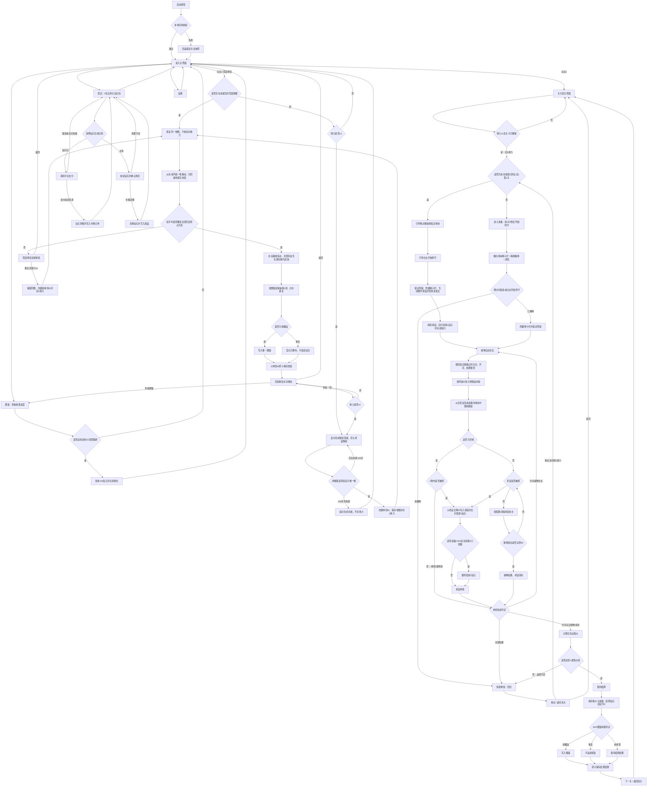

# 《花园手记》核心玩法与系统策划案

## 项目输入变量

| 变量 | 定义 |
|---|---|
| 游戏名称 | 花园手记 |
| 游戏品类 | 单手竖屏、轻度观察、点按防守、随机一笔挖路解谜 |
| 核心题材 | 午后手账花园、植物生长、偷花鼠防守 |
| 变现模式 | IAP，钻石内购为主，无广告 |
| 屏幕方向 | 竖屏，设计基准 1080 × 1920，适配 19.5:9～20:9 |
| 发布平台 | 移动端 H5 / 小游戏平台 |
| 视觉表现 | 2D 水彩手绘、牛皮纸手账拼贴、温暖低饱和自然色 |
| 新手引导 | 首次进入玩法1第1关时启用分步强引导，完成后不再自动触发 |
| 副玩法 | 玩法2「荒园修复」：从水池一笔挖路，为随机地图上的全部花浇水 |

## 一、核心玩法与操作机制

### 1.1 基础操作框架

游戏采用单手竖屏操作。单局分为“10 秒播种准备”和“生长防守”两段。

| 场景 | 输入 | 规则 | 反馈标准 |
|---|---|---|---|
| 浏览种子 | 左右滑动底部种子栏 | 单行横向滚动；每张种子卡显示种子图片、名称、花币图标和价格 | 滑动跟手，松手后停在最近完整卡位 |
| 播种 | 从底部种子栏拖拽种子至 3×3 花田 | 松手时格子为空且局内花币足够才完成购买 | 合法格显示绿色描边；非法格显示红色描边 |
| 抓鼠 | 直接点按场上老鼠实体 | 每次有效点按造成 1 点抓捕伤害；HP 归零才算抓获 | 抓获后立即显示“+1钻石”并原子写入存档；触控响应目标不高于 50ms |
| 确认 | 点按【开始防守】 | 至少播种 1 株时可提前结束倒计时 | 按钮按下缩至 94%，0.1s 回弹；空田时横向震动 0.2s |

进入战斗界面时，顶部提示条显示“`X秒后开始防守，请选择要播种的种子`”，其中 X 绑定准备倒计时并每秒刷新。倒计时归零后自动进入防守，底部准备栏（局内花币、种子栏和【开始防守】按钮）立即隐藏。若此时没有播种任何植物，本局失败，已消耗的 1 点体力不返还。

### 1.2 核心机制：九格布阵与持续防守

玩家用有限花币决定种植数量与花种价值。高价值阵容能提高结算收益，也会缩短刷鼠间隔；少种可以让更多刷新落在空地，降低实际受击概率。

- 老鼠直接出现在 3×3 地块上，不使用任何伪装。
- 每块地同时最多存在 1 只老鼠，全场数量还受关卡 `max_active_mice` 限制。
- 刷新在已播种地块时，老鼠按自身攻击间隔持续攻击该植物，直到被抓、植物累计受击达到 50，或本局结束。
- 刷新在空地时，老鼠不攻击，3.0s 后自动离开；期间仍可被玩家点按抓走。
- 玩家每次有效点按造成 1 点抓捕伤害；老鼠 HP 归零后立即离场并奖励 1 钻石。空地自动离场、植物枯萎或关卡结束清除的老鼠均不奖励钻石。

### 1.3 老鼠刷新与攻击逻辑

关卡只从 `allowed_mice` 列表抽取老鼠。每次刷新从当前没有老鼠且未枯萎的地块中等概率选择 1 格；种植格与空地都可被选中，枯萎格不再参与刷新。若没有合法地块或已达到关卡同场上限，则 0.5s 后重试，不累计补刷。

老鼠刷新间隔为：

$$SpawnInterval = \max(0.8, \frac{BaseInterval}{1 + 0.001 \times TotalSeedValue})$$

- `SpawnInterval`：本次刷新间隔，单位为秒，保留 2 位小数。
- `BaseInterval`：当前关卡基础刷新间隔。
- `TotalSeedValue`：本局已播种植物基础售价总和，不随受击变化。
- `0.8`：全局最短刷新间隔。

每只老鼠通过 `attack_interval_sec` 配置“每 X 秒攻击一次”。刷新在种植格时，第一次攻击发生在生成后的一个完整攻击间隔，之后持续重复；每次成功攻击只累计 1 次受击，植物累计被攻击 50 次后立即枯萎，该格老鼠随即消失。怪物压力差异由攻击间隔和抓捕 HP 体现。刷新在空地的老鼠不启动攻击计时，只执行 3.0s 自动离开。

### 1.4 植物生长、品质与胜负判断

每株植物依次经历生长期、开花期、结果期，三个时期必须分别使用不同的模型资源，不允许只换贴图、颜色或缩放复用同一模型。阶段切换时替换模型但保持地块占用、受击次数和计时状态不变。成熟植物在本局结算前仍可被老鼠攻击；当所有存活植物成熟并完成胜负判定时，场上老鼠统一清除。

植物最终售价为：

$$FinalSellPrice = \begin{cases}
0, & AttackCount \ge 50 \\
\lfloor BaseSellPrice \times (1 - 0.01 \times AttackCount) \rfloor, & 0 \le AttackCount < 50
\end{cases}$$

- 每增加 1 点 `attack_count`，最终售价降低 1%。
- `attack_count` 达到 50 时植物立即枯萎，停止生长且售价为 0。
- 每块地左侧常驻“受击 X”数字；0～19 为墨绿色、20～39 为琥珀色、40～49 为红色。

**胜利条件**：所有未枯萎植物均进入结果期、至少有 1 株植物未枯萎，且 `ActualTotalValue` 达到当前关卡 `star_1` 售价线。

**失败条件**：准备结束时未播种任何植物；所有已播种植物均已枯萎；或植物完成成熟结算但 `ActualTotalValue` 低于 `star_1`，判定为“品质不足”。失败后只能重试或返回。

**中途退出**：玩家主动返回主界面视为放弃，本局不结算售价、星级和图鉴；已经通过抓鼠实时获得的钻石保留。

### 1.5 单局核心循环

1. 消耗 1 点体力进入关卡，读取初始局内花币、允许出现的老鼠、刷新间隔与星级阈值。
2. 10 秒内购买并摆放 1～9 株植物，可调位、撤回或提前确认。
3. 植物自动生长；系统根据阵容总价值动态刷新老鼠。
4. 玩家点按老鼠完成抓获，每抓 1 只立即获得 1 钻石；空地老鼠可忽略，3 秒后会离开。
5. 所有存活植物成熟后只计算实际总售价、星级与图鉴掉落；关卡结算不再发放钻石，全部枯萎则进入失败弹窗。
6. 返回选关、进入下一关，或前往商店管理主角。

### 1.6 星级与奖励结算

`ActualTotalValue` 为所有植物最终售价之和。每关的 1～3 星门槛直接读取关卡表的绝对数值，不进行动态推导。最终售价只用于星级判断，不折算钻石。

$$BaseCaptureDiamonds = CapturedMouseCount$$

$$CharacterBonusDiamonds = \left\lfloor CapturedMouseCount \times CharacterCaptureBonus \right\rfloor$$

每只老鼠被玩家打至 HP 0 时立即发放 1 钻石。C004 的 `CharacterCaptureBonus=0.2`，表现为本局累计抓到第 5、10、15……只老鼠时额外发放 1 钻石；其他主角为 0。所有抓获奖励实时到账，结算时不重复发放。

| 结果 | 判定 | 奖励 |
|---|---|---|
| 失败 | 满足任一失败条件，包含成熟后未达 1 星售价线 | 无结算钻石、无图鉴掉落；已到账的抓鼠钻石保留 |
| 1 星 | `ActualTotalValue ≥ star_1` | 无结算钻石，可触发图鉴判定 |
| 2 星 | `ActualTotalValue ≥ star_2` | 无结算钻石，可触发图鉴判定 |
| 3 星 | `ActualTotalValue ≥ star_3` | 无结算钻石，可触发图鉴判定 |

通关后以 35% 独立概率进入图鉴掉落池，再按权重纯随机抽取 1 项，不设置保底。重复藏品不转化钻石；每累计新增 10 项藏品，由图鉴系统自动发放 100 钻石，该奖励不属于关卡结算。内购和抓鼠钻石均不改变关卡售价与星级门槛。

星级取玩家满足的最高档。某关首次获得至少 1 星时立即解锁下一关并保存；重复通关只在本次星级高于历史记录时覆盖最高星。

### 1.7 资源循环系统

```text
自然恢复(每15分钟1点) ──> 体力 ──> 进入关卡 ──> 生长防守
                                           │
关卡初始配置 ──> 局内花币 ──> 购买花种 ──────┤
                                           ▼
                              抓获老鼠 ──每只1钻石──> 钻石
                                                        │
                                                        ▼
                                                  购买主角角色

通关 ──35%判定──> 图鉴抽取 ──获得新藏品且累计10项──> 100钻石
荒园修复成功 ──必定权重抽取1项（允许重复）──> 图鉴藏品
内购礼包 ───────> 钻石 ──> 购买主角
```

资源边界如下：

- 体力只在局外显示，每次进入关卡消耗 1 点，上限 20 点，每 15 分钟恢复 1 点。
- 局内花币仅存在于当前关卡，来源只有关卡初始配置，离开关卡立即清空。
- 钻石来自内购、抓鼠实时奖励与图鉴累计奖励；关卡最终售价不折算钻石。
- 游戏不设角色等级和花种等级；共 5 位主角，SKN_01 为无技能标准体验，SKN_02～SKN_05 各自拥有固定技能，选择主角即启用对应技能。

### 1.8 副玩法：荒园修复

荒园修复是玩法2入口下的随机单局解谜。每张 5×7 地图只有 1 个水池，包含 1～4 朵花和若干作为静态障碍的老鼠。花初始显示对应花种的生长期模型；老鼠不移动、不攻击，也不能被点击抓捕。

#### 1.8.1 一笔挖路规则

| 阶段 | 玩家操作 | 系统规则 | 结果 |
|---|---|---|---|
| 开始 | 从水池格按下并拖动 | 起点不是水池时不创建路线 | 显示尚未注水的挖掘预览 |
| 延伸 | 拖入上下左右相邻土地 | 不允许斜向、跨格、经过老鼠或重复经过最终路线中的格子 | 合法时追加 1 格，非法移动不改变路线 |
| 调整 | 拖回当前路线的前一格 | 删除末端 1 格；可连续回退，未松手前不扣额外体力 | 更新路线预览 |
| 提交 | 松手 | 路线必须从水池开始、覆盖全部花、终点停在一朵花上，且全程无重复格 | 满足全部条件则放水，否则进入失败弹窗 |

一次按下至松手视为一次完整提交。玩家不能在松手后继续拼接旧路线；失败后只能返回，或消耗 1 点体力在同一张地图上重试。最终提交路线中的任意格只能出现一次，拖动时的末段回退只删除预览，不计为重复经过。

提交成功后，水从水池沿路线依次流过全部格子。所有花被水流覆盖后，从 `stage_models.growth` 直接切换为 `stage_models.result` 成熟模型；本玩法不播放中间开花期。水流完成前不弹出成功界面。

#### 1.8.2 随机地图与唯一解生成

地图必须采用“先答案、后地图”的反向生成方式，并在交付玩家前完成唯一解校验：

1. 在 5×7 网格边缘随机选择 1 格作为水池。
2. 从水池开始，用深度优先回溯生成一条上下左右相连、格子不重复的候选答案路径。
3. 按当前难度在答案路径上放置 1～4 朵花，其中路径末格必须为花；其余花可位于路径中段。
4. 在答案路径之外放置静态老鼠障碍，其他格保持为可挖土地。
5. 求解器枚举“从水池出发、不重复格、避开老鼠、覆盖全部花并结束在花上”的合法路线；找到第 2 条时立即停止。
6. 只有 `solution_count=1` 时地图才可使用；0 解或多解均重新生成。连续 100 次仍未生成合法地图时终止本次开始请求，提示重试且不扣体力。

地图生成和唯一解校验完成后，才创建 `repair_run_id` 并原子扣除 1 点体力。生成失败、校验超时或存档写入失败均不扣体力。随机种子、地图哈希与唯一解校验版本随单局保存，恢复时不得重新随机地图。

#### 1.8.3 胜负、体力与奖励

- **成功**：一次提交满足全部路线条件，水流覆盖所有花，并完成全部成熟模型切换。
- **失败**：松手时漏掉任意花、终点不在花上，或提交路线非法。拖动过程中触碰老鼠、斜向格或非相邻格只会被忽略，不会立即失败。
- **体力**：从主界面开始一局消耗 1 点；失败后【重试】保留原地图并重置路线，成功后【再来一局】生成新地图，两者各消耗 1 点。按住拖动、回退末段和非法移动均不额外扣除体力。
- **图鉴奖励**：每次成功必定按现有 100 项图鉴的 `drop_weight` 权重抽取 1 项，允许抽到重复藏品。新藏品写入图鉴并参与每 10 项唯一藏品的里程碑；重复藏品显示“已拥有”，不增加唯一数量，也不追加钻石。
- **经济隔离**：荒园修复中老鼠不可抓捕，不触发每只老鼠 1 钻石的关卡模式奖励；成功本身也不发钻石。
- **角色隔离**：5 位主角及其技能只影响玩法1；荒园修复不读取生长加速、老鼠减速、抓鼠钻石或抵消受击技能。

图鉴抽取与成功状态以 `repair_run_id` 为幂等键在同一事务内提交。应用中断后只补发尚未完成的成功奖励，不允许同一局重复抽取。

### 1.9 数据存档机制（Save System）

| 数据类别 | 存储内容 | 保存节点 | 防作弊底线 |
|---|---|---|---|
| 玩家档案 | 钻石、体力、皮肤、图鉴、图鉴里程碑、新手指引状态、历史最高星、荒园修复完成次数 | 每次资源变化后立即保存；同时在结算完成时建立完整快照 | 本地双份校验存档；关键资源带签名摘要，校验失败回滚至最近合法快照 |
| 单局临时档 | 关卡 ID、植物格位、阶段模型、阶段时间、受击次数、老鼠状态、已抓数量与已发钻石事件 | 每 5 秒及应用切入后台时保存 | 每只老鼠使用唯一实例 ID，抓获奖励事件只能提交一次 |
| 荒园修复单局 | 单局 ID、随机种子、地图哈希、花与老鼠格位、求解器版本、奖励提交状态 | 有效地图创建后、应用切入后台、成功提交时保存 | 地图通过唯一解校验后才扣体力；同一单局只抽取一次图鉴 |
| 体力计时 | 上次可信时间、当前体力 | 体力变化、应用退后台、应用关闭时保存 | 在线时以平台可信时间校准；离线时间倒退不产出体力 |
| 内购订单 | 商品 ID、平台订单号、到账状态、发放时间 | 平台支付成功回调后保存 | 同一订单号只发放一次；未收到成功回调不发货 |
| 设置 | 音乐、音效开关 | 开关变化即时保存 | 无经济价值，仅本地保存 |
| 新手指引 | 完成状态、当前步骤 | 每步完成后保存 | 中断后从当前步骤恢复，已完成步骤不重复发奖 |

抓鼠时以 `mouse_instance_id` 为幂等键，在同一事务内写入“已抓获”并增加钻石，避免重复点击或恢复存档重复发奖。单局结算只锁定星级与图鉴结果，不发放关卡钻石；应用在结算中断后重启时只补写未完成的星级或图鉴数据。游戏不提供离线挂机收益。

## 二、视听表现与美术风格

### 2.1 整体基调

采用温暖、低饱和的 2D 水彩手绘风。花田、植物、老鼠、角色和 UI 必须使用同一套线条、比例与上色方式，保证整体画风统一。

| 视觉维度 | 规范 |
|---|---|
| 场景 | 玩法1使用手账纸页中的 3×3 小花园；荒园修复使用固定 5×7 土地网格，构图清楚，不堆叠装饰 |
| 色彩 | 暖白、草绿、土壤棕为主，红色只用于受击与失败提示 |
| 角色与实体 | 轮廓清楚；每种花的生长期、开花期、结果期各使用一个独立模型，同时保持地块占位和视觉比例一致 |
| UI | 手账纸片样式，文字清楚，按钮与花田不重叠 |

不要求额外粒子、动态光照或复杂装饰。主界面展示 5 位可选主角，SKN_01 无技能，SKN_02～SKN_05 各自带技能。

### 2.2 音频设计规范（Audio Design）

| 场景 | 音频风格 | 具体规范 |
|---|---|---|
| 主界面 BGM | 轻柔木琴与吉他 | 低音量循环，不使用强鼓点 |
| 准备阶段 | 简单倒计时节拍 | 每秒一次，最后 3 秒略加强 |
| 防守阶段 | 轻快木琴 | 保持稳定节奏 |
| 荒园修复 | 轻柔水声与泥土刮擦声 | 挖路预览只播放短促泥土声；成功提交后水声沿路线连续移动 |
| 通用操作 | 木扣、纸张、泥土短音效 | 点击、错误、播种分别使用独立声音 |
| 抓鼠与受击 | `sfx_mouse_pop.wav`、`sfx_plant_hit.wav` | 命中和植物受击必须容易区分 |

音乐与音效分别受设置开关控制。

## 三、核心界面可视化、专属 AI 提示词与全景交互逻辑（UI/UX）

### 3.0 界面层级与导航策略

| 界面 | 类型 | 父级 / 入口 | 核心职责 |
|---|---|---|---|
| 主界面 | 独立全屏 | 启动后进入 | 展示游戏名、资源和核心入口 |
| 选关界面 | 独立全屏 | 主界面【玩法1】 | 选择关卡、查看最高星与体力消耗 |
| 核心战斗界面 | 独立全屏 | 选关界面【开始关卡】 | 播种、防守、暂停、显示局内状态 |
| 荒园修复界面 | 独立全屏 | 主界面【玩法2·荒园修复】 | 在随机唯一解地图中一笔挖路，为全部花浇水 |
| 商店界面 | 独立全屏 | 主界面【商店】 | 购买 5 位主角和钻石礼包 |
| 图鉴界面 | 覆盖型全屏面板 | 主界面【图鉴】 | 查看 100 项藏品与分类完成度 |
| 暂停界面 | 覆盖型弹窗 | 战斗界面 | 继续或放弃本局 |
| 设置界面 | 覆盖型弹窗 | 主界面【齿轮】 | 音乐、音效开关 |
| 新手指引层 | 覆盖型引导层 | 首次进入玩法1第1关 | 分步引导播种、开始防守和抓鼠领奖 |
| 结算界面 | 覆盖型弹窗 | 战斗胜利 | 星级、图鉴、抓鼠统计、下一关、商店 |
| 失败界面 | 覆盖型弹窗 | 战斗失败 | 重试、返回 |
| 荒园修复成功弹窗 | 覆盖型弹窗 | 荒园修复成功 | 展示本局抽到的图鉴及重复状态 |
| 荒园修复失败弹窗 | 覆盖型弹窗 | 荒园修复提交失败 | 消耗体力重试同图或返回 |

全局层级从低到高为 `Scene`（场景）→ `HUD`（常驻界面）→ `Popup`（弹窗）→ `Guide`（新手指引遮罩与手势）→ `Top`（断网、钻石到账与加载）。弹窗出现时使用黑色 55% 透明遮罩并拦截下层输入；仅设置弹窗允许点击遮罩空白处关闭。

### 3.1 主界面（独立全屏）

#### 3.1.1 高保真界面中文生成提示词

```text
Create a 1080x1920 vertical mobile home screen for “花园手记” in one consistent warm 2D watercolor hand-painted style. Show “体力 20/20” at the top-left, “钻石 268” and a settings icon at the top-right, the title “花园手记” above the center, and gardener 阿澄 beside a 3x3 miniature garden. Put two large vertical mode buttons “玩法1” and “玩法2·荒园修复” below the main scene, then place “商店” and “图鉴” side by side at the bottom. These are the only four text controls on the main screen. Keep the interface simple, readable and free of extra effects. All labels must be exact Chinese.

Also output one clean background without UI and one transparent UI asset image with components at their original coordinates. Remove 0–9 numeral glyph slices and use a separate black bounding box for each functional group.
```

#### 3.1.2 可视化文本线框图

```text
+--------------------------------------------------+
| [体力 20/20]                    [钻石 268] [齿轮]|
|                                                  |
|                  《花园手记》                    |
|                                                  |
|             [园丁阿澄与九格花园主景]             |
|                                                  |
|                    [ 玩法1 ]                     |
|                [ 玩法2·荒园修复 ]                |
|                                                  |
|                  [商店]    [图鉴]                |
+--------------------------------------------------+
```

#### 3.1.3 视口排版与空间占比

- 顶部资源栏锚定安全区顶部，占屏高 8%；设置图标为 72×72px 点击热区。
- 游戏名位于屏高 10%～22%，主景位于 22%～67%，两者不使用卡片承载。
- 【玩法1】与【玩法2·荒园修复】纵向排列在屏高 68%～84%，宽度约屏宽 52%，单个高度 96px。
- 【商店】与【图鉴】位于屏高 86%～94%，左右等宽，总宽不超过屏宽 72%。

#### 3.1.4 界面层级与遮罩逻辑

主界面位于 `Scene + HUD` 层，无遮罩。首次载入先显示纯场景，0.3s 后资源栏与按钮淡入；未完成存档读取时按钮可见但不可点击。设置弹窗打开后位于 `Popup` 层。

#### 3.1.5 精细化组件刷新规则

| 组件 | 数据源 | 刷新时机 | 插值与变化 | 边界状态 | 默认状态 |
|---|---|---|---|---|---|
| 体力文本 | `player_profile.stamina` | 进入界面、`OnStaminaChanged` | 0.3s 数字滚动 | 0 时红色 | `--/20` |
| 钻石文本 | `player_profile.diamonds` | 进入界面、`OnDiamondChanged` | 0.5s 数字滚动 | 0 时不置灰，商店自行校验 | `--` |
| 主角立绘 | `equipped_skin_id` | 进入界面、换装完成 | 直接刷新 | 资源缺失回退 SKN_01 | 默认皮肤剪影 |
| 玩法入口 | `mode_configs`、存档加载状态 | 数据读取完成 | 可用时 0.2s 亮度过渡 | 未开放玩法置灰 | 读取入口配置 |

#### 3.1.6 原子级交互事件定义

| 控件 | 输入与校验 | 瞬时反馈 | 成功 / 异常流 | 后置状态 |
|---|---|---|---|---|
| 玩法1按钮 | 点按；存档已加载且玩法开放 | 按下缩至 94%，播放木扣声，0.1s 回弹 | 进入当前关卡玩法的选关界面；读取失败显示重试提示 | 切换期间禁用 |
| 玩法2·荒园修复按钮 | 点按；存档已加载且玩法开放 | 同上 | 先生成并验证唯一解地图，成功后原子扣除 1 点体力并进入；体力不足或生成失败时不进入 | 切换期间禁用 |
| 商店按钮 | 点按；存档已加载 | 同上 | 打开商店；资源读取失败不进入 | 切换期间禁用 |
| 图鉴按钮 | 点按；存档已加载 | 书签上移 6px，0.2s 回落 | 打开图鉴全屏面板；读取失败显示纸页骨架 | 主界面输入被遮罩拦截 |
| 设置图标 | 点按 | 图标顺时针旋转 15°，0.1s 回正 | 打开设置弹窗 | 主界面输入被遮罩拦截 |

### 3.2 选关界面（独立全屏）

#### 3.2.1 高保真界面中文生成提示词

```text
Create a 1080x1920 vertical level-select screen for “花园手记” in the same warm 2D watercolor hand-painted style. The top contains a back icon, “花园地图”, “体力 20/20”, and “钻石 268”. Show “第1关”, “第2关”, and “第3关” as readable path nodes with three star slots. The bottom detail area shows “初始花币”, “可能出现”, mouse portraits and “开始关卡”. Keep the layout simple with no extra decorative effects. All labels must be exact Chinese.

Also output one clean background without UI and one transparent UI asset image with components at their original coordinates. Remove 0–9 numeral glyph slices and use a separate black bounding box for each functional group.
```

#### 3.2.2 可视化文本线框图

```text
+--------------------------------------------------+
| [返回]      花园地图                             |
|                                                  |
|           [第1关 ★★★]                         |
|                    \                             |
|                     [第2关 ★★☆]                |
|                              \                   |
|                               [第3关 ☆☆☆]        |
|                                                  |
| 初始花币:350  可能出现:[家鼠][飞鼠][田鼠][松鼠]  |
|                 [ 开始关卡 ]                     |
+--------------------------------------------------+
```

#### 3.2.3 视口排版与空间占比

- 顶栏占屏高 8%；返回键热区 88×88px。
- 路径滚动区占屏高 10%～72%，节点中心间距不小于 180px。
- 选中关卡详情为底部全宽信息带，占屏高 24%，不做悬浮卡片。
- 【开始关卡】宽屏宽 48%，高 96px，锚定详情带底部中心。

#### 3.2.4 界面层级与遮罩逻辑

关卡路径位于 `Scene`，顶栏与底部详情位于 `HUD`。选中节点只更新详情带，不弹遮罩；体力不足提示位于 `Top/Toast`，持续 1.5s。

#### 3.2.5 精细化组件刷新规则

| 组件 | 数据源 | 刷新时机 | 插值与变化 | 边界状态 | 默认状态 |
|---|---|---|---|---|---|
| 关卡节点 | `level_progress`、`levels` | 页面开启 | 0.2s 依次盖章出现 | 未解锁显示锁；三星显示金色印章 | 骨架纸签 |
| 最高星 | `best_star_by_level` | 页面开启、结算返回 | 星章以 0.1s 间隔点亮 | 0 星显示三个空章 | `☆☆☆` |
| 关卡详情 | `selected_level_id` | 选择节点时 | 0.2s 内容交叉淡化 | 无选择时隐藏开始按钮 | 选择首个可玩关 |
| 开始按钮 | `stamina`、关卡解锁状态 | 选择节点、体力变化 | 0.2s 颜色过渡 | 锁定或体力 0 时置灰 | 不可点击 |

#### 3.2.6 原子级交互事件定义

| 控件 | 输入与校验 | 瞬时反馈 | 成功 / 异常流 | 后置状态 |
|---|---|---|---|---|
| 关卡节点 | 点按；节点已解锁 | 0.2s 放大至 108%，播放纸章声 | 更新选中关卡与详情；锁定节点弹出“先完成前一关” | 选中节点保留描边 |
| 开始关卡 | 点按；体力 ≥1、关卡已解锁 | 缩至 94%，0.1s 回弹 | 原子扣除 1 体力并创建单局档；失败则恢复按钮并提示重试 | 成功后禁用并进入战斗 |
| 返回按钮 | 点按 | 左移 6px 后 0.1s 回弹 | 返回主界面 | 页面输入关闭 |

### 3.3 核心战斗界面（独立全屏）

#### 3.3.1 高保真界面中文生成提示词

```text
Create a clear 1080x1920 vertical mobile gameplay screen for “花园手记” in one consistent warm 2D watercolor hand-painted style. Place a compact top HUD with pause icon, level number and “局内花币 350”. During preparation, show the exact Chinese message “08秒后开始防守，请选择要播种的种子”. The center contains a stable 3x3 soil grid. A plot may contain one mouse at most; mice may appear directly on planted plots or empty plots, with a segmented HP bar. Every flower must visibly switch among three distinct models for growth, bloom and result stages. The bottom uses one horizontally scrollable seed tray. Every seed card must show a seed image, Chinese seed name, flower-coin icon and numeric price. Show “开始防守”. In the defense state, hide the complete bottom preparation area. When a mouse is captured, show a compact “+1钻石” toast near it. Keep the layout simple and readable; do not use disguises, extra particles, dynamic lighting or decorative effects. All specified labels must be exact Chinese.

Also output one clean background without UI and one transparent UI asset image with components kept at their original coordinates. Remove 0–9 numeral glyph slices and keep each functional group in a separate black bounding box.
```

#### 3.3.2 可视化文本线框图

```text
+--------------------------------------------------+
|[暂停] 第3关                         局内花币350  |
|--------------------------------------------------|
|       受击0 [田1]   受击0 [田2]   空地 [田3]     |
|              鼠HP2/2                鼠HP1/1      |
|       受击0 [田4]   受击3 [田5]   空地 [田6]     |
|                                                  |
|       受击0 [田7]   受击0 [田8]   空地 [田9]     |
|                                                  |
|        08秒后开始防守，请选择要播种的种子        |
|< [种子图]     [种子图] >                         |
|   雏菊           向日葵                          |
|   花币10         花币30                          |
|                                                  |
|                    [开始防守]                    |
+--------------------------------------------------+
```

#### 3.3.3 视口排版与空间占比

- 顶部 HUD 占屏高 8%，暂停按钮热区 88×88px。
- 3×3 花田锚定屏幕中心，占屏宽 88%、屏高 58%；格子尺寸固定，不因植物或血条出现而移动。
- 每块田的受击数字位于格子左侧预留栏，宽度为单格宽 22%；最长“受击49”不得覆盖植物。
- 底部种子栏占屏高 20%，采用单行横向滑动；种子卡固定宽度，显示图片、名称、花币图标和价格。
- 进入防守阶段后，局内花币、种子栏和【开始防守】按钮整体隐藏，花田区域尺寸不变化。
- 老鼠血条跟随鼠体顶部，始终夹在花田区域内，靠近屏幕边缘时向内偏移。

#### 3.3.4 界面层级与遮罩逻辑

场景纸页为 `Scene`；植物与老鼠为 `BattleEntity`；顶栏、受击数、提示条和种子栏为 `HUD`。准备期花田和种子栏接收拖拽，防守期只有老鼠接收点按。暂停弹窗打开时冻结全局时间并拦截战斗输入。

#### 3.3.5 精细化组件刷新规则

| 组件 | 数据源 | 刷新时机 | 插值与变化 | 边界状态 | 默认状态 |
|---|---|---|---|---|---|
| 阶段倒计时 | `level_runtime.phase_time_left` | 每 0.1s | 最后 3 秒每秒 0.1s 放大 | 0 时切换阶段，不显示负数 | `--` |
| 准备提示 | `level_runtime.phase_time_left` | 进入界面、每秒 | 直接替换文案中的 X | 进入防守后隐藏 | `10秒后开始防守，请选择要播种的种子` |
| 局内花币 | `level_runtime.level_coins` | 购买、退款、阶段切换 | 0.3s 数字滚动 | 防守阶段隐藏 | 关卡初始值 |
| 植物阶段模型 | `plots[].stage`、`seeds[].stage_models` | 阶段切换 | 0.2s 交叉淡化后替换为对应独立模型 | 资源缺失时显示阶段缺失占位，不复用其他阶段模型 | 生长期模型 |
| 受击数字 | `plots[].attack_count` | `OnPlantAttacked` | 直接刷新 | 40～49 显示红色；50 显示“枯萎” | `受击0` |
| 老鼠血条 | `active_mice[].current_hp` | 老鼠生成、命中 | 0.15s 分段缩短 | 0 时隐藏并播放抓捕动画 | 生成时满格 |
| 抓鼠钻石提示 | 抓获事务结果 | 老鼠 HP 归零且奖励写入成功 | “+1钻石”上移 24px 后淡出 | 写入失败不显示并恢复老鼠状态 | 隐藏 |
| 总成熟进度 | 存活植物成熟数量 / 存活植物数 | 植物阶段变化 | 0.3s 平滑填充 | 无存活植物时立即失败 | `0%` |
| 种子栏 | `allowed_seed_ids`、当前滚动位置、对局阶段 | 页面开启、滑动、阶段切换 | 横向跟手滚动 | 防守阶段整体隐藏 | 定位到第一张卡 |
| 种子卡 | 种子图片、名称、`level_buy_price`、局内花币 | 金币变化、格位变化 | 无额外效果 | 无空格或余额不足时置灰 | 显示图片、名称、花币图标和价格 |

#### 3.3.6 原子级交互事件定义

| 控件 | 输入与校验 | 瞬时反馈 | 成功 / 异常流 | 后置状态 |
|---|---|---|---|---|
| 种子卡 | 拖拽；准备期、余额足够、存在空格 | 拾取放大 110%，合法格绿色发光 | 落入空格后扣费并生成植物；失败回到种子栏并播放纸弹声 | 金币与可购状态刷新 |
| 种子栏 | 左右滑动；仅准备期 | 列表跟手移动 | 松手后吸附到最近完整卡位；滑到边界后停止 | 保留当前浏览位置 |
| 已播种植物 | 拖拽；准备期 | 原格虚线，植物半透明跟手 | 落入空格则换位；拖到底部删除区则全额退款 | 两格占用状态刷新 |
| 开始防守 | 点按；至少 1 株植物 | 缩至 94%，0.1s 回弹 | 锁定阵容；空田时提示“先种下一颗种子” | 底部准备栏立即隐藏 |
| 老鼠实体 | 点按；防守期且 HP>0 | 显示命中状态并播放抓捕音效 | 扣 1 HP；归零时以实例 ID 原子标记抓获并发放 1 钻石，成功后移除；无效点击不产生反馈 | 血条更新、钻石到账或实体销毁 |
| 暂停按钮 | 点按；非结算状态 | 图标缩至 90%，0.1s 回弹 | 冻结时间并打开暂停弹窗 | 战斗输入禁用 |

### 3.4 商店界面（独立全屏）

#### 3.4.1 高保真界面中文生成提示词

```text
Create a 1080x1920 vertical “花园商店” screen in the same warm 2D watercolor hand-painted style. Show a back icon and “钻石 268”. Present the protagonist list as the default page, with five playable protagonists showing image, diamond price, skill name and “使用中”, “换装” or “购买”. Support horizontal paging between the protagonist page and the diamond-package page without adding a separate tab row. Keep the layout simple and readable, without extra effects. All labels must be exact Chinese.

Also output one clean background without UI and one transparent UI asset image with components at their original coordinates. Remove 0–9 numeral glyph slices and use a separate black bounding box for each functional group.
```

#### 3.4.2 可视化文本线框图

```text
+--------------------------------------------------+
| [返回]           花园商店            [钻石 268]  |
|--------------------------------------------------|
| [原野花童立绘]  已拥有                  [使用中] |
| [薄荷茶会立绘]  800钻石                   [购买] |
| [猫咪猫爪立绘]  500钻石                   [购买] |
| [星光咏叹立绘] 1200钻石                   [购买] |
| [晨露花语立绘] 1000钻石                   [购买] |
|                                                  |
+--------------------------------------------------+
```

#### 3.4.3 视口排版与空间占比

- 顶栏占屏高 8%；商品页从屏高 10% 开始，不额外占用页签行。
- 商品滚动区占屏高 10%～92%；每个商品条目高度 230px，预览图占条目宽 34%。
- 价格与按钮锚定右侧，按钮宽 180px、高 88px，最长状态文字完整显示。

#### 3.4.4 界面层级与遮罩逻辑

商店为独立 `Scene + HUD`，购买确认采用原位二次确认：第一次点按按钮变为“确认 800”，3 秒内再次点按才成交，不弹套娃式确认卡片。购买成功飘字位于 `Top` 层。

#### 3.4.5 精细化组件刷新规则

| 组件 | 数据源 | 刷新时机 | 插值与变化 | 边界状态 | 默认状态 |
|---|---|---|---|---|---|
| 钻石栏 | `player_profile.diamonds` | 页面开启、购买、图鉴累计奖励到账 | 0.5s 数字滚动 | 不足时红闪 0.2s | `--` |
| 商品页 | `iap_products` / `characters` | 页面开启、左右翻页 | 0.2s 横向滚动 | 已拥有主角不再显示价格 | 默认主角页 |
| 主角状态 | 解锁列表、`equipped_skin_id` | 购买、换装 | 直接刷新 | 当前使用显示“使用中”且禁用 | `--` |
| 购买按钮 | 钻石、主角价格或平台商品状态 | 资源变化 | 0.2s 明暗过渡 | 钻石不足或平台商品不可用时置灰 | 加载态 |

#### 3.4.6 原子级交互事件定义

| 控件 | 输入与校验 | 瞬时反馈 | 成功 / 异常流 | 后置状态 |
|---|---|---|---|---|
| 商品页 | 左右滑动 | 页面跟手移动 | 切换钻石包或主角数据并保持各自纵向滚动位置 | 停在最近完整页面 |
| 主角购买 | 连续两次点按；钻石 ≥价格且未拥有 | 首次显示“确认 价格”；再次缩至 94% | 原子扣钻并解锁；余额不足时取消确认并提示 | 按钮变“换装” |
| 主角换装 | 点按；已拥有 | 按钮显示按下状态 | 保存 `equipped_skin_id`；资源缺失则回退 SKN_01 | 当前项变“使用中” |
| 钻石包购买 | 点按平台商品 | 0.1s 回弹 | 调用平台支付；成功后幂等发货，取消或失败不增加钻石 | 钻石栏刷新 |
| 返回按钮 | 点按 | 0.1s 回弹 | 返回主界面 | 商店输入关闭 |

### 3.5 暂停弹窗（覆盖型弹窗）

#### 3.5.1 高保真界面中文生成提示词

```text
Create a centered pause popup for the vertical mobile game “花园手记” in the same warm 2D watercolor hand-painted style. Use a 55% dark overlay over the frozen battle screen. Show the title “已暂停” and two clear commands: “继续游戏” and “返回主界面”. Keep the popup compact and do not add decorative effects. All labels must be exact Chinese.
```

#### 3.5.2 可视化文本线框图

```text
+--------------------------------------------------+
|                     已暂停                       |
|                                                  |
|                   [继续游戏]                     |
|                 [返回主界面]                     |
+--------------------------------------------------+
```

#### 3.5.3 视口排版与空间占比

- 弹窗宽度为屏宽 72%，高度不超过屏高 32%，居中显示。
- 两个按钮纵向排列，宽度一致，触控高度不小于 96px。

#### 3.5.4 界面层级与遮罩逻辑

暂停弹窗位于 `Popup` 层，使用 55% 黑色遮罩并冻结战斗计时、植物成长和老鼠攻击。点击遮罩空白处不关闭。

#### 3.5.5 精细化组件刷新规则

| 组件 | 数据源 | 刷新时机 | 边界状态 | 默认状态 |
|---|---|---|---|---|
| 暂停标题 | `level_runtime.is_paused` | 弹窗打开 | 单局已结束时不允许打开 | `已暂停` |
| 操作按钮 | 当前单局状态 | 弹窗打开 | 存档写入中临时禁用 | 可用 |

#### 3.5.6 原子级交互事件定义

| 控件 | 输入与校验 | 瞬时反馈 | 成功 / 异常流 | 后置状态 |
|---|---|---|---|---|
| 继续游戏 | 点按；单局未结束 | 缩至 94%，0.1s 回弹 | 关闭弹窗并恢复全部单局计时 | 战斗输入恢复 |
| 返回主界面 | 连续两次点按确认 | 首次变为“确认返回” | 保存放弃结果并销毁单局档；保存失败则留在弹窗 | 返回主界面 |

### 3.6 设置弹窗（覆盖型弹窗）

#### 3.6.1 高保真界面中文生成提示词

```text
Create a centered settings popup for the vertical mobile game “花园手记” in the same warm 2D watercolor hand-painted style. Use a 55% dark overlay. Show “设置”, a close icon, and two switch rows: “音乐” and “音效”. Use familiar toggle controls and no extra decoration. All labels must be exact Chinese.
```

#### 3.6.2 可视化文本线框图

```text
+--------------------------------------------------+
| [关闭]                  设置                     |
|--------------------------------------------------|
| 音乐                                      [开关] |
| 音效                                      [开关] |
+--------------------------------------------------+
```

#### 3.6.3 视口排版与空间占比

- 弹窗宽度为屏宽 78%，两行设置项高度固定且左右对齐。
- 关闭图标位于标题栏左侧，点击热区不小于 88×88px。

#### 3.6.4 界面层级与遮罩逻辑

设置弹窗位于 `Popup` 层，从主界面齿轮打开。点击遮罩或【关闭】均返回主界面。

#### 3.6.5 精细化组件刷新规则

| 组件 | 数据源 | 刷新时机 | 边界状态 | 默认状态 |
|---|---|---|---|---|
| 音乐开关 | `settings.music_enabled` | 打开、切换 | 音频模块不可用时置灰 | 开 |
| 音效开关 | `settings.sound_enabled` | 打开、切换 | 关闭后不播放确认音 | 开 |

#### 3.6.6 原子级交互事件定义

| 控件 | 输入与校验 | 瞬时反馈 | 成功 / 异常流 | 后置状态 |
|---|---|---|---|---|
| 设置开关 | 点按；功能可用 | 滑块 0.2s 移动 | 即时保存；保存失败则回滚并提示 | 新状态生效 |
| 关闭 | 点按或点击遮罩 | 0.1s 回弹 | 返回主界面 | 主界面输入恢复 |

### 3.7 图鉴界面（覆盖型全屏面板）

#### 3.7.1 高保真界面中文生成提示词

```text
Create a full-screen collection overlay for the vertical mobile game “花园手记” in the same warm 2D watercolor hand-painted style. Show “花园图鉴”, “0/100”, a close icon, and one vertically scrollable four-column grid containing obtained images and pencil silhouettes. At the bottom show “累计获得X个藏品可获得100钻石”, where X is the next collection milestone. Do not show category tabs. Keep the layout dense and readable without extra effects. All labels must be exact Chinese.
```

#### 3.7.2 可视化文本线框图

```text
+--------------------------------------------------+
| [关闭]              花园图鉴             0/100   |
|--------------------------------------------------|
|  [剪影1]    [剪影2]    [剪影3]    [剪影4]        |
|  [已获得]   [已获得]   [已获得]   [已获得]       |
|  [剪影1]    [剪影2]    [剪影3]    [剪影4]        |
|  [已获得]   [已获得]   [已获得]   [已获得]       |
|                                                  |
|         累计获得 X 个藏品可获得 100钻石          |
+--------------------------------------------------+
```

#### 3.7.3 视口排版与空间占比

- 面板占满安全区，标题栏占屏高 8%，网格区域从标题栏下方开始纵向滚动。
- 网格固定四列，藏品图块尺寸稳定，长名称只在详情区域显示。

#### 3.7.4 界面层级与遮罩逻辑

图鉴使用 `Popup` 层的全屏不透明纸页面板，拦截下层输入。点击空白处不关闭，只能使用【关闭】返回主界面。

#### 3.7.5 精细化组件刷新规则

| 组件 | 数据源 | 刷新时机 | 边界状态 | 默认状态 |
|---|---|---|---|---|
| 完成度 | `owned_collection_ids` | 打开、新藏品写入 | 非法 ID 不计入 | `0/100` |
| 藏品网格 | `collection_items`、已拥有 ID | 打开、新藏品写入 | 未拥有项显示铅笔剪影 | 从 COL_001 开始 |
| 藏品详情 | 当前选中藏品 | 点按藏品 | 未拥有项不显示获取时间 | 未展开 |
| 累计奖励 | 唯一藏品数、`claimed_collection_milestones` | 打开图鉴 | 每累计 10 项可领一档；已发档位不重复 | 显示下一档 X |

#### 3.7.6 原子级交互事件定义

| 控件 | 输入与校验 | 瞬时反馈 | 成功 / 异常流 | 后置状态 |
|---|---|---|---|---|
| 藏品图块 | 点按 | 图块上浮 4px | 已获得则显示详情；未获得只显示剪影 | 详情区域刷新 |
| 累计奖励检测 | 打开图鉴 | “+100钻石”上移后淡出 | 达到新档位时原子发放 100 钻石并记录档位；未达到则只显示进度 | 下一档 X 更新 |
| 关闭 | 点按 | 0.1s 回弹 | 返回主界面 | 主界面输入恢复 |

### 3.8 胜利结算弹窗（覆盖型弹窗）

#### 3.8.1 高保真界面中文生成提示词

```text
Create a centered victory-results popup for the vertical mobile game “花园手记” in the same warm 2D watercolor hand-painted style. Use a 55% dark overlay. Show “胜利结算”, three star positions, final sell value, captured mouse count, collection result, and buttons “下一关”, “商店” and “返回”. Do not show or grant settlement diamonds; mouse-capture diamonds have already arrived during gameplay. Keep information compact. All labels must be exact Chinese.
```

#### 3.8.2 可视化文本线框图

```text
+--------------------------------------------------+
|                    胜利结算                      |
|                 ★    ★    ★                   |
| 总售价 830                         抓鼠 12只     |
| 图鉴结果                     [晨露压花]          |
|                                                  |
|             [下一关] [商店] [返回]               |
+--------------------------------------------------+
```

#### 3.8.3 视口排版与空间占比

- 弹窗宽度为屏宽 86%，高度不超过屏高 52%，结算信息按星级、售价、抓鼠数、图鉴纵向排列。
- 三个操作按钮位于底部同一行，最长文字不得换行或挤压相邻按钮。

#### 3.8.4 界面层级与遮罩逻辑

结算弹窗位于 `Popup` 层，使用 55% 黑色遮罩并锁定单局输入。结算事务完成前所有离开按钮禁用；点击遮罩空白处不关闭。

#### 3.8.5 精细化组件刷新规则

| 组件 | 数据源 | 刷新时机 | 边界状态 | 默认状态 |
|---|---|---|---|---|
| 星级 | `result.star` | 结算锁定后 | 0 星不进入本弹窗 | 空星位 |
| 售价与抓鼠数 | `result.actual_total_value`、`result.captured_mouse_count` | 结算锁定后 | 数值异常时阻止保存 | `--` |
| 图鉴结果 | `result.collection_drop` | 图鉴判定后 | 未掉落显示“本局未获得” | 判定中 |

#### 3.8.6 原子级交互事件定义

| 控件 | 输入与校验 | 瞬时反馈 | 成功 / 异常流 | 后置状态 |
|---|---|---|---|---|
| 下一关 | 点按；结算已保存且体力 ≥1 | 缩至 94%，0.1s 回弹 | 扣除体力并进入下一关；体力不足提示等待恢复 | 关闭结算弹窗 |
| 商店 | 点按；结算已保存 | 同上 | 打开商店；失败则留在结算弹窗 | 商店输入开启 |
| 返回 | 点按；结算已保存 | 同上 | 返回选关界面 | 刷新最高星与解锁状态 |

结算只保存星级、售价、抓鼠统计和图鉴结果，不发放钻石。抓鼠钻石已经在战斗中实时到账；钻石不足时统一前往商店购买。

### 3.9 失败弹窗（覆盖型弹窗）

#### 3.9.1 高保真界面中文生成提示词

```text
Create a centered failure popup for the vertical mobile game “花园手记” in the same warm 2D watercolor hand-painted style. Use a 55% dark overlay. Show only “挑战失败” and buttons “重试” and “返回”. Do not show a failure-reason sentence, revive control or purchase control. All labels must be exact Chinese.
```

#### 3.9.2 可视化文本线框图

```text
+--------------------------------------------------+
|                    挑战失败                      |
|                                                  |
|                                                  |
|                  [重试] [返回]                   |
+--------------------------------------------------+
```

#### 3.9.3 视口排版与空间占比

- 弹窗宽度为屏宽 76%，高度不超过屏高 30%，标题与两个操作按钮居中显示。
- 两个按钮等宽并排，触控高度不小于 96px。

#### 3.9.4 界面层级与遮罩逻辑

失败弹窗位于 `Popup` 层，使用 55% 黑色遮罩，出现后销毁场上老鼠并停止单局计时。点击遮罩空白处不关闭。

#### 3.9.5 精细化组件刷新规则

| 组件 | 数据源 | 刷新时机 | 边界状态 | 默认状态 |
|---|---|---|---|---|
| 重试按钮 | `player_profile.stamina` | 弹窗打开、体力变化 | 体力不足时置灰 | 可用 |

#### 3.9.6 原子级交互事件定义

| 控件 | 输入与校验 | 瞬时反馈 | 成功 / 异常流 | 后置状态 |
|---|---|---|---|---|
| 重试 | 点按；体力 ≥1 | 缩至 94%，0.1s 回弹 | 扣除 1 体力并创建新单局；失败则恢复按钮 | 进入准备阶段 |
| 返回 | 点按 | 同上 | 返回选关界面 | 销毁失败单局档 |

### 3.10 新手指引层（覆盖型引导层）

#### 3.10.1 高保真界面中文生成提示词

```text
Create an in-game first-time tutorial overlay for the vertical mobile game “花园手记” in the same warm 2D watercolor hand-painted style. Keep the battle screen visible under a 65% dim overlay. Cut one clear spotlight around the current target and show a simple hand pointer. Use the exact step texts “拖动种子到花田”, “点击开始防守”, and “点击老鼠，抓到后获得1钻石”. Do not add a permanent tutorial button or a separate instruction page. All labels must be exact Chinese.
```

#### 3.10.2 可视化文本线框图

```text
+--------------------------------------------------+
|[暂停] 第1关                         局内花币100  |
|--------------------------------------------------|
|                 [高亮目标地块]                   |
|                        ↑                        |
|                  [拖拽手势]                      |
|                                                  |
|                 拖动种子到花田                   |
|--------------------------------------------------|
|        [高亮 雏菊种子图 / 花币10]                |
+--------------------------------------------------+
```

#### 3.10.3 视口排版与空间占比

- 遮罩覆盖完整安全区，只镂空当前步骤目标及其必要拖拽路径。
- 提示文字靠近目标但不得遮挡种子、地块、开始按钮或老鼠；手势尺寸固定为 88px。

#### 3.10.4 界面层级与遮罩逻辑

指引位于 `Guide` 层，高于战斗 HUD、低于系统级 `Top` 提示。除当前高亮目标需要的输入外，其余战斗输入全部拦截。播种与开始防守步骤持续暂停准备倒计时；首次老鼠出现后暂停其攻击计时，直到玩家完成第一次有效点按。

#### 3.10.5 精细化组件刷新规则

| 组件 | 数据源 | 刷新时机 | 边界状态 | 默认状态 |
|---|---|---|---|---|
| 指引步骤 | `tutorial_step` | 进入第1关、步骤完成 | 已完成指引不创建引导层 | 步骤1 |
| 高亮目标 | 当前步骤目标控件 | 布局完成、横竖屏安全区变化 | 目标不存在时暂停并等待重新绑定 | 雏菊种子卡 |
| 手势动画 | 起点与目标坐标 | 目标绑定完成 | 拖拽步骤循环，点按步骤单点循环 | 隐藏至目标就绪 |

#### 3.10.6 原子级交互事件定义

| 步骤 | 允许输入 | 完成条件 | 后置状态 |
|---|---|---|---|
| 1 播种 | 拖动雏菊种子至高亮地块 | 植物成功生成并扣除花币 | 保存步骤2，倒计时继续暂停 |
| 2 防守 | 点按【开始防守】 | 阵容锁定且进入防守阶段 | 保存步骤3，生成一只教学家鼠 |
| 3 抓鼠 | 点按高亮教学家鼠 | 家鼠 HP 归零，1 钻石写入成功 | 保存 `tutorial_completed=true`，移除引导层并进入正常战斗 |

### 3.11 荒园修复界面（独立全屏）

#### 3.11.1 高保真界面中文生成提示词

```text
Create a clear 1080x1920 vertical mobile puzzle screen named “荒园修复” in the same warm 2D watercolor hand-painted style as “花园手记”. Show a back icon, “荒园修复”, “体力 19/20” and the objective “一笔浇灌 0/3”. Center one stable 5x7 soil grid. The map contains exactly one pond, several flowers using their growth-stage models, static mice occupying blocked cells, and ordinary diggable soil. Show one restrained dry-channel preview extending from the pond under the player’s continuous drag. Do not show seed cards, mouse HP, attack effects, combat controls or decorative particles. Keep all cells readable and fixed in size. All labels must be exact Chinese.

Also output one clean background without UI and one transparent UI asset image with components at their original coordinates. Remove 0–9 numeral glyph slices and keep each functional group in a separate black bounding box.
```

#### 3.11.2 可视化文本线框图

```text
+--------------------------------------------------+
| [返回]            荒园修复            体力19/20  |
|--------------------------------------------------|
|                 一笔浇灌 0/3                     |
|                                                  |
|       [池][沟][土][鼠][土][花][土]               |
|       [鼠][沟][鼠][土][鼠][土][土]               |
|       [土][沟][花][土][土][鼠][土]               |
|       [土][土][沟][沟][沟][土][鼠]               |
|       [鼠][土][土][鼠][花][土][土]               |
|                                                  |
|                    路线未提交                    |
+--------------------------------------------------+
```

#### 3.11.3 视口排版与空间占比

- 顶栏占屏高 8%，返回按钮热区 88×88px；目标进度位于顶栏下方，不与地图重叠。
- 5×7 地图占屏宽 92%、屏高不超过 68%，格子尺寸固定；水池、花、老鼠和土地出现时均不得改变网格尺寸。
- 路线预览位于地块之上、花与老鼠之下；水流宽度不超过格子宽度的 28%，避免遮挡格内实体。
- 手指位于屏幕边缘时自动将路线预览向内收束，不滚动地图，不改变棋盘缩放。

#### 3.11.4 界面层级与遮罩逻辑

纸页荒园为 `Scene`，地块、水池、花与静态老鼠为 `PuzzleEntity`，路线预览和顶栏为 `HUD`。按下水池后只由路径输入层接收移动事件，其他按钮暂时禁用；松手完成提交后锁定地图输入，打开对应成功或失败弹窗。

#### 3.11.5 精细化组件刷新规则

| 组件 | 数据源 | 刷新时机 | 变化 | 边界状态 | 默认状态 |
|---|---|---|---|---|---|
| 体力文本 | `player_profile.stamina` | 进入、重试或再来一局 | 0.3s 数字滚动 | 0 时红色 | `--/20` |
| 地图网格 | `active_repair_run.map_cells`、地图哈希 | 有效地图载入 | 直接创建固定格位 | 哈希校验失败时阻止进入且不扣体力 | 纸页骨架 |
| 目标进度 | 路线已覆盖花数 / 全部花数 | 合法格追加或末段回退 | 直接刷新 | 不超过总花数 | `0/X` |
| 路线预览 | `current_drag_path` | 指针移动 | 在相邻格中心间绘制干水沟 | 非相邻、斜向、老鼠格和已用格不追加 | 隐藏 |
| 生长期花 | 花格、`seeds[].stage_models.growth` | 地图创建 | 无额外效果 | 资源缺失显示生长期缺失占位 | 生长期模型 |
| 成熟花 | `seeds[].stage_models.result`、水流到达状态 | 成功放水到达花格 | 0.2s 替换模型 | 未到达时不得提前切换 | 隐藏 |
| 静态老鼠 | 障碍格的 `mouse_id` | 地图创建 | 无移动与攻击动画 | 不显示血条，不接收抓捕点击 | 静态站立 |
| 状态文本 | 当前输入状态 | 开始拖动、松手 | 直接替换 | 提交后隐藏 | `路线未提交` |

#### 3.11.6 原子级交互事件定义

| 控件 / 手势 | 输入与校验 | 瞬时反馈 | 成功 / 异常流 | 后置状态 |
|---|---|---|---|---|
| 水池格按下 | 当前存在有效未提交单局 | 水池描边加深 | 创建仅存在于内存的路线预览；从其他格按下不响应 | 路径输入独占触摸 |
| 拖入相邻土地或花格 | 与末格上下左右相邻、非老鼠、最终路线未使用 | 增加一段干水沟 | 合法时追加；非法移动忽略 | 目标进度刷新 |
| 拖回前一格 | 当前路线至少 2 格 | 末段立即收回 | 删除末端格，可连续回退 | 不扣体力，不构成重复格 |
| 松手提交 | 路线从水池开始 | 路线锁定 | 覆盖全部花且终点为花时依次放水；否则标记失败 | 打开对应独立弹窗 |
| 返回 | 未处于放水或奖励提交阶段 | 图标回弹 | 保存当前未提交地图并返回主界面；再次进入恢复同图，不重复扣体力 | 拖动中的预览丢弃 |

### 3.12 荒园修复成功弹窗（覆盖型弹窗）

#### 3.12.1 高保真界面中文生成提示词

```text
Create a compact success popup for “荒园修复” in the same warm 2D watercolor hand-painted style. Use a 55% dark overlay. Show “修复完成”, one collection image, its Chinese name, and either “新藏品” or “已拥有”. Place buttons “再来一局”, “查看图鉴” and “返回” in one stable bottom row. Do not show diamonds, stars, mouse rewards or extra effects. All labels must be exact Chinese.
```

#### 3.12.2 可视化文本线框图

```text
+--------------------------------------------------+
|                    修复完成                      |
|                                                  |
|             [图鉴图片] 晨露压花                  |
|                    新藏品                        |
|                                                  |
|          [再来一局] [查看图鉴] [返回]            |
+--------------------------------------------------+
```

#### 3.12.3 视口排版与空间占比

- 弹窗宽度为屏宽 86%，高度不超过屏高 42%；图鉴图片使用固定正方形区域。
- 三个按钮位于底部同一行，文字不得换行；窄屏时保持按钮宽度并缩小水平间距。

#### 3.12.4 界面层级与遮罩逻辑

弹窗位于 `Popup` 层，55% 黑色遮罩拦截地图输入。图鉴奖励事务完成前按钮全部禁用；点击遮罩空白处不关闭。

#### 3.12.5 精细化组件刷新规则

| 组件 | 数据源 | 刷新时机 | 边界状态 | 默认状态 |
|---|---|---|---|---|
| 图鉴结果 | 本局权重抽取结果 | 奖励事务成功后 | 重复项显示“已拥有”，仍展示本次抽中内容 | 抽取中 |
| 再来一局 | 当前体力 | 弹窗打开、体力变化 | 体力不足时置灰 | 可用 |
| 查看图鉴 | `owned_collection_ids` | 奖励事务成功后 | 数据未落盘时禁用 | 禁用 |

#### 3.12.6 原子级交互事件定义

| 控件 | 输入与校验 | 瞬时反馈 | 成功 / 异常流 | 后置状态 |
|---|---|---|---|---|
| 再来一局 | 点按；奖励已保存且体力 ≥1 | 缩至 94%，0.1s 回弹 | 生成并验证一张新地图，成功后扣除 1 点体力；失败不扣 | 关闭弹窗并载入新图 |
| 查看图鉴 | 点按；奖励已保存 | 同上 | 打开图鉴全屏面板并检查唯一藏品里程碑 | 成功弹窗保留在下层 |
| 返回 | 点按；奖励已保存 | 同上 | 返回主界面 | 销毁已完成单局 |

### 3.13 荒园修复失败弹窗（覆盖型弹窗）

#### 3.13.1 高保真界面中文生成提示词

```text
Create a compact failure popup for “荒园修复” in the same warm 2D watercolor hand-painted style. Use a 55% dark overlay. Show only “修复失败” and buttons “重试” and “返回”. Do not show a failure-reason sentence, solution hint, purchase control or extra effects. All labels must be exact Chinese.
```

#### 3.13.2 可视化文本线框图

```text
+--------------------------------------------------+
|                    修复失败                      |
|                                                  |
|                                                  |
|                  [重试] [返回]                   |
+--------------------------------------------------+
```

#### 3.13.3 视口排版与空间占比

- 弹窗宽度为屏宽 76%，高度不超过屏高 30%，标题与两个按钮居中。
- 两个按钮等宽并排，触控高度不小于 96px。

#### 3.13.4 界面层级与遮罩逻辑

弹窗位于 `Popup` 层，55% 黑色遮罩拦截地图输入。点击遮罩空白处不关闭；失败路线保留在遮罩下方，便于玩家复盘。

#### 3.13.5 精细化组件刷新规则

| 组件 | 数据源 | 刷新时机 | 边界状态 | 默认状态 |
|---|---|---|---|---|
| 重试按钮 | `player_profile.stamina` | 弹窗打开、体力变化 | 体力不足时置灰 | 可用 |

#### 3.13.6 原子级交互事件定义

| 控件 | 输入与校验 | 瞬时反馈 | 成功 / 异常流 | 后置状态 |
|---|---|---|---|---|
| 重试 | 点按；体力 ≥1 | 缩至 94%，0.1s 回弹 | 保留相同随机种子和地图，创建新单局 ID 并扣除 1 点体力；存档失败则回滚 | 清空路线并关闭弹窗 |
| 返回 | 点按 | 同上 | 返回主界面，不返还本局体力 | 销毁失败单局 |

## 四、主角、怪物、花卉与资源系统（核心设定说明）

### 4.1 主角与皮肤

### C001｜园丁阿澄

- **战场定位**：局外展示角色；局内玩家直接点按老鼠，不显示角色实体。
- **外观特征**：麻布围裙、草帽，栗色低马尾与暖棕眼睛；随身携带压花手账和短铅笔。
- **物理与行为**：不进入战场，不具备碰撞体，也不成为老鼠目标。
- **基础战斗数值**：生命 0、攻击 1、防御 0、移动速度 0、点按冷却 0.05s。数值为输入代理参数，`targetable=false`，生命 0 不代表死亡。
- **专属技能**：无技能，使用标准规则。

### C002｜茶会园丁

- **对应皮肤**：SKN_02「薄荷茶会」；薄荷绿洛丽塔裙。
- **战场定位**：缩短植物生长期的效率型主角。
- **专属技能**：时光轻拂，所有植物的生长期缩短 20%，开花期不变。
- **基础战斗数值**：与 C001 相同，生命 0、攻击 1、防御 0、移动速度 0、点按冷却 0.05s。

### C003｜猫爪园丁

- **对应皮肤**：SKN_03「猫咪猫爪」；粉白猫耳斗篷。
- **战场定位**：扩大空地老鼠处理窗口的控制型主角。
- **专属技能**：猫咪威压，老鼠探头停留时间延长 0.5s（在空地表现为离场计时延长）；老鼠移动速度降低 15%。种植格老鼠仍持续攻击，不因该技能自动消失。
- **基础战斗数值**：与 C001 相同，生命 0、攻击 1、防御 0、移动速度 0、点按冷却 0.05s。

### C004｜星光园丁

- **对应皮肤**：SKN_04「星光咏叹」；梦幻紫金晚礼服。
- **战场定位**：提高实时抓鼠钻石的收益型主角。
- **专属技能**：星光庇护，抓鼠钻石收益提升 20%，以整数档位发放：本局累计抓到第 5、10、15……只老鼠时额外获得 1 钻石。不改变关卡售价、星级门槛和图鉴概率。
- **基础战斗数值**：与 C001 相同，生命 0、攻击 1、防御 0、移动速度 0、点按冷却 0.05s。

### C005｜晨露园丁

- **对应皮肤**：SKN_05「晨露花语」；白青晨露长裙。
- **战场定位**：降低持续受击损耗的保护型主角。
- **专属技能**：晨露回响，每株植物每 10 秒的第一次受击不计入 `attack_count`。
- **基础战斗数值**：与 C001 相同，生命 0、攻击 1、防御 0、移动速度 0、点按冷却 0.05s。

| 主角 ID | 皮肤 ID | 名称 | 获取途径 | 专属技能 |
|---|---|---|---|---|
| C001 | SKN_01 | 原野花童 | 初始拥有 | 无技能：标准体验 |
| C002 | SKN_02 | 薄荷茶会 | 商店 800 钻石 | 时光轻拂：所有植物生长期缩短 20% |
| C003 | SKN_03 | 猫咪猫爪 | 商店 500 钻石 | 猫咪威压：老鼠探头停留 +0.5s，移动速度 -15% |
| C004 | SKN_04 | 星光咏叹 | 商店 1200 钻石 | 星光庇护：抓鼠钻石收益 +20% |
| C005 | SKN_05 | 晨露花语 | 商店 1000 钻石 | 晨露回响：每株每 10 秒抵消 1 点受击 |

> 需求仅给出了 SKN_01～SKN_04 的具体设定；为满足“五个主角”的结构，本版将 SKN_05「晨露花语」作为可替换的第五位方案，后续可直接替换其名称、价格与技能字段。

### 4.2 老鼠实体

### M001｜偷吃家鼠

- **定位与外观**：基础老鼠，灰褐短毛、圆耳。
- **刷新规则**：可出现在任意无老鼠且未枯萎的地块；每块地最多 1 只。
- **AI 行为**：种植格上每 1.5s 攻击一次，直到被抓或植物受击达到 50；空地上 3.0s 后离开。
- **基础数值**：HP 1、每次攻击增加 1 点受击、防御 0、移动速度 0、刷新权重 45。

### M002｜迅捷飞鼠

- **定位与外观**：快速攻击老鼠，浅棕毛、背草籽小包。
- **刷新规则**：同 M001。
- **AI 行为**：种植格上每 1.0s 攻击一次；空地上 3.0s 后离开。
- **基础数值**：HP 1、每次攻击增加 1 点受击、防御 0、移动速度 0、刷新权重 35。

### M003｜盔甲田鼠

- **定位与外观**：高血量老鼠，深棕体毛、坚果壳头盔。
- **刷新规则**：同 M001。
- **AI 行为**：种植格上每 2.0s 攻击一次；空地上 3.0s 后离开。
- **基础数值**：HP 3、每次攻击增加 1 点受击、防御 0、移动速度 0、刷新权重 25。

### M004｜盗贼松鼠

- **定位与外观**：高频攻击老鼠，红棕蓬尾、眼罩、细木棍。
- **刷新规则**：同 M001。
- **AI 行为**：种植格上每 0.8s 攻击一次；空地上 3.0s 后离开。
- **基础数值**：HP 2、每次攻击增加 1 次受击、防御 0、移动速度 0、刷新权重 15。

| 老鼠 ID | HP | 攻击间隔 `attack_interval_sec` | 每次增加受击 | 种植格离场条件 | 空地离场条件 |
|---|---:|---:|---:|---|---|
| M001 | 1 | 1.5s | 1 | 被抓、植物受击达到 50 或本局结束 | 3.0s |
| M002 | 1 | 1.0s | 1 | 被抓、植物受击达到 50 或本局结束 | 3.0s |
| M003 | 3 | 2.0s | 1 | 被抓、植物受击达到 50 或本局结束 | 3.0s |
| M004 | 2 | 0.8s | 1 | 被抓、植物受击达到 50 或本局结束 | 3.0s |

### 4.3 花卉种子

| 种子 ID | 名称 | 种子图 | 生长期模型 | 开花期模型 | 结果期模型 | 局内价格 | 基础售价 | 生长期 | 开花期 | 成熟总时长 |
|---|---|---|---|---|---|---:|---:|---:|---:|---:|
| S001 | 雏菊种子 | `icon_seed_daisy.png` | `model_daisy_growth.prefab` | `model_daisy_bloom.prefab` | `model_daisy_result.prefab` | 10 | 25 | 5s | 5s | 10s |
| S002 | 向日葵种子 | `icon_seed_sunflower.png` | `model_sunflower_growth.prefab` | `model_sunflower_bloom.prefab` | `model_sunflower_result.prefab` | 30 | 80 | 10s | 10s | 20s |
| S003 | 郁金香种子 | `icon_seed_tulip.png` | `model_tulip_growth.prefab` | `model_tulip_bloom.prefab` | `model_tulip_result.prefab` | 60 | 180 | 15s | 15s | 30s |
| S004 | 薰衣草种子 | `icon_seed_lavender.png` | `model_lavender_growth.prefab` | `model_lavender_bloom.prefab` | `model_lavender_result.prefab` | 100 | 320 | 20s | 20s | 40s |
| S005 | 铃兰种子 | `icon_seed_lily_of_valley.png` | `model_lily_of_valley_growth.prefab` | `model_lily_of_valley_bloom.prefab` | `model_lily_of_valley_result.prefab` | 180 | 600 | 25s | 25s | 50s |
| S006 | 星光玫瑰种子 | `icon_seed_starlight_rose.png` | `model_starlight_rose_growth.prefab` | `model_starlight_rose_bloom.prefab` | `model_starlight_rose_result.prefab` | 300 | 1100 | 30s | 30s | 60s |

所有种子可重复购买，单局最多占用 9 格。每种花的 `growth`、`bloom`、`result` 三个模型资源名必须互不相同，阶段切换只替换模型，不重置生长计时和受击状态。花种没有局外等级。

### 4.4 货币

| 唯一 ID | 名称 | 类型 | 功能描述 | 获取途径 |
|---|---|---|---|---|
| CUR_STA | 体力 | 基础资源 | 每次进入关卡消耗 1 点，上限 20 | 每 15 分钟恢复 1 点 |
| CUR_DIA | 钻石 | 通用货币 | 购买 5 位主角 | 内购、抓鼠实时奖励、图鉴累计奖励 |
| CUR_LCOIN | 局内花币 | 单局货币 | 准备期购买种子；离开关卡清空 | 仅由关卡初始配置发放 |


### 4.5 100 项图鉴收集库

图鉴藏品只有收集与展示用途，不提供属性。玩法1胜利后有 35% 概率抽取 1 项，荒园修复成功后必定抽取 1 项；两者都按 `drop_weight` 从完整池独立抽取，无保底、无未收集优先并允许重复。重复藏品不发钻石；唯一藏品数量每达到 10 的倍数，下一次打开图鉴时自动发放 100 钻石并记录已领奖档位。

| ID | 名称 | 分类 | 稀有度 | 权重 |
|---|---|---|---|---:|
| COL_001 | 晨露压花 | 花卉标本 | 常见 | 10 |
| COL_002 | 雏菊初绽 | 花卉标本 | 常见 | 10 |
| COL_003 | 向日葵金瓣 | 花卉标本 | 常见 | 10 |
| COL_004 | 郁金香薄页 | 花卉标本 | 常见 | 10 |
| COL_005 | 薰衣草香束 | 花卉标本 | 常见 | 10 |
| COL_006 | 铃兰银铃 | 花卉标本 | 常见 | 10 |
| COL_007 | 星光玫瑰 | 花卉标本 | 常见 | 10 |
| COL_008 | 雨后绣球 | 花卉标本 | 常见 | 10 |
| COL_009 | 山茶红笺 | 花卉标本 | 常见 | 10 |
| COL_010 | 木槿朝颜 | 花卉标本 | 常见 | 10 |
| COL_011 | 夜来香影 | 花卉标本 | 常见 | 10 |
| COL_012 | 白梅寒枝 | 花卉标本 | 常见 | 10 |
| COL_013 | 樱花落瓣 | 花卉标本 | 常见 | 10 |
| COL_014 | 风信子蓝 | 花卉标本 | 常见 | 10 |
| COL_015 | 水仙清香 | 花卉标本 | 常见 | 10 |
| COL_016 | 金盏暖阳 | 花卉标本 | 常见 | 10 |
| COL_017 | 虞美人绡 | 花卉标本 | 常见 | 10 |
| COL_018 | 波斯菊纹 | 花卉标本 | 常见 | 10 |
| COL_019 | 勿忘我信 | 花卉标本 | 常见 | 10 |
| COL_020 | 满天星屑 | 花卉标本 | 常见 | 10 |
| COL_021 | 紫藤垂穗 | 花卉标本 | 少见 | 5 |
| COL_022 | 鸢尾蓝羽 | 花卉标本 | 少见 | 5 |
| COL_023 | 百合月白 | 花卉标本 | 少见 | 5 |
| COL_024 | 茉莉小冠 | 花卉标本 | 少见 | 5 |
| COL_025 | 栀子雪盏 | 花卉标本 | 少见 | 5 |
| COL_026 | 海棠胭脂 | 花卉标本 | 少见 | 5 |
| COL_027 | 芍药春绢 | 花卉标本 | 少见 | 5 |
| COL_028 | 牡丹锦心 | 花卉标本 | 少见 | 5 |
| COL_029 | 荷花清圆 | 花卉标本 | 少见 | 5 |
| COL_030 | 桂花金粟 | 花卉标本 | 少见 | 5 |
| COL_031 | 玉兰素影 | 花卉标本 | 少见 | 5 |
| COL_032 | 凌霄橘钟 | 花卉标本 | 少见 | 5 |
| COL_033 | 蔷薇旧页 | 花卉标本 | 少见 | 5 |
| COL_034 | 三色堇信笺 | 花卉标本 | 少见 | 5 |
| COL_035 | 矢车菊蓝 | 花卉标本 | 少见 | 5 |
| COL_036 | 迷迭香枝 | 花卉标本 | 珍藏 | 2 |
| COL_037 | 鼠尾草穗 | 花卉标本 | 珍藏 | 2 |
| COL_038 | 甜豌豆花 | 花卉标本 | 珍藏 | 2 |
| COL_039 | 雪滴花铃 | 花卉标本 | 珍藏 | 2 |
| COL_040 | 四叶草押花 | 花卉标本 | 珍藏 | 2 |
| COL_041 | 地洞门牌 | 鼠鼠手记 | 常见 | 10 |
| COL_042 | 灰尾脚印 | 鼠鼠手记 | 常见 | 10 |
| COL_043 | 咬痕地图 | 鼠鼠手记 | 常见 | 10 |
| COL_044 | 夜巡路线 | 鼠鼠手记 | 常见 | 10 |
| COL_045 | 瓜子壳账单 | 鼠鼠手记 | 常见 | 10 |
| COL_046 | 草绳背包 | 鼠鼠手记 | 常见 | 10 |
| COL_047 | 坚果头盔 | 鼠鼠手记 | 常见 | 10 |
| COL_048 | 小木棍记号 | 鼠鼠手记 | 常见 | 10 |
| COL_049 | 泥点通行证 | 鼠鼠手记 | 常见 | 10 |
| COL_050 | 仓房密语 | 鼠鼠手记 | 常见 | 10 |
| COL_051 | 月下哨声 | 鼠鼠手记 | 常见 | 10 |
| COL_052 | 篱笆缺口 | 鼠鼠手记 | 常见 | 10 |
| COL_053 | 花盆暗号 | 鼠鼠手记 | 常见 | 10 |
| COL_054 | 雨棚躲藏处 | 鼠鼠手记 | 常见 | 10 |
| COL_055 | 午睡时刻 | 鼠鼠手记 | 常见 | 10 |
| COL_056 | 奶酪假线索 | 鼠鼠手记 | 少见 | 5 |
| COL_057 | 松果收藏单 | 鼠鼠手记 | 少见 | 5 |
| COL_058 | 落叶藏食图 | 鼠鼠手记 | 少见 | 5 |
| COL_059 | 快速巡园图 | 鼠鼠手记 | 少见 | 5 |
| COL_060 | 谨慎撤退图 | 鼠鼠手记 | 少见 | 5 |
| COL_061 | 家鼠家书 | 鼠鼠手记 | 少见 | 5 |
| COL_062 | 飞鼠邮签 | 鼠鼠手记 | 少见 | 5 |
| COL_063 | 田鼠护甲稿 | 鼠鼠手记 | 少见 | 5 |
| COL_064 | 松鼠盗宝图 | 鼠鼠手记 | 少见 | 5 |
| COL_065 | 四角伏击录 | 鼠鼠手记 | 少见 | 5 |
| COL_066 | 地块观察谱 | 鼠鼠手记 | 珍藏 | 2 |
| COL_067 | 爪印尺寸表 | 鼠鼠手记 | 珍藏 | 2 |
| COL_068 | 风向观察页 | 鼠鼠手记 | 珍藏 | 2 |
| COL_069 | 园丁值班表 | 鼠鼠手记 | 珍藏 | 2 |
| COL_070 | 和平停战信 | 鼠鼠手记 | 珍藏 | 2 |
| COL_071 | 黄铜浇水壶 | 花园旧物 | 常见 | 10 |
| COL_072 | 木柄小花铲 | 花园旧物 | 常见 | 10 |
| COL_073 | 蓝边搪瓷杯 | 花园旧物 | 常见 | 10 |
| COL_074 | 牛皮纸种袋 | 花园旧物 | 常见 | 10 |
| COL_075 | 旧木线轴 | 花园旧物 | 常见 | 10 |
| COL_076 | 蕾丝手帕 | 花园旧物 | 常见 | 10 |
| COL_077 | 陶土花盆 | 花园旧物 | 常见 | 10 |
| COL_078 | 玻璃喷雾瓶 | 花园旧物 | 常见 | 10 |
| COL_079 | 日晷残片 | 花园旧物 | 常见 | 10 |
| COL_080 | 园门铜铃 | 花园旧物 | 常见 | 10 |
| COL_081 | 草帽缎带 | 花园旧物 | 常见 | 10 |
| COL_082 | 围裙木扣 | 花园旧物 | 常见 | 10 |
| COL_083 | 藤编篮牌 | 花园旧物 | 常见 | 10 |
| COL_084 | 压花书签 | 花园旧物 | 常见 | 10 |
| COL_085 | 蜂蜡蜡烛 | 花园旧物 | 常见 | 10 |
| COL_086 | 邮差印章 | 花园旧物 | 少见 | 5 |
| COL_087 | 白瓷茶匙 | 花园旧物 | 少见 | 5 |
| COL_088 | 手摇八音盒 | 花园旧物 | 少见 | 5 |
| COL_089 | 窗台风铃 | 花园旧物 | 少见 | 5 |
| COL_090 | 花园钥匙 | 花园旧物 | 少见 | 5 |
| COL_091 | 铜制剪枝剪 | 花园旧物 | 少见 | 5 |
| COL_092 | 木质苗牌 | 花园旧物 | 少见 | 5 |
| COL_093 | 雨靴鞋扣 | 花园旧物 | 少见 | 5 |
| COL_094 | 格纹野餐布 | 花园旧物 | 少见 | 5 |
| COL_095 | 月相怀表 | 花园旧物 | 少见 | 5 |
| COL_096 | 星纹胸针 | 花园旧物 | 珍藏 | 2 |
| COL_097 | 旧照相底片 | 花园旧物 | 珍藏 | 2 |
| COL_098 | 花房门牌 | 花园旧物 | 珍藏 | 2 |
| COL_099 | 缝补针盒 | 花园旧物 | 珍藏 | 2 |
| COL_100 | 午后留言笺 | 花园旧物 | 珍藏 | 2 |

### 4.6 核心美术资产设定集中文提示词

```text
Create a clean game asset sheet for the Chinese vertical mobile game “花园手记”, pure white background, consistent warm 2D watercolor hand-painted style. Use a separated grid containing: five protagonists and outfits “原野花童”, “薄荷茶会”, “猫咪猫爪”, “星光咏叹”, “晨露花语”; four mice labeled “偷吃家鼠”, “迅捷飞鼠”, “盔甲田鼠”, “盗贼松鼠”; and six seed packet icons labeled “雏菊”, “向日葵”, “郁金香”, “薰衣草”, “铃兰”, “星光玫瑰”. For every flower, create three visibly different standalone plant models labeled “生长期”, “开花期” and “结果期”, for 18 plant-stage models in total. The three stages must have different silhouettes and structures, not recolors or scaled copies. Add the restrained puzzle tiles required by “荒园修复”: one small pond start tile, one dry soil tile, dry channel straight and corner tiles, water-filled channel straight and corner tiles, and one terminal channel tile. All puzzle tiles must share one fixed square footprint; mice reuse their existing models as static obstacles. Do not add disguises, particle effects or decorative props. Keep every object separate, fully visible and easy to cut, with one black bounding box per object. All labels must be exact Chinese.
```

## 五、新手指引流程

新账号首次进入玩法1的 L001 时自动开始，不在主界面提供“玩法介绍”入口。指引共 3 步，完成后永久关闭自动触发。

| 步骤 | 引导目标 | 系统限制 | 完成条件 |
|---|---|---|---|
| 1 播种 | 高亮雏菊种子和指定空地，提示“拖动种子到花田” | 暂停准备倒计时，只允许目标拖拽 | 雏菊成功种入指定地块 |
| 2 开始防守 | 高亮【开始防守】，提示“点击开始防守” | 其他输入关闭 | 进入防守阶段 |
| 3 抓鼠领奖 | 在已种地块生成教学家鼠，提示“点击老鼠，抓到后获得1钻石” | 首次有效点按前暂停该鼠攻击 | 家鼠 HP 归零且 1 钻石成功写入 |

每步完成后立即保存 `tutorial_step`。应用中断后回到当前步骤，不回退已完成步骤；教学家鼠使用固定实例 ID，抓获钻石只能发放一次。完成第 3 步后写入 `tutorial_completed=true`，移除引导遮罩并继续正常关卡。

## 六、商业化与内容投放节奏

本项目采用 IAP，不接入激励视频、插屏广告或 Banner。钻石用于购买主角；关卡模式中通过抓鼠实时获得钻石，结算不发放钻石。荒园修复共用体力系统，成功只抽取图鉴，不设置钻石或广告奖励。


## 七、全局与实体核心配置表（JSON 格式）

### 7.1 核心数学模型

**刷新间隔**：

$$SpawnInterval = \max(MinInterval, \frac{BaseInterval}{1 + SpawnFactor \times TotalSeedValue})$$

`MinInterval` 为全局最短间隔 0.8s；`BaseInterval` 为关卡基础值；`SpawnFactor` 为 0.001；`TotalSeedValue` 为本局阵容基础售价总和。

**植物最终售价**：

$$FinalSellPrice = AttackCount \ge 50 ? 0 : \lfloor BaseSellPrice \times (1 - 0.01 \times AttackCount) \rfloor$$

`AttackCount` 为植物累计受击点数；`BaseSellPrice` 为种子基础售价。全场 `ActualTotalValue` 等于所有植物 `FinalSellPrice` 之和。

**抓鼠钻石**：

$$BaseCaptureDiamonds = CapturedMouseCount \times MouseCaptureDiamondReward$$

$$CharacterBonusDiamonds = \left\lfloor CapturedMouseCount \times CharacterCaptureBonus \right\rfloor$$

`MouseCaptureDiamondReward` 为 1。每只老鼠 HP 归零时实时发放基础奖励；装备 C004 时 `CharacterCaptureBonus=0.2`，每累计抓 5 只额外发放 1 钻石。`LevelSettlementDiamonds` 恒为 0，最终售价不折算钻石。

**主角技能**：C002 的 `AdjustedGrowthTime = BaseGrowthTime × 0.8`；C003 的老鼠探头停留时间为 `BasePeekDuration + 0.5` 秒且移动速度乘以 `0.85`（空地离场计时同步延长）；C004 的抓鼠钻石收益为基础值的 120%；C005 每株植物每 10 秒抵消 1 点受击。

### 7.2 字段含义说明

*全局表 (`global_configs`)*：`prep_time_sec` 为准备时长；`empty_plot_mouse_leave_sec` 为空地老鼠离场时间；`max_mice_per_plot` 为单格老鼠上限；`mouse_capture_diamond_reward` 为每只抓获老鼠的实时钻石；`level_settlement_diamonds` 为关卡结算钻石且固定为 0；`collection_milestone_step_count` 与 `collection_milestone_reward_diamonds` 定义图鉴累计奖励；`tutorial_enabled` 和 `tutorial_step_count` 定义首次三步指引；`tutorial_pause_prep_timer_until_defense` 表示开始防守前暂停准备倒计时。

*玩法入口表 (`mode_configs`)*：`MODE_01` 进入玩法1选关，`MODE_02` 直接进入荒园修复随机地图流程；关闭 `enabled` 时主界面对应入口置灰。

*角色表 (`characters`)*：`character_id` 为角色唯一 ID；`targetable` 表示是否可被怪物选中；`tap_damage` 为每次有效点按伤害；`tap_cooldown_sec` 为两次有效输入的最短间隔；`peek_duration_bonus_sec` 为 C003 的探头停留加成。

*皮肤表 (`skins`)*：`skin_id` 为角色外观 ID；`price_diamonds` 为钻石售价；`has_skill`、`skill_type` 和 `skill_value` 定义主角技能。

*怪物表 (`monsters`)*：`entity_id` 为怪物 ID；`hp` 为抓捕血量；`attack_interval_sec` 表示每 X 秒攻击一次；`attack_damage_count` 为每次增加的植物受击点数；`spawn_weight` 为相对刷新权重。种植格老鼠持续攻击，空地老鼠按全局时长离开。

*种子表 (`seeds`)*：`entity_id` 为种子 ID；`icon_asset` 为种子栏图片；`stage_models.growth`、`stage_models.bloom`、`stage_models.result` 为三个时期互不复用的模型；`level_buy_price` 为局内花币价格；`base_sell_price` 为无受击售价；`growth_time_sec` 与 `bloom_time_sec` 为两个计时阶段时长。

*资源表 (`items`)*：`item_id` 为唯一 ID；`icon_asset` 为界面图标；`item_type` 区分体力、钻石和局内花币；`effect_type` 定义资源用途。

*关卡表 (`levels`)*：`level_id` 为关卡 ID；`initial_level_coins` 为初始局内花币；`allowed_seed_ids` 和 `allowed_mice` 为允许实体；`max_active_mice` 为同时在场上限；`star_thresholds` 为实际总售价的固定星级线。

*荒园修复配置 (`garden_repair_config`)*：定义玩法2的 5×7 网格、单水池、一笔四向路径、不可重复格、花数范围、静态老鼠障碍、反向生成与唯一解校验。`required_solution_count` 固定为 1；`generation_max_attempts` 为单次开始请求的最大生成次数；`reward_count` 为成功后按图鉴权重抽取的数量。

*图鉴表 (`collection_items`)*：`item_id` 为藏品 ID；`category` 为数据分类但当前界面不分页；`rarity` 为展示稀有度；`drop_weight` 为独立随机抽取权重，无保底修正。

*内购表 (`iap_products`)*：`sku_id` 为平台商品 ID；`price_anchor_usd` 为定价锚点；`diamond_amount` 为到账钻石；`value_label` 为商店展示标签。

### 7.3 Markdown 配置表

#### 全局参数

| 配置键 | 值 | 说明 |
|---|---:|---|
| `max_stamina` | 20 | 体力上限 |
| `stamina_recovery_sec` | 900 | 每 15 分钟恢复 1 点 |
| `level_stamina_cost` | 1 | 每次进入关卡消耗 |
| `prep_time_sec` | 10 | 播种准备时长 |
| `prep_message_template` | `{seconds}秒后开始防守，请选择要播种的种子` | 准备阶段提示文案 |
| `empty_plot_mouse_leave_sec` | 3.0 | 空地老鼠自动离开时长 |
| `max_mice_per_plot` | 1 | 每块地同场老鼠上限 |
| `seed_tray_scroll_direction` | `horizontal` | 种子栏横向滑动 |
| `bottom_prep_bar_hide_in_defense` | `true` | 防守开始后隐藏局内花币、种子栏和按钮 |
| `min_spawn_interval_sec` | 0.8 | 最短刷鼠间隔 |
| `wither_attack_limit` | 50 | 植物枯萎受击阈值 |
| `mouse_capture_diamond_reward` | 1 | 每抓 1 只老鼠实时获得的钻石 |
| `level_settlement_diamonds` | 0 | 关卡结算固定不发钻石 |
| `collection_drop_chance` | 0.35 | 胜利后的图鉴触发概率 |
| `collection_milestone_step_count` | 10 | 每累计新增 10 项藏品进入一档奖励 |
| `collection_milestone_reward_diamonds` | 100 | 每档图鉴累计奖励 |
| `tutorial_enabled` | `true` | 首次进入玩法1第1关启用新手指引 |
| `tutorial_step_count` | 3 | 播种、开始防守、抓鼠领奖三步 |
| `tutorial_pause_prep_timer_until_defense` | `true` | 前两步持续暂停准备倒计时 |

#### 荒园修复参数

| 配置键 | 值 | 说明 |
|---|---:|---|
| `mode_id` | `MODE_02` | 主界面玩法2入口 |
| `grid_rows` / `grid_columns` | 5 / 7 | 固定竖屏地图尺寸 |
| `stamina_cost` | 1 | 开始、重试或再来一局消耗 |
| `pool_count` | 1 | 每张地图固定一个水池起点 |
| `flower_count_min` / `flower_count_max` | 1 / 4 | 花必须全部位于唯一答案路径上 |
| `orthogonal_only` | `true` | 只允许上下左右延伸 |
| `allow_revisit` | `false` | 最终路线不可重复经过同一格 |
| `require_end_at_flower` | `true` | 松手时终点必须位于花格 |
| `required_solution_count` | 1 | 交付玩家前必须验证为唯一解 |
| `generation_max_attempts` | 100 | 超限则本次开始失败且不扣体力 |
| `generation_total_timeout_ms` | 1500 | 整次生成超时后终止且不扣体力 |
| `reward_count` | 1 | 每次成功抽取 1 项图鉴 |
| `duplicate_collection_allowed` | `true` | 图鉴抽取允许重复 |

#### 前三关配置

| 关卡 ID | 初始花币 | 基础刷新间隔 | 同场老鼠上限 | 允许老鼠 | 允许种子 | 1/2/3 星售价线 |
|---|---:|---:|---:|---|---|---|
| L001 | 100 | 3.0s | 2 | M001、M002 | S001、S002 | 120 / 180 / 225 |
| L002 | 200 | 2.5s | 3 | M001、M002、M003 | S001～S004 | 300 / 450 / 600 |
| L003 | 350 | 2.0s | 4 | M001～M004 | S001～S006 | 600 / 900 / 1150 |

#### 三星可达性校验

| 关卡 | 一组预算内最优阵容 | 总成本 | 无伤总售价 | 三星线 | 无伤余量 |
|---|---|---:|---:|---:|---:|
| L001 | 3×向日葵 + 1×雏菊 | 100 | 265 | 225 | 40 |
| L002 | 2×薰衣草 | 200 | 640 | 600 | 40 |
| L003 | 1×星光玫瑰 + 1×向日葵 + 2×雏菊 | 350 | 1230 | 1150 | 80 |

角色、皮肤、怪物、种子、资源与全部图鉴的 Markdown 明细见第四部分；下方 JSON 与其一一对应。

### 7.4 核心配置 JSON

```json
{
  "global_configs": {
    "game_id": "garden_notes",
    "screen_orientation": "portrait",
    "monetization_model": "iap",
    "max_stamina": 20,
    "stamina_recovery_sec": 900,
    "level_stamina_cost": 1,
    "grid_rows": 3,
    "grid_columns": 3,
    "prep_time_sec": 10,
    "prep_message_template": "{seconds}秒后开始防守，请选择要播种的种子",
    "input_response_target_ms": 50,
    "empty_plot_mouse_leave_sec": 3.0,
    "max_mice_per_plot": 1,
    "despawn_mouse_when_target_withered": true,
    "seed_tray_scrollable": true,
    "seed_tray_scroll_direction": "horizontal",
    "bottom_prep_bar_hide_in_defense": true,
    "spawn_value_factor": 0.001,
    "min_spawn_interval_sec": 0.8,
    "spawn_retry_sec": 0.5,
    "quality_loss_per_attack": 0.01,
    "wither_attack_limit": 50,
    "mouse_capture_diamond_reward": 1,
    "level_settlement_diamonds": 0,
    "collection_drop_chance": 0.35,
    "collection_milestone_step_count": 10,
    "collection_milestone_reward_diamonds": 100,
    "tutorial_enabled": true,
    "tutorial_mode_id": "MODE_01",
    "tutorial_level_id": "L001",
    "tutorial_mouse_id": "M001",
    "tutorial_step_count": 3,
    "tutorial_pause_prep_timer_until_defense": true,
    "tutorial_pause_mouse_attack_until_first_tap": true,
    "offline_idle_reward_enabled": false
  },
  "mode_configs": [
    {
      "mode_id": "MODE_01",
      "display_name": "玩法1",
      "entry_type": "level_select",
      "enabled": true
    },
    {
      "mode_id": "MODE_02",
      "display_name": "玩法2·荒园修复",
      "entry_type": "garden_repair",
      "enabled": true
    }
  ],
  "garden_repair_config": {
    "mode_id": "MODE_02",
    "display_name": "荒园修复",
    "grid_rows": 5,
    "grid_columns": 7,
    "stamina_cost": 1,
    "pool_count": 1,
    "pool_spawn_area": "grid_edge",
    "flower_count_min": 1,
    "flower_count_max": 4,
    "allowed_flower_seed_ids": ["S001", "S002", "S003", "S004", "S005", "S006"],
    "allowed_obstacle_mouse_ids": ["M001", "M002", "M003", "M004"],
    "obstacle_count_min": 6,
    "obstacle_count_max": 18,
    "mouse_obstacle_interactable": false,
    "path_input_type": "single_continuous_drag",
    "orthogonal_only": true,
    "allow_revisit": false,
    "allow_tail_backtrack_before_release": true,
    "require_start_at_pool": true,
    "require_all_flowers_on_path": true,
    "require_end_at_flower": true,
    "validate_on_pointer_up": true,
    "invalid_move_behavior": "ignore",
    "invalid_submission_result": "failure",
    "initial_flower_stage": "growth",
    "watered_flower_stage": "result",
    "generation_strategy": "reverse_from_solution_path",
    "solution_path_cell_count_min": 8,
    "solution_path_cell_count_max": 24,
    "required_solution_count": 1,
    "solver_strategy": "enumerate_simple_paths_stop_after_second",
    "generation_max_attempts": 100,
    "generation_total_timeout_ms": 1500,
    "generation_failure_stamina_cost": 0,
    "retry_reuses_map": true,
    "resume_unsubmitted_map_without_stamina_cost": true,
    "reward_type": "weighted_collection_draw",
    "reward_count": 1,
    "duplicate_collection_allowed": true,
    "duplicate_collection_bonus": 0
  },
  "characters": [
    {
      "character_id": "C001",
      "skin_id": "SKN_01",
      "name": "园丁阿澄",
      "role": "player_input_avatar",
      "targetable": false,
      "base_hp": 0,
      "base_attack": 1,
      "base_defense": 0,
      "move_speed": 0,
      "tap_damage": 1,
      "tap_cooldown_sec": 0.05,
      "skill_type": "none",
      "skill_value": 0
    },
    {
      "character_id": "C002",
      "skin_id": "SKN_02",
      "name": "茶会园丁",
      "role": "player_input_avatar",
      "targetable": false,
      "base_hp": 0,
      "base_attack": 1,
      "base_defense": 0,
      "move_speed": 0,
      "tap_damage": 1,
      "tap_cooldown_sec": 0.05,
      "skill_type": "reduce_growth_time",
      "skill_value": 0.2
    },
    {
      "character_id": "C003",
      "skin_id": "SKN_03",
      "name": "猫爪园丁",
      "role": "player_input_avatar",
      "targetable": false,
      "base_hp": 0,
      "base_attack": 1,
      "base_defense": 0,
      "move_speed": 0,
      "tap_damage": 1,
      "tap_cooldown_sec": 0.05,
      "skill_type": "extend_empty_mouse_leave_and_slow_exit",
      "skill_value": 0.5,
      "peek_duration_bonus_sec": 0.5,
      "move_speed_multiplier": 0.85
    },
    {
      "character_id": "C004",
      "skin_id": "SKN_04",
      "name": "星光园丁",
      "role": "player_input_avatar",
      "targetable": false,
      "base_hp": 0,
      "base_attack": 1,
      "base_defense": 0,
      "move_speed": 0,
      "tap_damage": 1,
      "tap_cooldown_sec": 0.05,
      "skill_type": "bonus_mouse_capture_diamonds",
      "skill_value": 0.2
    },
    {
      "character_id": "C005",
      "skin_id": "SKN_05",
      "name": "晨露园丁",
      "role": "player_input_avatar",
      "targetable": false,
      "base_hp": 0,
      "base_attack": 1,
      "base_defense": 0,
      "move_speed": 0,
      "tap_damage": 1,
      "tap_cooldown_sec": 0.05,
      "skill_type": "ignore_first_attack_per_plant_interval",
      "skill_value": 10,
      "ignored_attack_count": 1
    }
  ],
  "skins": [
    {
      "skin_id": "SKN_01",
      "character_id": "C001",
      "name": "原野花童",
      "price_diamonds": 0,
      "unlock_type": "default",
      "has_skill": false,
      "skill_type": "none",
      "skill_value": 0
    },
    {
      "skin_id": "SKN_02",
      "character_id": "C002",
      "name": "薄荷茶会",
      "price_diamonds": 800,
      "unlock_type": "diamond_shop",
      "has_skill": true,
      "skill_type": "reduce_growth_time",
      "skill_value": 0.2
    },
    {
      "skin_id": "SKN_03",
      "character_id": "C003",
      "name": "猫咪猫爪",
      "price_diamonds": 500,
      "unlock_type": "diamond_shop",
      "has_skill": true,
      "skill_type": "extend_empty_mouse_leave_and_slow_exit",
      "skill_value": 0.5,
      "peek_duration_bonus_sec": 0.5,
      "move_speed_multiplier": 0.85
    },
    {
      "skin_id": "SKN_04",
      "character_id": "C004",
      "name": "星光咏叹",
      "price_diamonds": 1200,
      "unlock_type": "diamond_shop",
      "has_skill": true,
      "skill_type": "bonus_mouse_capture_diamonds",
      "skill_value": 0.2
    },
    {
      "skin_id": "SKN_05",
      "character_id": "C005",
      "name": "晨露花语",
      "price_diamonds": 1000,
      "unlock_type": "diamond_shop",
      "has_skill": true,
      "skill_type": "ignore_first_attack_per_plant_interval",
      "skill_value": 10,
      "ignored_attack_count": 1
    }
  ],
  "monsters": [
    {
      "entity_id": "M001",
      "name": "偷吃家鼠",
      "hp": 1,
      "attack_interval_sec": 1.5,
      "attack_damage_count": 1,
      "defense": 0,
      "move_speed": 0,
      "spawn_weight": 45,
      "spawn_position": "any_unoccupied_non_withered_grid_plot",
      "persistent_on_planted_plot": true
    },
    {
      "entity_id": "M002",
      "name": "迅捷飞鼠",
      "hp": 1,
      "attack_interval_sec": 1.0,
      "attack_damage_count": 1,
      "defense": 0,
      "move_speed": 0,
      "spawn_weight": 35,
      "spawn_position": "any_unoccupied_non_withered_grid_plot",
      "persistent_on_planted_plot": true
    },
    {
      "entity_id": "M003",
      "name": "盔甲田鼠",
      "hp": 3,
      "attack_interval_sec": 2.0,
      "attack_damage_count": 1,
      "defense": 0,
      "move_speed": 0,
      "spawn_weight": 25,
      "spawn_position": "any_unoccupied_non_withered_grid_plot",
      "persistent_on_planted_plot": true
    },
    {
      "entity_id": "M004",
      "name": "盗贼松鼠",
      "hp": 2,
      "attack_interval_sec": 0.8,
      "attack_damage_count": 1,
      "defense": 0,
      "move_speed": 0,
      "spawn_weight": 15,
      "spawn_position": "any_unoccupied_non_withered_grid_plot",
      "persistent_on_planted_plot": true
    }
  ],
  "seeds": [
    {
      "entity_id": "S001",
      "name": "雏菊种子",
      "icon_asset": "icon_seed_daisy.png",
      "stage_models": {
        "growth": "model_daisy_growth.prefab",
        "bloom": "model_daisy_bloom.prefab",
        "result": "model_daisy_result.prefab"
      },
      "level_buy_price": 10,
      "base_sell_price": 25,
      "growth_time_sec": 5.0,
      "bloom_time_sec": 5.0,
      "mature_total_time_sec": 10.0
    },
    {
      "entity_id": "S002",
      "name": "向日葵种子",
      "icon_asset": "icon_seed_sunflower.png",
      "stage_models": {
        "growth": "model_sunflower_growth.prefab",
        "bloom": "model_sunflower_bloom.prefab",
        "result": "model_sunflower_result.prefab"
      },
      "level_buy_price": 30,
      "base_sell_price": 80,
      "growth_time_sec": 10.0,
      "bloom_time_sec": 10.0,
      "mature_total_time_sec": 20.0
    },
    {
      "entity_id": "S003",
      "name": "郁金香种子",
      "icon_asset": "icon_seed_tulip.png",
      "stage_models": {
        "growth": "model_tulip_growth.prefab",
        "bloom": "model_tulip_bloom.prefab",
        "result": "model_tulip_result.prefab"
      },
      "level_buy_price": 60,
      "base_sell_price": 180,
      "growth_time_sec": 15.0,
      "bloom_time_sec": 15.0,
      "mature_total_time_sec": 30.0
    },
    {
      "entity_id": "S004",
      "name": "薰衣草种子",
      "icon_asset": "icon_seed_lavender.png",
      "stage_models": {
        "growth": "model_lavender_growth.prefab",
        "bloom": "model_lavender_bloom.prefab",
        "result": "model_lavender_result.prefab"
      },
      "level_buy_price": 100,
      "base_sell_price": 320,
      "growth_time_sec": 20.0,
      "bloom_time_sec": 20.0,
      "mature_total_time_sec": 40.0
    },
    {
      "entity_id": "S005",
      "name": "铃兰种子",
      "icon_asset": "icon_seed_lily_of_valley.png",
      "stage_models": {
        "growth": "model_lily_of_valley_growth.prefab",
        "bloom": "model_lily_of_valley_bloom.prefab",
        "result": "model_lily_of_valley_result.prefab"
      },
      "level_buy_price": 180,
      "base_sell_price": 600,
      "growth_time_sec": 25.0,
      "bloom_time_sec": 25.0,
      "mature_total_time_sec": 50.0
    },
    {
      "entity_id": "S006",
      "name": "星光玫瑰种子",
      "icon_asset": "icon_seed_starlight_rose.png",
      "stage_models": {
        "growth": "model_starlight_rose_growth.prefab",
        "bloom": "model_starlight_rose_bloom.prefab",
        "result": "model_starlight_rose_result.prefab"
      },
      "level_buy_price": 300,
      "base_sell_price": 1100,
      "growth_time_sec": 30.0,
      "bloom_time_sec": 30.0,
      "mature_total_time_sec": 60.0
    }
  ],
  "items": [
    {
      "item_id": "CUR_STA",
      "name": "体力",
      "icon_asset": "icon_stamina_leaf.png",
      "item_type": "currency",
      "effect_type": "level_entry_cost",
      "effect_value": 1,
      "price_diamonds": null,
      "inventory_limit": 20
    },
    {
      "item_id": "CUR_DIA",
      "name": "钻石",
      "icon_asset": "icon_diamond.png",
      "item_type": "currency",
      "effect_type": "shop_currency",
      "effect_value": null,
      "price_diamonds": null,
      "inventory_limit": null
    },
    {
      "item_id": "CUR_LCOIN",
      "name": "局内花币",
      "icon_asset": "icon_flower_coin.png",
      "item_type": "match_currency",
      "effect_type": "seed_purchase_currency",
      "effect_value": null,
      "price_diamonds": null,
      "inventory_limit": null
    }
  ],
  "levels": [
    {
      "level_id": "L001",
      "name": "雏菊篱边",
      "unlock_previous_level_id": null,
      "initial_level_coins": 100,
      "base_spawn_interval_sec": 3.0,
      "max_active_mice": 2,
      "allowed_seed_ids": ["S001", "S002"],
      "allowed_mice": ["M001", "M002"],
      "star_thresholds": {
        "star_1": 120,
        "star_2": 180,
        "star_3": 225
      }
    },
    {
      "level_id": "L002",
      "name": "郁金香小径",
      "unlock_previous_level_id": "L001",
      "initial_level_coins": 200,
      "base_spawn_interval_sec": 2.5,
      "max_active_mice": 3,
      "allowed_seed_ids": ["S001", "S002", "S003", "S004"],
      "allowed_mice": ["M001", "M002", "M003"],
      "star_thresholds": {
        "star_1": 300,
        "star_2": 450,
        "star_3": 600
      }
    },
    {
      "level_id": "L003",
      "name": "星光花房",
      "unlock_previous_level_id": "L002",
      "initial_level_coins": 350,
      "base_spawn_interval_sec": 2.0,
      "max_active_mice": 4,
      "allowed_seed_ids": ["S001", "S002", "S003", "S004", "S005", "S006"],
      "allowed_mice": ["M001", "M002", "M003", "M004"],
      "star_thresholds": {
        "star_1": 600,
        "star_2": 900,
        "star_3": 1150
      }
    }
  ],
  "collection_items": [
    {"item_id": "COL_001", "name": "晨露压花", "category": "花卉标本", "rarity": "common", "drop_weight": 10},
    {"item_id": "COL_002", "name": "雏菊初绽", "category": "花卉标本", "rarity": "common", "drop_weight": 10},
    {"item_id": "COL_003", "name": "向日葵金瓣", "category": "花卉标本", "rarity": "common", "drop_weight": 10},
    {"item_id": "COL_004", "name": "郁金香薄页", "category": "花卉标本", "rarity": "common", "drop_weight": 10},
    {"item_id": "COL_005", "name": "薰衣草香束", "category": "花卉标本", "rarity": "common", "drop_weight": 10},
    {"item_id": "COL_006", "name": "铃兰银铃", "category": "花卉标本", "rarity": "common", "drop_weight": 10},
    {"item_id": "COL_007", "name": "星光玫瑰", "category": "花卉标本", "rarity": "common", "drop_weight": 10},
    {"item_id": "COL_008", "name": "雨后绣球", "category": "花卉标本", "rarity": "common", "drop_weight": 10},
    {"item_id": "COL_009", "name": "山茶红笺", "category": "花卉标本", "rarity": "common", "drop_weight": 10},
    {"item_id": "COL_010", "name": "木槿朝颜", "category": "花卉标本", "rarity": "common", "drop_weight": 10},
    {"item_id": "COL_011", "name": "夜来香影", "category": "花卉标本", "rarity": "common", "drop_weight": 10},
    {"item_id": "COL_012", "name": "白梅寒枝", "category": "花卉标本", "rarity": "common", "drop_weight": 10},
    {"item_id": "COL_013", "name": "樱花落瓣", "category": "花卉标本", "rarity": "common", "drop_weight": 10},
    {"item_id": "COL_014", "name": "风信子蓝", "category": "花卉标本", "rarity": "common", "drop_weight": 10},
    {"item_id": "COL_015", "name": "水仙清香", "category": "花卉标本", "rarity": "common", "drop_weight": 10},
    {"item_id": "COL_016", "name": "金盏暖阳", "category": "花卉标本", "rarity": "common", "drop_weight": 10},
    {"item_id": "COL_017", "name": "虞美人绡", "category": "花卉标本", "rarity": "common", "drop_weight": 10},
    {"item_id": "COL_018", "name": "波斯菊纹", "category": "花卉标本", "rarity": "common", "drop_weight": 10},
    {"item_id": "COL_019", "name": "勿忘我信", "category": "花卉标本", "rarity": "common", "drop_weight": 10},
    {"item_id": "COL_020", "name": "满天星屑", "category": "花卉标本", "rarity": "common", "drop_weight": 10},
    {"item_id": "COL_021", "name": "紫藤垂穗", "category": "花卉标本", "rarity": "uncommon", "drop_weight": 5},
    {"item_id": "COL_022", "name": "鸢尾蓝羽", "category": "花卉标本", "rarity": "uncommon", "drop_weight": 5},
    {"item_id": "COL_023", "name": "百合月白", "category": "花卉标本", "rarity": "uncommon", "drop_weight": 5},
    {"item_id": "COL_024", "name": "茉莉小冠", "category": "花卉标本", "rarity": "uncommon", "drop_weight": 5},
    {"item_id": "COL_025", "name": "栀子雪盏", "category": "花卉标本", "rarity": "uncommon", "drop_weight": 5},
    {"item_id": "COL_026", "name": "海棠胭脂", "category": "花卉标本", "rarity": "uncommon", "drop_weight": 5},
    {"item_id": "COL_027", "name": "芍药春绢", "category": "花卉标本", "rarity": "uncommon", "drop_weight": 5},
    {"item_id": "COL_028", "name": "牡丹锦心", "category": "花卉标本", "rarity": "uncommon", "drop_weight": 5},
    {"item_id": "COL_029", "name": "荷花清圆", "category": "花卉标本", "rarity": "uncommon", "drop_weight": 5},
    {"item_id": "COL_030", "name": "桂花金粟", "category": "花卉标本", "rarity": "uncommon", "drop_weight": 5},
    {"item_id": "COL_031", "name": "玉兰素影", "category": "花卉标本", "rarity": "uncommon", "drop_weight": 5},
    {"item_id": "COL_032", "name": "凌霄橘钟", "category": "花卉标本", "rarity": "uncommon", "drop_weight": 5},
    {"item_id": "COL_033", "name": "蔷薇旧页", "category": "花卉标本", "rarity": "uncommon", "drop_weight": 5},
    {"item_id": "COL_034", "name": "三色堇信笺", "category": "花卉标本", "rarity": "uncommon", "drop_weight": 5},
    {"item_id": "COL_035", "name": "矢车菊蓝", "category": "花卉标本", "rarity": "uncommon", "drop_weight": 5},
    {"item_id": "COL_036", "name": "迷迭香枝", "category": "花卉标本", "rarity": "treasured", "drop_weight": 2},
    {"item_id": "COL_037", "name": "鼠尾草穗", "category": "花卉标本", "rarity": "treasured", "drop_weight": 2},
    {"item_id": "COL_038", "name": "甜豌豆花", "category": "花卉标本", "rarity": "treasured", "drop_weight": 2},
    {"item_id": "COL_039", "name": "雪滴花铃", "category": "花卉标本", "rarity": "treasured", "drop_weight": 2},
    {"item_id": "COL_040", "name": "四叶草押花", "category": "花卉标本", "rarity": "treasured", "drop_weight": 2},
    {"item_id": "COL_041", "name": "地洞门牌", "category": "鼠鼠手记", "rarity": "common", "drop_weight": 10},
    {"item_id": "COL_042", "name": "灰尾脚印", "category": "鼠鼠手记", "rarity": "common", "drop_weight": 10},
    {"item_id": "COL_043", "name": "咬痕地图", "category": "鼠鼠手记", "rarity": "common", "drop_weight": 10},
    {"item_id": "COL_044", "name": "夜巡路线", "category": "鼠鼠手记", "rarity": "common", "drop_weight": 10},
    {"item_id": "COL_045", "name": "瓜子壳账单", "category": "鼠鼠手记", "rarity": "common", "drop_weight": 10},
    {"item_id": "COL_046", "name": "草绳背包", "category": "鼠鼠手记", "rarity": "common", "drop_weight": 10},
    {"item_id": "COL_047", "name": "坚果头盔", "category": "鼠鼠手记", "rarity": "common", "drop_weight": 10},
    {"item_id": "COL_048", "name": "小木棍记号", "category": "鼠鼠手记", "rarity": "common", "drop_weight": 10},
    {"item_id": "COL_049", "name": "泥点通行证", "category": "鼠鼠手记", "rarity": "common", "drop_weight": 10},
    {"item_id": "COL_050", "name": "仓房密语", "category": "鼠鼠手记", "rarity": "common", "drop_weight": 10},
    {"item_id": "COL_051", "name": "月下哨声", "category": "鼠鼠手记", "rarity": "common", "drop_weight": 10},
    {"item_id": "COL_052", "name": "篱笆缺口", "category": "鼠鼠手记", "rarity": "common", "drop_weight": 10},
    {"item_id": "COL_053", "name": "花盆暗号", "category": "鼠鼠手记", "rarity": "common", "drop_weight": 10},
    {"item_id": "COL_054", "name": "雨棚躲藏处", "category": "鼠鼠手记", "rarity": "common", "drop_weight": 10},
    {"item_id": "COL_055", "name": "午睡时刻", "category": "鼠鼠手记", "rarity": "common", "drop_weight": 10},
    {"item_id": "COL_056", "name": "奶酪假线索", "category": "鼠鼠手记", "rarity": "uncommon", "drop_weight": 5},
    {"item_id": "COL_057", "name": "松果收藏单", "category": "鼠鼠手记", "rarity": "uncommon", "drop_weight": 5},
    {"item_id": "COL_058", "name": "落叶藏食图", "category": "鼠鼠手记", "rarity": "uncommon", "drop_weight": 5},
    {"item_id": "COL_059", "name": "快速巡园图", "category": "鼠鼠手记", "rarity": "uncommon", "drop_weight": 5},
    {"item_id": "COL_060", "name": "谨慎撤退图", "category": "鼠鼠手记", "rarity": "uncommon", "drop_weight": 5},
    {"item_id": "COL_061", "name": "家鼠家书", "category": "鼠鼠手记", "rarity": "uncommon", "drop_weight": 5},
    {"item_id": "COL_062", "name": "飞鼠邮签", "category": "鼠鼠手记", "rarity": "uncommon", "drop_weight": 5},
    {"item_id": "COL_063", "name": "田鼠护甲稿", "category": "鼠鼠手记", "rarity": "uncommon", "drop_weight": 5},
    {"item_id": "COL_064", "name": "松鼠盗宝图", "category": "鼠鼠手记", "rarity": "uncommon", "drop_weight": 5},
    {"item_id": "COL_065", "name": "四角伏击录", "category": "鼠鼠手记", "rarity": "uncommon", "drop_weight": 5},
    {"item_id": "COL_066", "name": "地块观察谱", "category": "鼠鼠手记", "rarity": "treasured", "drop_weight": 2},
    {"item_id": "COL_067", "name": "爪印尺寸表", "category": "鼠鼠手记", "rarity": "treasured", "drop_weight": 2},
    {"item_id": "COL_068", "name": "风向观察页", "category": "鼠鼠手记", "rarity": "treasured", "drop_weight": 2},
    {"item_id": "COL_069", "name": "园丁值班表", "category": "鼠鼠手记", "rarity": "treasured", "drop_weight": 2},
    {"item_id": "COL_070", "name": "和平停战信", "category": "鼠鼠手记", "rarity": "treasured", "drop_weight": 2},
    {"item_id": "COL_071", "name": "黄铜浇水壶", "category": "花园旧物", "rarity": "common", "drop_weight": 10},
    {"item_id": "COL_072", "name": "木柄小花铲", "category": "花园旧物", "rarity": "common", "drop_weight": 10},
    {"item_id": "COL_073", "name": "蓝边搪瓷杯", "category": "花园旧物", "rarity": "common", "drop_weight": 10},
    {"item_id": "COL_074", "name": "牛皮纸种袋", "category": "花园旧物", "rarity": "common", "drop_weight": 10},
    {"item_id": "COL_075", "name": "旧木线轴", "category": "花园旧物", "rarity": "common", "drop_weight": 10},
    {"item_id": "COL_076", "name": "蕾丝手帕", "category": "花园旧物", "rarity": "common", "drop_weight": 10},
    {"item_id": "COL_077", "name": "陶土花盆", "category": "花园旧物", "rarity": "common", "drop_weight": 10},
    {"item_id": "COL_078", "name": "玻璃喷雾瓶", "category": "花园旧物", "rarity": "common", "drop_weight": 10},
    {"item_id": "COL_079", "name": "日晷残片", "category": "花园旧物", "rarity": "common", "drop_weight": 10},
    {"item_id": "COL_080", "name": "园门铜铃", "category": "花园旧物", "rarity": "common", "drop_weight": 10},
    {"item_id": "COL_081", "name": "草帽缎带", "category": "花园旧物", "rarity": "common", "drop_weight": 10},
    {"item_id": "COL_082", "name": "围裙木扣", "category": "花园旧物", "rarity": "common", "drop_weight": 10},
    {"item_id": "COL_083", "name": "藤编篮牌", "category": "花园旧物", "rarity": "common", "drop_weight": 10},
    {"item_id": "COL_084", "name": "压花书签", "category": "花园旧物", "rarity": "common", "drop_weight": 10},
    {"item_id": "COL_085", "name": "蜂蜡蜡烛", "category": "花园旧物", "rarity": "common", "drop_weight": 10},
    {"item_id": "COL_086", "name": "邮差印章", "category": "花园旧物", "rarity": "uncommon", "drop_weight": 5},
    {"item_id": "COL_087", "name": "白瓷茶匙", "category": "花园旧物", "rarity": "uncommon", "drop_weight": 5},
    {"item_id": "COL_088", "name": "手摇八音盒", "category": "花园旧物", "rarity": "uncommon", "drop_weight": 5},
    {"item_id": "COL_089", "name": "窗台风铃", "category": "花园旧物", "rarity": "uncommon", "drop_weight": 5},
    {"item_id": "COL_090", "name": "花园钥匙", "category": "花园旧物", "rarity": "uncommon", "drop_weight": 5},
    {"item_id": "COL_091", "name": "铜制剪枝剪", "category": "花园旧物", "rarity": "uncommon", "drop_weight": 5},
    {"item_id": "COL_092", "name": "木质苗牌", "category": "花园旧物", "rarity": "uncommon", "drop_weight": 5},
    {"item_id": "COL_093", "name": "雨靴鞋扣", "category": "花园旧物", "rarity": "uncommon", "drop_weight": 5},
    {"item_id": "COL_094", "name": "格纹野餐布", "category": "花园旧物", "rarity": "uncommon", "drop_weight": 5},
    {"item_id": "COL_095", "name": "月相怀表", "category": "花园旧物", "rarity": "uncommon", "drop_weight": 5},
    {"item_id": "COL_096", "name": "星纹胸针", "category": "花园旧物", "rarity": "treasured", "drop_weight": 2},
    {"item_id": "COL_097", "name": "旧照相底片", "category": "花园旧物", "rarity": "treasured", "drop_weight": 2},
    {"item_id": "COL_098", "name": "花房门牌", "category": "花园旧物", "rarity": "treasured", "drop_weight": 2},
    {"item_id": "COL_099", "name": "缝补针盒", "category": "花园旧物", "rarity": "treasured", "drop_weight": 2},
    {"item_id": "COL_100", "name": "午后留言笺", "category": "花园旧物", "rarity": "treasured", "drop_weight": 2}
  ],
  "iap_products": [
    {
      "sku_id": "SKU_DIA_001",
      "name": "小花罐钻石",
      "price_anchor_usd": 0.99,
      "diamond_amount": 120,
      "value_label": "首充入口"
    },
    {
      "sku_id": "SKU_DIA_002",
      "name": "园丁篮钻石",
      "price_anchor_usd": 4.99,
      "diamond_amount": 700,
      "value_label": "约17%加量"
    },
    {
      "sku_id": "SKU_DIA_003",
      "name": "花房箱钻石",
      "price_anchor_usd": 9.99,
      "diamond_amount": 1600,
      "value_label": "约33%加量"
    }
  ],
  "save_schema": {
    "schema_version": 3,
    "default_profile": {
      "stamina": 20,
      "last_stamina_update_at": null,
      "diamonds": 0,
      "equipped_skin_id": "SKN_01",
      "owned_skin_ids": ["SKN_01"],
      "unlocked_level_ids": ["L001"],
      "best_star_by_level": {},
      "owned_collection_ids": [],
      "collection_acquired_at_by_id": {},
      "claimed_collection_milestones": 0,
      "tutorial_completed": false,
      "tutorial_step": 0,
      "active_match_processed_capture_reward_ids": [],
      "garden_repair_completed_runs": 0,
      "active_garden_repair_run": null,
      "processed_garden_repair_reward_run_ids": [],
      "iap_orders": [],
      "settings": {
        "music_enabled": true,
        "sound_enabled": true
      }
    }
  }
}
```

## 八、游戏核心流程图（Flowchart）


