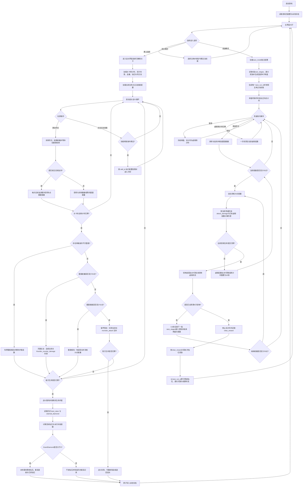

# 雷霆勇士 \(Thunder Warrior\) 游戏策划案

【输入变量】

游戏名称 = "雷霆勇士 \(Thunder Warrior\)"
游戏品类 = "街机闯关与计时竞速消除 \(Arcade Stage & Time Trial Match\-3\)"
核心题材 = "雷暴神域的勇士与怪兽"
变现模式 = "无广告单机版"
屏幕方向 = "竖屏"
发布平台 = "移动端"
视觉表现 = "2D 雷暴奇幻厚涂风"
新手引导 = "不需要"

## 一、核心玩法与操作机制

### 基础符文消除与棋盘刷新规则 \(Strict Match \& Refresh\)

本游戏采用 6x6 矩阵棋盘，操作与刷新规则如下：

符文类型库（10 种基础符文）：系统内置 10 种雷霆符文（闪电、风暴盾、雷锤、疾风、霹雳枪、银电刃、黑云、金雷戟、青霆弩、天罚印）。每种符文拥有独立轮廓与色彩，确保玩家在高速操作中可以快速辨认。

关卡动态分配：每个关卡由配置表决定本关投入的具体符文种类与数量（如：前期关卡仅投入 4 种，极易连消；后期投入 8 种，盘面杂乱难度极高）。

经典消除判定：玩家单指拖拽相邻符文互换，达成横纵连续 3 个及以上同类符文即判定消除。若互换未形成消除，符文在 0\.1s 内弹回原位。

强制动画锁 \(No Free\-swapping\)：严禁无缝微操。在符文消除、重力下落以及新符文填补期间，棋盘被完全锁定，玩家必须等待盘面完全静止后方可进行下一次滑动，极大考验玩家在有限时间内的单次操作收益与大局观。

### 核心机制：连消蓄雷与动态生死倒计时 \(Thunder Charge \& Dynamic Attack Timer\)

#### 雷霆能量获取规则：

基础消除：单次消除 3 个符文获得 3 点雷霆能量，消除 4 个获得 4 点雷霆能量，以此类推。

连锁雷暴额外奖励（Combo Bonus）：若玩家的 1 次滑动操作引发后续符文下落并触发多次连续消除，除第 1 次消除外的每一次连消（Cascade），都将额外获得 5 点雷霆能量。

动态敌方攻击回合（关卡配置）：由具体关卡配置敌方的“攻击倒计时（Attack Interval）”和“怪物攻击力（Monster Attack）”（如：前期小怪每 12 秒攻击一次，Boss 关卡可能每 6 秒就发动一次攻击）。

雷霆防御判定：倒计时归零时敌方必定发动攻击，系统根据当前【雷霆能量】强制判定：

【天雷反击】（雷霆能量 $\ge$ 20）：消耗 20 点雷霆能量，以落雷打断敌方攻击，免疫本次伤害，并按照当前关卡的 `thunder_counter_damage` 配置对敌方造成雷击伤害。

【雷盾格挡】（10 $\le$ 雷霆能量 $<$ 20）：消耗 10 点雷霆能量，展开雷盾免疫本次伤害，但不造成反击伤害。

【破甲受击】（雷霆能量 $<$ 10）：保留当前雷霆能量，我方勇士的雷铠被击穿，按照当前关卡的 `monster_attack` 配置扣除生命值。

### 主角与主动技能系统

- 游戏共提供 5 名可选主角。所有主角的生命值和天雷反击伤害仍由关卡配置决定，角色之间不提供局外属性成长，仅通过主动技能形成玩法差异。

- 每名主角固定携带 1 个主动技能。进入关卡后，核心战斗界面显示当前主角的专属技能按钮；技能不消耗雷霆能量，使用后按照 `skills.cooldown_sec` 进入局内冷却。

- 技能冷却在每局开始时重置为可用状态，仅在战斗正常计时期间递减；暂停、结算和失败期间停止递减。

- 通用释放条件：主角存活、战斗未结束、技能未处于冷却、棋盘不在消除或下落动画锁中。条件不满足时按钮置灰，并显示剩余冷却时间或对应原因。

- 技能释放成功后立即写入本地战斗存档。技能效果读取游戏包内的 `skills` 本地配置，运行时不得自行改写效果数值和冷却时间。

### 双模式结构

#### 选关模式

选关模式以固定关卡闯关推进。我方生命值、敌方生命值、怪物攻击力和天雷反击伤害均由具体关卡配置独立决定。玩家需在敌方攻击倒计时内快速消除符文、积蓄雷霆能量。通过天雷反击削减敌方生命值，击败当前关卡的风暴魔物后解锁下一关，并按照剩余生命值结算星级与首通钻石。

#### 竞速模式：雷霆追猎（Thunder Rush）

【入口与解锁】

- 主界面固定显示【选关模式】与【竞速模式】两个并列入口。竞速模式默认开放，不设置选关进度或其他解锁条件；入口、战斗数值和通关奖励均为独立系统，不读取或复用选关模式数据。

- 进入竞速模式后沿用当前出战主角的角色外观，但所有主角主动技能统一禁用，避免防御类、倒计时类技能在无怪物攻击规则下失效。每次挑战开始时雷霆能量为 0。

【核心目标与时间规则】

- 单局目标是按固定顺序击败 6 只怪物，结算时展示本局完成全部击杀所用的总时间。竞速没有倒计时上限，也不计算击杀分数。

- 总计时从棋盘解除初始锁定、允许玩家进行第一次交换时开始；第 6 只怪物生命值降至 0 的同一逻辑帧立即停止。暂停期间总计时冻结，恢复游戏后继续累计。

- 竞速按照 `race_mode.race_stages` 的数组顺序加载 6 只怪物。每个竞速阶段独立配置 `monster_id`、`enemy_hp` 和 `attack_damage`；除共享怪物美术 ID 外，不读取选关配置 `levels` 中的任何战斗数值。

- 竞速棋盘始终为 6x6，整局固定使用 `race_mode.rune_pool` 中的 6 种符文。初始棋盘和后续补充序列由本地固定种子生成；初始棋盘不得自带三连，且必须至少存在 1 个合法消除步骤，确保同一配置版本下的重复挑战条件一致。

- 击败前 5 只怪物后，下一只怪物在 0\.6 秒内入场。换怪时间计入总用时；棋盘与剩余雷霆能量继续继承，上一只怪物的虚弱层数和虚弱倒计时立即清零。击败第 6 只怪物后直接结算，不再循环。

【竞速专属机制：满能自动攻击】

- 竞速模式中的怪物不会攻击，不配置怪物攻击力和敌方攻击倒计时，玩家也不会受到伤害或因生命值归零失败。

- 每当雷霆能量累计达到 20 点，系统立即自动消耗 20 点能量并攻击当前怪物 1 次，无需玩家点击。我方本次基础攻击力读取当前竞速阶段的 `race_stages[].attack_damage`，与选关模式的 `thunder_counter_damage` 完全独立。

|竞速顺序|竞速阶段 ID|怪物|独立怪物生命值|独立我方基础攻击力|
|---|---|---|---|---|
|1|`rs_001`|蚀雷魔犬|30|10|
|2|`rs_002`|风暴行刑者|60|15|
|3|`rs_003`|天穹毁灭者|150|25|
|4|`rs_004`|雷鸣石像|240|30|
|5|`rs_005`|云海女妖|350|35|
|6|`rs_006`|万雷之王|600|50|

- 能量允许溢出并连续结算。若一次消除或连消使能量由 18 增加至 43，则按顺序触发 2 次攻击，最后保留 3 点能量。多次攻击必须逐次独立结算伤害与虚弱层数，不得合并为一次总伤害。

- 若连续攻击过程中当前怪物死亡，立即停止对死亡目标的后续攻击，尚未消耗的能量全部保留。下一只怪物完成 0\.6 秒入场后重新检查能量；若能量仍达到 20 点，立即继续触发自动攻击。

【竞速专属机制：虚弱叠层】

- 每次竞速攻击先按照怪物命中前已有的虚弱层数计算伤害，伤害结算完成后再为仍存活的怪物增加 1 层【虚弱】。因此第 1 次攻击造成 100% 基础伤害并叠加第 1 层虚弱，第 2 次攻击受到第 1 层加成并造成 110% 基础伤害。

- 每 1 层虚弱使怪物受到的后续伤害增加 10%，层数不设固定上限：

  $WeaknessMultiplier = 1 + WeaknessStacks \times 0.10$

  $RaceAttackDamage = \lfloor CurrentRaceStage.attack\_damage \times WeaknessMultiplier \rfloor$

- 虚弱为整组共享倒计时。首次获得虚弱后持续 10 秒；在虚弱尚未结束时每获得 1 层新虚弱，层数增加 1，并将整组虚弱的剩余时间重置为 10 秒。

- 若 10 秒内没有获得新层数，虚弱倒计时归零时所有层数一次性清空，不按层逐个消退。虚弱倒计时在棋盘消除、下落动画和换怪过场期间继续流逝；打开暂停界面时冻结，恢复游戏后从暂停前的剩余时间继续。

- 若本次攻击直接击杀怪物，则不再给已死亡怪物添加新层虚弱；下一只怪物入场时固定从 0 层虚弱开始。

【独立配置与中断规则】

- `race_mode` 是完整独立的竞速配置表。竞速怪物数值、符文池、固定种子或其他规则发生调整时，更新 `config_version`，用于标识当前运行配置和定位本地存档问题。

- 暂停时棋盘不可操作，总计时和虚弱倒计时同时冻结；应用切入后台时自动暂停。主动退出或关闭应用视为放弃本局，不保存本局用时，也不获得通关奖励。

【竞速模式通关奖励】

- 完整击败第 6 只怪物即视为竞速通关。每次通关都读取 `race_mode.clear_reward` 并发放 1 份配置奖励，重复通关也可获得；奖励不设首次通关限制和每日次数上限。

- 当前配置示例为每次通关获得 100 钻石。奖励类型由 `currency_id` 配置，数量由 `amount` 配置；当前版本仅支持已存在的 `CUR_DIAMOND`。

- 每局开始时生成唯一的本地 `race_run_id`。结算时使用该 ID 防止结算重试造成重复发奖，并在同一个本地事务中完成钻石增加、通关次数增加和已结算 ID 写入。中途退出或未击败全部 6 只怪物不发放奖励。


### 选关模式胜负判断与评分评星（纯血量评定）

胜利条件：将本关配置的敌方生命值削减至 0。

失败条件：本关配置的我方生命值降至 0。

评星条件：
1 星：成功击败敌人通关（我方剩余血量 \> 0%）。
2 星：通关时我方剩余生命值 $\ge$ 50%（即雷铠被击穿次数极少）。
3 星：通关时我方生命值保持 100%（即全程触发雷盾格挡或天雷反击，无伤通关）。

### 选关模式通关钻石与补星奖励

- 每个关卡配置 `diamond_reward_base`，表示该关卡达到 3 星时可累计领取的钻石总额。关卡未通关时不可领取钻石；首次通关会激活并结算该关唯一的钻石奖励池。

- 星级对应的累计领取比例固定为：1 星 50%、2 星 75%、3 星 100%。

- 首次通关时，按照本次星级计算应领取钻石。首次 1 星领取 `diamond_reward_base × 50%`，首次 2 星领取 `diamond_reward_base × 75%`，首次 3 星领取全部 `diamond_reward_base`。

- 后续重复挑战只有在刷新历史最高星级时才发放补星差额。相同星级或低于历史最高星级时，本次钻石奖励为 0。

- 结算公式：

  $TargetDiamond = \lfloor diamond\_reward\_base \times StarRate(CurrentStars) \rfloor$

  $GrantDiamond = \max(0, TargetDiamond - ClaimedDiamond)$

- 其中 `StarRate(1)=0.50`、`StarRate(2)=0.75`、`StarRate(3)=1.00`；钻石结果向下取整。本地事务成功写入 `GrantDiamond` 后，才更新该关的 `best_stars` 与 `claimed_diamond`。

- 示例：某关 `diamond_reward_base=200`。首次 1 星获得 100 钻石；之后补到 2 星再获得 50 钻石；最后补到 3 星再获得 50 钻石，累计不超过 200 钻石。

### 数据存档机制（Save System）

选关模式单局战斗采用“每次敌方攻击判定后即刻本地存档”，主角技能释放后也立即记录技能冷却与待触发状态。当前出战主角、通关进度、历史最高星级、各关已领取钻石与玩家钻石余额全部保存在本机。钻石结算使用 `level_id + target_best_stars` 作为本地幂等键，并以“先计算、后一次性写入”的事务方式更新钻石和关卡记录，防止重复点击导致多次发奖。

竞速模式不提供断点续局。完整击败 6 只怪物后，以 `race_run_id` 为幂等键，在一次本地事务中发放 `clear_reward` 并更新竞速通关次数。暂停或切入后台会冻结总计时和虚弱倒计时；主动退出、关闭应用或成功结算前异常中断均视为放弃本局。游戏不使用游戏业务服务器或云存档，卸载游戏、清除本地数据或更换设备后记录不会保留。

## 二、视听表现与美术风格

### 整体基调

2D 雷暴奇幻厚涂风（Storm Fantasy）。故事发生在被永恒雷云笼罩的天穹神域，雷霆勇士需要夺回被风暴魔物侵蚀的雷霆圣殿。视觉上强调 “银黑雷铠、白金闪电、青蓝风暴与破碎神殿”，以暖金火光点缀环境，避免战场被单一冷色吞没。由于我方生命值由关卡动态配置，UI 采用带有雷纹裂痕的金属血条与数字混合显示（如 HP: 80/80）。

### 音频设计规范（Audio Design）

BGM：低沉战鼓、呼啸风声与远处雷鸣构成环境层；敌方攻击倒计时最后 3 秒时，战鼓和雷声逐渐加速，形成风暴压境的紧迫感。

Combo 音效递进：连消奖励触发时，电流音调必须逐级拔高；每次连锁在战场层追加一次闪电反馈，形成从微弱电弧到连锁雷暴的听觉升级。

机制交互：UI 按钮点击为短促的金属电流声；【雷盾格挡】触发厚重的雷盾轰鸣；【天雷反击】必须以一声穿透力极强的落雷爆响收尾，并伴随屏幕重震与短暂白金闪光。

## 三、核心界面可视化、专属 AI 提示词与全景交互逻辑（UI/UX）

### 核心界面输出策略（按层级与类型划分）

#### 一、 强制输出界面（基础层与核心弹窗）

【主界面】 \(独立全屏界面 \- 游戏外枢纽\)
【核心战斗界面】 \(独立全屏界面 \- 局内底层\)
【选关界面】 \(独立全屏界面，由主界面进入\)
【竞速准备界面】 \(独立全屏界面，由主界面的竞速模式入口进入\)
【竞速结算界面】 \(覆盖型弹窗，父级为竞速战斗界面\)
【勇士选择界面】 \(独立全屏界面，由主界面进入\)
【结算界面】 \(覆盖型弹窗，父级为战斗界面\)：带遮罩。包含星级变化、钻石差额、下一关按钮和返回选关按钮。
【暂停界面】 \(覆盖型弹窗，父级为战斗界面\)：带 80% 黑色遮罩。
【设置界面】 \(覆盖型弹窗，父级为主 / 暂停界面\)：带遮罩。
【玩法介绍界面】 \(覆盖型弹窗，父级为主界面\)：带遮罩。

#### 二、 可选输出界面（根据品类特性动态补齐）

【失败界面】 \(覆盖型弹窗，父级为战斗界面\)：带红色警告遮罩。包含失败原因提示、重新挑战按钮和退出按钮，不提供复活或局内增益入口。

### 独立界面详细设计拆解

#### 1\. 【主界面】 \(独立全屏界面 \- 游戏外枢纽\)

【高保真界面中文生成提示词】
Prompt: A high\-quality game UI mockup for a storm fantasy mobile game\. Theme: The currently selected thunder hero standing on the steps of a ruined sky temple while white\-gold lightning tears through blue storm clouds\. Layout: Portrait orientation\. Top 20%: A massive metallic game title logo carved with glowing thunder runes, with a compact diamond counter in the top right\. Center: The selected hero's full body artwork, with visible face and clear equipment details\. Bottom 30%: Two equal primary mode entrances placed side by side, "Level Mode" and "Thunder Rush", followed by one smaller utility button "Hero Select"\. Show the player's highest cleared level in one compact record row\. Small icons for "Settings" and "Tutorial" at the screen corners\. Texture: Brushed steel, cracked stone, electric arcs, restrained warm golden torchlight\. Mandatory Chinese text on UI: "雷霆勇士", "选关模式", "竞速模式", "勇士选择", "最高通关", "钻石", "设置", "玩法介绍"\. Output three separate images: 1\. Complete UI mockup\. 2\. Clean background without UI \(flawless repaint\)\. 3\. Transparent PNG of UI assets only, precise absolute coordinates, thick black bounding boxes per logic group, pixel\-perfect hard edges, strictly REMOVE all independent numbers 0\-9\.

【可视化文本线框图】

```Plain Text
+-----------------------------------------+
| [体力:30/30]                    [钻石:500]|
|           [ 雷霆勇士 (Logo) ]           |
|                                         |
|                                         |
|                                         |
|        (神殿雷光中的雷铠勇士)           |
|
|                                         |
|           (当前勇士: 雷霆勇士)          |
|       [ 选关模式 ]    [ 竞速模式 ]       |
|              [ 勇士选择 ]               |
|              最高通关:6关               |
|                                         |
|                                   [设置]|
+-----------------------------------------+
```

【视口排版与空间占比】
Top \(Anchor: Top Center\)：游戏 Logo 与通关记录占比 25%。
Middle \(Anchor: Center\)：核心美术展示区与待机动画占比 45%。
Bottom \(Anchor: Bottom Center\)：主操作枢纽占比 30%。

【界面层级与遮罩逻辑】
UI 层级：Z\-Order 0。无遮罩。

【精细化组件刷新规则】
组件名称：“最高通关” 文本。
数据源绑定：PlayerProfile\.MaxClearedLevel。
刷新时机：界面开启时初始化（OnEnable）。
插值与变化表现：静态显示，文本附带缓慢的 Alpha 呼吸灯效果（2\.0s 周期，Alpha 0\.6 至 1\.0）。
边界状态表现：若数据为 0，文本置灰显示 “尚未踏入深渊”。
初始默认状态：“读取记录中\.\.\.”。

组件名称：“钻石” 文本。

数据源绑定：PlayerProfile\.Diamonds。

刷新时机：主界面开启时初始化；监听 OnDiamondsChanged，在通关钻石或补星差额到账后立即刷新。

边界状态表现：本地存档读取中显示 “钻石: \-\-”；到账时播放 0\.4s 数字滚动与白金闪光。

【原子级交互事件定义】
控件名称：“选关模式”按钮。
输入方式：点按（Tap）。
前置条件校验：校验关卡配置与玩家解锁进度是否加载。
瞬时视听反馈：按下时整体缩放至 0\.95，边缘亮起白金电弧，播放 ui\_thunder\_charge\.wav；抬起时弹簧回弹。
逻辑执行与异常流：成功则进入【选关界面】；异常则左右震动 0\.2s 并提示进度加载中。
后置状态转换：加载期间不可点击（Interactable=false）。

控件名称：“竞速模式”按钮。

输入方式：点按（Tap）。

前置条件校验：检查竞速配置版本、6 条 `race_stages`、通关奖励和本地固定种子是否加载完成。

逻辑执行与异常流：配置完整时进入【竞速准备界面】；本地配置缺失或读取失败时按钮保持置灰，并显示“竞速配置加载失败”。

控件名称：“勇士选择”按钮。

输入方式：点按（Tap）。

逻辑执行：打开勇士选择界面并定位到当前已选主角；当前版本 5 名主角默认可选，不设置钻石解锁条件。

#### 2\. 【核心战斗界面】 \(独立全屏界面 \- 局内底层\)

【高保真界面中文生成提示词】
Prompt: A high\-quality game UI mockup for a storm fantasy Match\-3 mobile game\. Theme: The selected thunder hero versus a corrupted storm beast in a ruined sky temple\. Layout: Portrait\. Top 40%: The selected hero and a massive storm monster in a tense standoff, readable metallic numeric HP bars \(e\.g\., HP: 80/80\) above them\. Middle 15%: A lightning\-shaped Attack Timer, a glowing Thunder Energy Bar with distinct checkpoints at 10 and 20, and one stable active skill button showing the hero's skill icon and cooldown overlay\. Bottom 45%: A 6x6 match\-3 grid containing chunky, clearly differentiated thunder runes \(Lightning Bolt, Storm Shield, Thunder Hammer, Wind Spiral\)\. Above the grid, glowing combo text "Thunder Combo \+5\!"\. Texture: Brushed steel, cracked sky\-temple stone, electric arcs, white\-gold highlights, cyan storm energy\. Mandatory Chinese text on UI: "暂停", "破甲受击", "雷盾格挡", "天雷反击", "技能"\. Output three separate images: 1\. Complete UI mockup\. 2\. Clean background without UI\. 3\. Transparent PNG of UI elements only, exact absolute coordinates, thick black bounding boxes, pixel\-perfect hard edges, strictly REMOVE all independent numbers 0\-9\.

【可视化文本线框图】

```Plain Text
+-----------------------------------------+
| [勇士 HP: 80/80]      [风暴魔物 HP:120] |
|                                  (暂停) |
|      (雷铠勇士)    ><   (风暴巨兽)       |
+-----------------------------------------+
| >>> 敌方攻击倒计时: 08.5s <<<           |
|  (破甲受击) [雷盾格挡]    【天雷反击】  |
| 蓄雷:[██████░░░░░|░░░░░░░░░░|░░░░░░] 6 |
| 技能:[雷霆号令]              冷却:18s |
+-----------------------------------------+
|          (雷霆连消 x2! 蓄雷 +5)         |
|  [电] [盾] [锤] [风] [电] [盾]          |
|  [盾] [电] [电] [盾] [枪] [电]          |
|  [锤] [电] [盾] [锤] [盾] [盾]          |
|  [风] [锤] [电] [电] [盾] [电]          |
|  [盾] [电] [枪] [盾] [锤] [电]          |
|  [电] [盾] [盾] [风] [盾] [枪]          |
+-----------------------------------------+
```

【视口排版与空间占比】
Top \(Anchor: Top Center\)：1v1 动画展现与血条组件，占比 40%。
Middle \(Anchor: Center\)：倒计时、三段式能量槽与主动技能按钮，占比 15%。
Bottom \(Anchor: Bottom Center\)：6x6 雷霆符文消除棋盘区，占比 45%。

【界面层级与遮罩逻辑】
UI 层级：Z\-Order 0。无遮罩。

【精细化组件刷新规则】
组件名称：三段式雷霆能量槽 \(Tri\-State Thunder Energy Bar\)。
数据源绑定：BattleManager\.CurrentEnergy。
刷新时机：监听 OnEnergyChanged。
插值与变化表现：增加时，填充条以 0\.1s 极速 Lerp 推进。跨越 10 点闪蓝光；跨越 20 点尾端爆红火花特效。
边界状态表现：达到 20 点以上，能量槽变为白金色雷浆，UI 框体出现轻微高频震动与电弧游走。
初始默认状态：0/20，全暗空槽。

【原子级交互事件定义】
控件名称：雷霆符文 \(Match Rune\)。
输入方式：滑动（Swipe）。
前置条件校验：判断棋盘处于 “非动画锁”；滑动后能形成 ≥ 3 连线。
瞬时视听反馈：符文放大至 1\.05 倍；成功消除播放 rune\_spark\.wav，并伴随电弧向雷霆能量槽汇聚。
逻辑执行与异常流：成功则锁死棋盘 \-\> 销毁符文并计算雷霆能量 \-\> 下落并检测雷霆连消 \-\> 解锁；失败则 0\.1s 弹性退回原位。
后置状态转换：符文被销毁或复位。

控件名称：主角主动技能按钮。

输入方式：点按（Tap）。

前置条件校验：执行主角存活、战斗状态、棋盘动画锁、技能冷却与特殊待触发状态校验。

瞬时视听反馈：释放成功时图标爆发白金电弧并进入环形冷却遮罩；失败时按钮轻微震动，并显示“冷却中”或“当前不可释放”。

逻辑执行与异常流：成功则读取当前 `character_id` 关联的 `skill_id`，执行对应技能效果并写入战斗存档；配置缺失时禁止释放并记录本地错误日志，不使用默认效果兜底。

#### 3\. 【选关界面】 \(独立全屏界面，父级为主界面\)

【高保真界面中文生成提示词】
Prompt: A high\-quality game UI mockup for a storm fantasy mobile game\. Theme: A journey across floating sky islands toward the Thunder Temple\. Layout: Portrait\. Top 10%: A metallic header with "Level Select" and a "Back" button\. Center 90%: A vertical scrolling map showing a path through storm cliffs, floating ruins, a lightning forest, and the Thunder Temple\. Along the path are circular level nodes shaped like thunder seals\. Unlocked nodes glow white\-gold, while locked nodes are dark stone covered by broken chains\. Above each unlocked node are 3 star slots\. Texture: Weathered map material, brushed metal, storm clouds, lightning veins, restrained warm gold accents\. Mandatory Chinese text on UI: "选择关卡", "返回"\. Output three separate images: 1\. Complete UI mockup\. 2\. Clean background without UI\. 3\. Transparent PNG of UI assets only, exact absolute coordinates, thick black bounding boxes, pixel\-perfect hard edges, strictly REMOVE all independent numbers 0\-9\.

【可视化文本线框图】

```Plain Text
+-----------------------------------------+
| [返回]        [ 选 择 关 卡 ]           |
|-----------------------------------------|
|                                         |
|               [★★★]                   |
|               (关卡3)                   |
|                  |                      |
|                  |                      |
|         [★☆☆]                         |
|         (关卡2)                         |
|            |                            |
|            |                            |
|          [★★★]                        |
|          (关卡1)                        |
|                                         |
|        (浮空群岛与雷云地图背景)         |
+-----------------------------------------+
```

【视口排版与空间占比】
Top \(Anchor: Top Stretch\)：顶部导航栏，占比 10%。
Center \(Anchor: Stretch\)：全屏垂直滑动地图（Scroll Rect），占比 90%。

【界面层级与遮罩逻辑】
UI 层级：Z\-Order 10。无遮罩。

【精细化组件刷新规则】
组件名称：关卡节点星级展示 \(Level Star Slots\)。
数据源绑定：PlayerProfile\.LevelStarsDict \[Level\_ID\]。
刷新时机：界面开启时（OnEnable）或滑动地图时。
插值与变化表现：无插值。
边界状态表现：未解锁关卡无星级槽且节点带铁链置灰；已解锁未通关显示 3 个空星槽。
初始默认状态：空星槽。

【原子级交互事件定义】
控件名称：关卡节点按钮。
输入方式：点按（Tap）。
前置条件校验：校验该关卡是否已解锁。
瞬时视听反馈：按下时缩放至 0\.9，播放 ui\_bell\_toll\.wav。
逻辑执行与异常流：成功写入 CurrentLevelID 并转场；异常震动节点并播放铁链声 ui\_chain\_rattle\.wav。
后置状态转换：加载期间当前界面不可交互。

#### 4\. 【勇士选择界面】 \(独立全屏界面，由主界面进入\)

【高保真界面中文生成提示词】
Prompt: A high\-quality hero selection screen for a portrait storm fantasy mobile game\. Top: back button, title "勇士选择", and compact diamond counter\. Center: large full\-body artwork of the selected hero with the hero name and one active skill description below\. Bottom: a stable horizontal row of five distinct hero portraits and one primary "出战" button\. Heroes: Thunder Warrior with hammer and shield, Storm Swordmaiden with twin blades, Thunder Shield Guardian with tower shield, Thunder Rune Priest with a rune staff, and Lightning Ranger with a compact crossbow\. Use brushed metal, storm clouds, white\-gold lightning, cyan energy, and warm red accents\. Mandatory Chinese text on UI: "勇士选择", "主动技能", "出战", "返回", "钻石"\. Output three separate images: 1\. Complete UI mockup\. 2\. Clean background without UI\. 3\. Transparent PNG of UI assets only, exact coordinates, clear group bounding boxes, no overlapping text, strictly REMOVE all independent numbers 0\-9\.

【可视化文本线框图】

```Plain Text
+-----------------------------------------+
| [返回]          勇士选择      [钻石:500]|
|                                         |
|             [当前勇士立绘]              |
|               雷霆勇士                  |
|                                         |
| 主动技能：雷霆号令                      |
| 立即获得 10 点雷霆能量，冷却 35 秒      |
|                                         |
| [勇士] [剑姬] [守卫] [祭司] [游侠]      |
|                                         |
|               [ 出 战 ]                 |
+-----------------------------------------+
```

【视口排版与空间占比】
Top \(Anchor: Top Stretch\)：导航与钻石占比 10%；Middle \(Anchor: Center\)：角色立绘和技能说明占比 65%；Bottom \(Anchor: Bottom Center\)：五头像选择条与出战按钮占比 25%。

【精细化组件刷新规则】
组件名称：主动技能说明。

数据源绑定：CharacterDB\.CurrentSelected\.SkillId 对应的 SkillsConfig 数据。

刷新规则：切换头像后同步刷新技能名称、效果数值和冷却时间；配置加载失败时显示“技能数据加载失败”，出战按钮置灰。

【原子级交互事件定义】
控件名称：“出战”按钮。

前置条件校验：当前角色与技能配置均完整可用。

逻辑执行与异常流：成功则写入 PlayerProfile\.SelectedCharacterId 并返回主界面，主界面立绘同步更新；失败则保留当前选择，不覆盖原已选角色。

#### 5\. 【结算界面】 \(覆盖型弹窗，父级为战斗界面\)

【高保真界面中文生成提示词】
Prompt: A high\-quality victory settlement popup for a portrait storm fantasy mobile game\. Centered metallic panel over a dark 80% mask\. Top: glowing Chinese title "雷霆胜利" and three large star slots\. Middle: previous best stars changing to current best stars, a crystal diamond reward pool, this run's newly granted diamonds, and total claimed diamonds for the level\. Bottom: two clear buttons for next level and level select\. White\-gold lightning accents, brushed steel, readable cyan diamond reward numbers, no overlapping text\. Mandatory Chinese text on UI: "雷霆胜利", "历史最佳", "三星钻石总额", "本次获得", "已累计", "下一关", "返回选关"\. Output three separate images: 1\. Complete UI mockup\. 2\. Clean masked background without the popup\. 3\. Transparent PNG of popup UI assets only, exact coordinates, clear bounding boxes, strictly REMOVE all independent numbers 0\-9\.

【可视化文本线框图】

```Plain Text
+-----------------------------------------+
|                                         |
|       +---------------------------+     |
|       |        雷 霆 胜 利         |     |
|       |          ★ ★ ☆           |     |
|       | 历史最佳: ★☆☆  →  ★★☆   |     |
|       | 三星钻石总额:        200  |     |
|       | 本次获得:            +50  |     |
|       | 已累计:           150/200 |     |
|       |                           |     |
|       | [ 返回主界面 ]  [ 下一关 ]  |     |
|       +---------------------------+     |
|                                         |
+-----------------------------------------+
```

【视口排版与空间占比】
Center \(Anchor: Middle Center\)：弹窗占屏幕宽度 82%、高度 64%；星级区占弹窗 25%，钻石结算区占 45%，按钮区占 30%。

【界面层级与遮罩逻辑】
UI 层级：Z\-Order 100。背景使用 80% 黑色遮罩，本地钻石结算写入完成前禁止点击遮罩和离开按钮。

【精细化组件刷新规则】
组件名称：本次获得钻石。

数据源绑定：LevelResult\.GrantDiamond。

刷新时机：本地存档完成星级与钻石差额事务后刷新。首次通关显示首通所得；补星显示差额所得；没有刷新最高星级时显示 “本次获得: 0”。

组件名称：历史最佳星级。

数据源绑定：LevelResult\.PreviousBestStars 与 LevelResult\.NewBestStars。

刷新规则：只有 `NewBestStars > PreviousBestStars` 时播放星级提升动画，否则仅显示当前历史最佳星级，不播放补星特效。

【原子级交互事件定义】
控件名称：“下一关”按钮。

前置条件校验：钻石差额事务已成功提交，且下一关已解锁。

逻辑执行与异常流：成功则加载下一关；钻石结算仍在写入时按钮保持不可点击并显示加载状态；写入失败则保留当前弹窗并允许重试，不在事务成功前增加钻石。

#### 6\. 【竞速准备与结算界面】

【竞速准备界面高保真生成提示词】
Prompt: A high\-quality Thunder Rush preparation screen for a portrait storm fantasy mobile game\. Top: back button, title "Thunder Rush", and the goal "Defeat 6 Monsters"\. Center: the selected hero standing before a circular storm gate, with six distinct monster silhouettes in a fixed sequence\. Bottom: a compact repeatable diamond clear reward preview and one large "Start Rush" button\. White\-gold lightning, cyan storm energy, warm red accents, brushed dark metal, no overlapping text\. Mandatory Chinese text on UI: "竞速模式", "击败6只怪物", "通关奖励", "钻石", "开始竞速", "返回"\.

【竞速准备界面线框图】

```Plain Text
+-----------------------------------------+
| [返回]          竞 速 模 式             |
| 目标: 击败6只怪物          奖励: 100钻石 |
|                                         |
|          (雷门前的当前出战勇士)         |
|             [ 击败6只怪物 ]             |
|                                         |
| 怪物序列: 犬 → 刑 → 铠 → 像 → 妖 → 王  |
|           每次通关均可获得奖励           |
|                                         |
|              [ 开始竞速 ]               |
+-----------------------------------------+
```

【竞速战斗界面差异】

- 沿用核心战斗界面的角色、怪物血条、雷霆能量与 6x6 棋盘布局。移除玩家生命值、敌方攻击倒计时、雷盾 / 破甲状态提示和主角主动技能按钮。

- 顶部关卡名称替换为【本局总用时】与【怪物进度】，其中怪物进度固定显示 `1/6` 至 `6/6`。原敌方攻击倒计时区域改为【本次基础攻击力】、【虚弱层数】与【虚弱剩余时间】，使用紫色破甲图标与 10 秒衰减条。

- 雷霆能量达到 20 点时自动播放落雷攻击动画并扣除能量，不显示主动攻击按钮。单次连消触发多次攻击时，落雷动画按 0\.15 秒间隔依次播放，但伤害和虚弱必须在逻辑层即时顺序结算。

- 换怪期间怪物血条清空并在 0\.6 秒内重新填充，顶部怪物进度同步增加；棋盘与能量区不得重置或发生位置跳动，基础攻击力切换为下一条 `race_stages[].attack_damage`，虚弱区域立即恢复为“0 层 / --”。

【竞速结算界面线框图】

```Plain Text
+-----------------------------------------+
|              竞 速 完 成                |
|                                         |
| 本局总用时: 02:36.48                    |
| 怪物进度: 6/6       总交换次数: 42      |
| 最大连消: x5        最高虚弱: 7层       |
| 通关奖励: +100钻石                      |
|                                         |
|       [ 返回主界面 ]  [ 再来一次 ]      |
+-----------------------------------------+
```

【精细化组件刷新规则】

- 竞速总计时绑定 `RaceContext.ElapsedTimeMs`，以 `MM:SS.cc` 格式显示并每 0\.01 秒刷新。暂停期间显示值与底层计时同时冻结，第 6 只怪物死亡时固定最终值。

- 怪物进度绑定 `RaceContext.CurrentMonsterIndex`；数值增加时播放 0\.25 秒放大回弹，同时读取下一条 `race_stages` 的怪物生命值和我方基础攻击力。

- 虚弱层数绑定 `RaceContext.WeaknessStacks`，虚弱时间绑定 `RaceContext.WeaknessRemaining`。新增层数时数字向上跳动并将衰减条瞬间补满；到期后层数和衰减条同时归零。

- 第 6 只怪物死亡后立即冻结本局用时，读取 `clear_reward` 并展示“通关奖励”。钻石奖励和竞速通关次数必须一次性写入本地存档；写入期间操作按钮置灰，写入失败时保留本次结算并使用相同 `race_run_id` 重试。

【原子级交互事件定义】

- “开始竞速”：校验当前角色、竞速配置版本、6 条 `race_stages`、`clear_reward` 与本地固定种子；全部成功后生成唯一 `race_run_id` 和竞速配置快照，加载固定种子棋盘，在棋盘首次可操作时启动正向总计时。

- “满能攻击事件”：每次能量变化后执行 `while CurrentEnergy >= 20` 检查。每轮依次扣除 20 点能量、按攻击前虚弱层数结算伤害、对存活怪物增加 1 层虚弱并重置 10 秒倒计时；怪物死亡后立刻停止剩余攻击，剩余能量继承至下一只怪物。

- “暂停 / 恢复”：暂停时冻结棋盘输入、消除动画推进、总计时和虚弱倒计时；恢复时从暂停帧继续，不补算暂停经过的现实时间。

- “再来一次”：沿用当前 `config_version` 与 `fixed_seed` 新建竞速局，所有局内状态清零；不得继承上一局棋盘、能量、虚弱层数或虚弱倒计时。

## 四、主角、怪物、道具、系统（核心设定说明）

\(注：本版本无广告且不设置局外数值养成。钻石通过选关首通、补星差额和竞速每次通关奖励累计，本策划案暂不定义钻石消耗出口。\)

### 1\. 设定说明 \(角色与怪物\)

【可选主角】

游戏共提供 5 名主角，所有主角默认可选。角色不改变关卡配置的生命值、天雷反击伤害与钻石奖励，仅通过专属主动技能改变局内决策。

|唯一 ID|主角名称|战场定位|外观特征|主动技能|
|---|---|---|---|---|
|C001|雷霆勇士|稳定蓄雷|银黑雷纹重甲、暖红披风，手持短柄雷锤与折叠式风暴盾|雷霆号令|
|C002|风暴剑姬|盘面整理|轻型白银雷铠，手持一对青蓝电弧短剑|风暴重排|
|C003|雷盾守卫|容错防御|厚重铜黑塔盾与封闭式头盔，盾面刻有白金雷环|不灭雷盾|
|C004|雷纹祭司|群体消除|白金祭司法袍与悬浮雷纹法杖，身后环绕符文页|雷纹共鸣|
|C005|霹雳游侠|倒计时控制|深青轻甲与短斗篷，装备折叠式雷弩和计时雷晶|雷时延缓|

【主动技能详细规则】

|技能 ID|技能名称|所属主角|技能效果|冷却时间|
|---|---|---|---|---|
|SK001|雷霆号令|雷霆勇士|立即获得 10 点雷霆能量|35 秒|
|SK002|风暴重排|风暴剑姬|重新随机排列当前棋盘|40 秒|
|SK003|不灭雷盾|雷盾守卫|获得 1 层不灭雷盾；下一次敌方攻击强制判定为免费【雷盾格挡】，不消耗雷霆能量、不触发天雷反击，生效后移除|45 秒|
|SK004|雷纹共鸣|雷纹祭司|消除当前棋盘中数量最多的一类符文，后续自然连锁正常计算 Combo 奖励|45 秒|
|SK005|雷时延缓|霹雳游侠|当前敌方攻击倒计时增加 5 秒|30 秒|


【怪物图鉴 \(仅作美术表现，血量、攻击力与攻击频率均被关卡配置覆盖\)】

|唯一 ID|怪物名称|战场定位|外观特征|
|---|---|---|---|
|M001|蚀雷魔犬|基础杂兵|由黑云和碎裂甲片组成的四足魔犬，口中泄出失控电弧。|
|M002|风暴行刑者|重装精英|披覆铜黑避雷重甲，挥舞能够吸收雷电的巨型断雷斧。|
|M003|天穹毁灭者|关底 Boss|被风暴核心寄生的巨型浮空铠甲，背后悬浮三枚旋转雷环。|
|M004|雷鸣石像|遗迹守卫|由破碎神殿巨石拼合而成，胸口嵌有持续震鸣的雷鼓核心。|
|M005|云海女妖|风暴法师|漂浮在云雾中的女性魔灵，双臂延伸为弧形闪电羽翼。|
|M006|万雷之王|终章 Boss|驾驭巨型风暴王座的远古雷霆暴君，头顶悬浮分裂天空的雷冠。|

### 2\. 核心美术资产设定集中文提示词

Prompt: A Game Asset Sheet for a storm fantasy Match\-3 mobile game, pure white background\. Layout: Strict grid\-based adaptive multi\-row layout, ultra\-wide safety margins between cells, strictly no overlapping, pixel\-perfect hard edges, absolutely zero anti\-aliasing blur, independent thick black bounding boxes for each asset\. Content: Row 1, five hero concepts: C001 Thunder Warrior with hammer and shield, C002 Storm Swordmaiden with twin arc blades, C003 Thunder Shield Guardian with a massive tower shield, C004 Thunder Rune Priest with a floating rune staff, C005 Lightning Ranger with a folding thunder crossbow\. Row 2, six monsters: M001 Lightning Eater Hound, M002 Storm Executioner, M003 Skybreaker floating armor, M004 Thunder Stone Idol with a drum core, M005 Cloud Sea Siren with lightning wings, M006 King of Ten Thousand Thunders on a storm throne\. Row 3: ten clearly differentiated Match\-3 rune icons: Lightning Bolt, Storm Shield, Thunder Hammer, Wind Spiral, Thunder Spear, Silver Arc Blade, Black Cloud, Golden Lightning Halberd, Cyan Thunder Crossbow, Divine Smite Seal; five separate active skill icons matching the heroes; and one separate faceted cyan diamond icon engraved with a lightning emblem\. Style: 2D storm fantasy, crisp readable silhouettes, detailed brushed metal and stone textures, cyan storm energy balanced with white\-gold lightning and warm red accents\.

### 3\. 钻石设定

|唯一 ID|名称|功能描述|获取途径|
|---|---|---|---|
|CUR\_DIAMOND|钻石|记录玩家通过游戏获得的累计奖励；当前版本不影响战斗数值|选关模式首次通关与补星差额、竞速模式每次通关奖励|

## 五、新手引导流程拆解（Onboarding \& Tutorial）

根据初始设定，本项目采用强直觉式设计，不设置任何强制新手引导流程。

## 六、版本内容边界

本版本不接入任何广告系统，不设置广告位、观看奖励、复活广告、局内增益广告或结算广告。选关失败后只能重新挑战或退出；竞速中途退出后只能重新开始。

本版本不包含付费购买入口。钻石仅作为通关与补星的累计奖励，不影响战斗数值。

## 七、全局与实体核心配置表 \(JSON 格式\)

### 【数值成长与数学模型设定】

单次操作雷霆能量获取公式：
$ThunderEnergyGain = \sum_{i=1}^{n} (MatchCount_i + ThunderBonus_i)$
\(其中 $n$ 为由 1 次滑动引发的连锁次数。若 $i=1$，则 $ThunderBonus_i = 0$；若 $i \ge 2$，则 $ThunderBonus_i = 5$。\)

伤害公式：
$ThunderCounterDamage = LevelConfig.thunder\_counter\_damage$

$HurtDamage = LevelConfig.monster\_attack$

竞速第 $i$ 只怪物的我方攻击力与伤害公式：

$RaceBaseAttack_i = RaceMode.race\_stages_i.attack\_damage$

$RaceAttackDamage_i = \lfloor RaceBaseAttack_i \times (1 + WeaknessStacks \times 0.10) \rfloor$

竞速每次通关奖励公式：

$RaceClearReward = RaceMode.clear\_reward.amount$

钻石差额公式：
$TargetDiamond = \lfloor LevelConfig.diamond\_reward\_base \times GlobalConfig.star\_diamond\_reward\_rates[CurrentStars] \rfloor$

$GrantDiamond = \max(0, TargetDiamond - LevelProgress.claimed\_diamond)$

### 【字段含义说明字典】

- global\_configs \(全局参数配置\)

    - storm\_shield\_cost: 触发【雷盾格挡】所需扣除的雷霆能量值。

    - thunder\_counter\_cost: 触发【天雷反击】所需扣除的雷霆能量值。

    - thunder\_combo\_bonus: 雷霆连消时，第 2 次及以后每次消除额外奖励的雷霆能量值。

    - star\_diamond\_reward\_rates: 各星级对应的累计钻石领取比例，1 星为 0\.50、2 星为 0\.75、3 星为 1\.00。

- runes \(雷霆符文实体配置\)

    - rune\_id: 雷霆符文唯一标识符，程序识别码。

    - name: 雷霆符文的中文名称 / 对应美术表现映射。

- characters \(主角实体配置\)

    - entity\_id: 主角唯一标识符。

    - name: 主角的中文名称。

    - skill\_id: 主角关联的唯一主动技能 ID。

- skills \(主动技能配置\)

    - skill\_id: 主动技能唯一标识符。

    - name: 主动技能展示名称。

    - effect\_type: 技能效果执行类型，由战斗逻辑映射到对应处理器。

    - effect\_params: 技能效果参数对象，不同 `effect_type` 使用各自的参数字段。

    - cooldown\_sec: 技能释放成功后的局内冷却时间，单位为秒。

- monsters \(怪物实体配置\)

    - entity\_id: 怪物唯一标识符。

    - name: 怪物的中文名称 / 美术立绘映射。

- currencies \(货币配置\)

    - currency\_id: 货币唯一标识符。

    - name: 货币展示名称。

- levels \(关卡配置\)

    - level\_id: 关卡唯一标识符。

    - level\_name: 雷霆主题关卡展示名称。

    - attack\_interval: 本关卡敌方每次发动攻击的倒计时周期时间（单位：秒）。数值越小，玩家压迫感越强。

    - monster\_attack: 本关卡怪物的单次攻击力；触发【破甲受击】时，玩家扣除该数值的生命值。

    - thunder\_counter\_damage: 本关卡【天雷反击】对怪物造成的单次雷击伤害。

    - player\_hp: 本关卡我方初始分配的生命值（即我方的血量上限）。

    - enemy\_hp: 本关卡敌方初始分配的生命值（玩家需要削减至 0 的目标）。

    - diamond\_reward\_base: 本关卡达到 3 星时可累计领取的钻石总额，也是首通与补星差额的计算基数。

    - rune\_pool: 字符串数组，定义本关卡将投入使用的具体雷霆符文 ID 列表。种类越多，消除难度呈指数级增加。

    - monster\_id: 关联本关卡战斗中显示的怪物美术形象 ID。

- race\_mode \(竞速模式配置\)

    - mode\_id: 竞速模式唯一标识符。

    - config\_version: 独立竞速配置版本。`race_stages` 战斗数值、竞速符文池、固定种子或其他规则变更时更新该值。

    - fixed\_seed: 当前竞速配置版本固定使用的本地棋盘随机种子。

    - rune\_pool: 竞速模式整局固定使用的符文 ID 列表。

    - race\_stages: 竞速专用的 6 阶段配置数组，数组顺序即怪物出场顺序，不引用选关模式 `levels`。

    - race\_stages\[\]\.race\_stage\_id: 竞速阶段唯一 ID。

    - race\_stages\[\]\.monster\_id: 当前阶段使用的怪物美术实体 ID。

    - race\_stages\[\]\.enemy\_hp: 当前竞速怪物的独立生命值。

    - race\_stages\[\]\.attack\_damage: 当前阶段我方每次满能攻击的独立基础伤害。

    - clear\_reward: 每次完整击败 6 只怪物后发放的奖励对象。

    - clear\_reward\.reward\_id: 竞速通关奖励配置唯一 ID。

    - clear\_reward\.currency\_id: 奖励货币 ID，当前版本配置为 `CUR_DIAMOND`。

    - clear\_reward\.amount: 每次竞速通关发放的数量，当前示例为 100。

    - clear\_reward\.repeatable: 是否每次通关均可获得，固定为 `true`。

    - disable\_character\_skills: 是否在竞速模式禁用全部主角主动技能，固定为 `true`。

    - energy\_cost\_per\_attack: 每次自动攻击消耗的雷霆能量，固定为 20。

    - weakness\_duration\_sec: 整组虚弱 Buff 的持续时间与刷新时间，固定为 10 秒。

    - weakness\_damage\_per\_stack: 每层虚弱提供的额外受伤比例，固定为 0\.10。

    - weakness\_max\_stacks: 虚弱最大层数；值为 `null` 表示不设固定上限。

    - monster\_transition\_sec: 击杀后下一只怪物的入场时间；此过程不暂停全局计时。

    - pause\_freezes\_elapsed\_time: 暂停是否冻结竞速总计时，固定为 `true`。

    - pause\_freezes\_weakness\_timer: 暂停是否冻结虚弱倒计时，固定为 `true`。

- player\_save \(本地存档字段\)

    - diamonds: 玩家当前钻石余额。

    - selected\_character\_id: 当前出战主角 ID，首次进入游戏默认使用 `c001`。

    - level\_progress\[level\_id\]\.best\_stars: 对应关卡的历史最高星级，初始值为 0。

    - level\_progress\[level\_id\]\.claimed\_diamond: 对应关卡已累计领取的钻石，初始值为 0，最大不得超过该关 `diamond_reward_base`。

    - race\_clear\_count: 竞速模式累计完整通关次数，每次成功发奖时增加 1。

    - last\_settled\_race\_run\_id: 最近一次已完成奖励事务的竞速局 ID，用于阻止同一局重复结算。

```json
{
  "global_configs": {
    "storm_shield_cost": 10,
    "thunder_counter_cost": 20,
    "thunder_combo_bonus": 5,
    "star_diamond_reward_rates": {
      "1": 0.50,
      "2": 0.75,
      "3": 1.00
    }
  },
  "runes": [
    { "rune_id": "r001", "name": "闪电符文" },
    { "rune_id": "r002", "name": "风暴盾符文" },
    { "rune_id": "r003", "name": "雷锤符文" },
    { "rune_id": "r004", "name": "疾风符文" },
    { "rune_id": "r005", "name": "霹雳枪符文" },
    { "rune_id": "r006", "name": "银电刃符文" },
    { "rune_id": "r007", "name": "黑云符文" },
    { "rune_id": "r008", "name": "金雷戟符文" },
    { "rune_id": "r009", "name": "青霆弩符文" },
    { "rune_id": "r010", "name": "天罚印符文" }
  ],
  "characters": [
    { "entity_id": "c001", "name": "雷霆勇士", "skill_id": "SK001" },
    { "entity_id": "c002", "name": "风暴剑姬", "skill_id": "SK002" },
    { "entity_id": "c003", "name": "雷盾守卫", "skill_id": "SK003" },
    { "entity_id": "c004", "name": "雷纹祭司", "skill_id": "SK004" },
    { "entity_id": "c005", "name": "霹雳游侠", "skill_id": "SK005" }
  ],
  "skills": [
    {
      "skill_id": "SK001",
      "name": "雷霆号令",
      "effect_type": "add_thunder_energy",
      "effect_params": { "energy_gain": 10 },
      "cooldown_sec": 35.0
    },
    {
      "skill_id": "SK002",
      "name": "风暴重排",
      "effect_type": "shuffle_board",
      "effect_params": { "guarantee_legal_match": true },
      "cooldown_sec": 40.0
    },
    {
      "skill_id": "SK003",
      "name": "不灭雷盾",
      "effect_type": "grant_free_storm_shield",
      "effect_params": { "shield_layers": 1 },
      "cooldown_sec": 45.0
    },
    {
      "skill_id": "SK004",
      "name": "雷纹共鸣",
      "effect_type": "clear_most_common_rune",
      "effect_params": { "tie_breaker": "lowest_rune_id" },
      "cooldown_sec": 45.0
    },
    {
      "skill_id": "SK005",
      "name": "雷时延缓",
      "effect_type": "extend_attack_timer",
      "effect_params": { "timer_add_sec": 5.0, "cap_at_attack_interval": true },
      "cooldown_sec": 30.0
    }
  ],
  "monsters": [
    { "entity_id": "m001", "name": "蚀雷魔犬" },
    { "entity_id": "m002", "name": "风暴行刑者" },
    { "entity_id": "m003", "name": "天穹毁灭者" },
    { "entity_id": "m004", "name": "雷鸣石像" },
    { "entity_id": "m005", "name": "云海女妖" },
    { "entity_id": "m006", "name": "万雷之王" }
  ],
  "currencies": [
    { "currency_id": "CUR_DIAMOND", "name": "钻石" }
  ],
  "levels": [
    {
      "level_id": "l_001",
      "level_name": "雷云前哨",
      "attack_interval": 12.0,
      "monster_attack": 10,
      "thunder_counter_damage": 10,
      "player_hp": 30,
      "enemy_hp": 30,
      "diamond_reward_base": 100,
      "rune_pool": ["r001", "r002", "r003", "r004"],
      "monster_id": "m001"
    },
    {
      "level_id": "l_002",
      "level_name": "风暴断崖",
      "attack_interval": 10.0,
      "monster_attack": 15,
      "thunder_counter_damage": 15,
      "player_hp": 50,
      "enemy_hp": 60,
      "diamond_reward_base": 200,
      "rune_pool": ["r001", "r002", "r003", "r004", "r005", "r006"],
      "monster_id": "m002"
    },
    {
      "level_id": "l_003",
      "level_name": "天穹神殿",
      "attack_interval": 8.0,
      "monster_attack": 20,
      "thunder_counter_damage": 25,
      "player_hp": 80,
      "enemy_hp": 150,
      "diamond_reward_base": 400,
      "rune_pool": ["r001", "r002", "r003", "r004", "r005", "r006", "r007", "r008"],
      "monster_id": "m003"
    },
    {
      "level_id": "l_004",
      "level_name": "雷鸣回廊",
      "attack_interval": 7.0,
      "monster_attack": 25,
      "thunder_counter_damage": 30,
      "player_hp": 100,
      "enemy_hp": 240,
      "diamond_reward_base": 600,
      "rune_pool": ["r001", "r002", "r003", "r004", "r005", "r006", "r007", "r008", "r009"],
      "monster_id": "m004"
    },
    {
      "level_id": "l_005",
      "level_name": "云海祭坛",
      "attack_interval": 6.5,
      "monster_attack": 30,
      "thunder_counter_damage": 35,
      "player_hp": 120,
      "enemy_hp": 350,
      "diamond_reward_base": 800,
      "rune_pool": ["r001", "r002", "r003", "r004", "r005", "r006", "r007", "r008", "r009", "r010"],
      "monster_id": "m005"
    },
    {
      "level_id": "l_006",
      "level_name": "万雷王座",
      "attack_interval": 6.0,
      "monster_attack": 40,
      "thunder_counter_damage": 50,
      "player_hp": 150,
      "enemy_hp": 600,
      "diamond_reward_base": 1200,
      "rune_pool": ["r001", "r002", "r003", "r004", "r005", "r006", "r007", "r008", "r009", "r010"],
      "monster_id": "m006"
    }
  ],
  "race_mode": {
    "mode_id": "race_001",
    "config_version": "race_stages_v1",
    "fixed_seed": "race_v1_001",
    "rune_pool": ["r001", "r002", "r003", "r004", "r005", "r006"],
    "race_stages": [
      { "race_stage_id": "rs_001", "monster_id": "m001", "enemy_hp": 30, "attack_damage": 10 },
      { "race_stage_id": "rs_002", "monster_id": "m002", "enemy_hp": 60, "attack_damage": 15 },
      { "race_stage_id": "rs_003", "monster_id": "m003", "enemy_hp": 150, "attack_damage": 25 },
      { "race_stage_id": "rs_004", "monster_id": "m004", "enemy_hp": 240, "attack_damage": 30 },
      { "race_stage_id": "rs_005", "monster_id": "m005", "enemy_hp": 350, "attack_damage": 35 },
      { "race_stage_id": "rs_006", "monster_id": "m006", "enemy_hp": 600, "attack_damage": 50 }
    ],
    "clear_reward": {
      "reward_id": "race_clear_diamond_001",
      "currency_id": "CUR_DIAMOND",
      "amount": 100,
      "repeatable": true
    },
    "disable_character_skills": true,
    "energy_cost_per_attack": 20,
    "weakness_duration_sec": 10.0,
    "weakness_damage_per_stack": 0.10,
    "weakness_max_stacks": null,
    "monster_transition_sec": 0.6,
    "pause_freezes_elapsed_time": true,
    "pause_freezes_weakness_timer": true
  },
  "player_save_defaults": {
    "diamonds": 0,
    "selected_character_id": "c001",
    "level_progress": {},
    "race_clear_count": 0,
    "last_settled_race_run_id": null
  }
}
```

## 八、游戏核心流程图（Flowchart）



