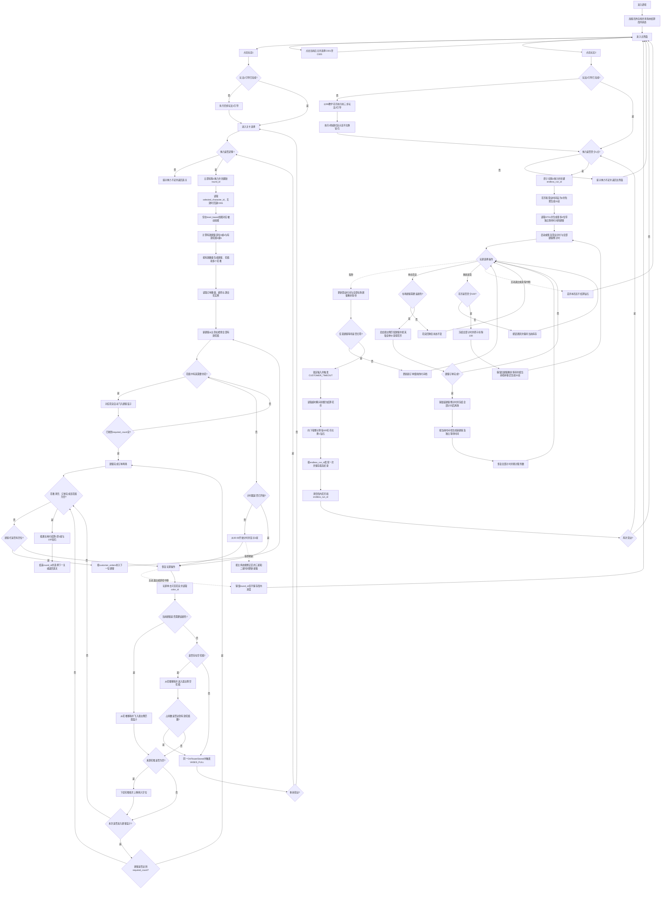

# 《甜心花店》核心玩法与系统策划案

## 【输入变量】

```text
游戏名称 = "甜心花店"
游戏品类 = "休闲益智、花材分类与顾客订单收纳"
游戏模式 = "玩法1为关卡制；玩法2为无尽花店经营"
核心题材 = "甜美街角花店、女性顾客、多个混合花堆分拣与共享花瓶"
变现模式 = "无广告、无 IAA；玩法1通关固定获得 100 钻石，玩法2按结算花币兑换钻石"
屏幕方向 = "竖屏"
发布平台 = "移动端"
视觉表现 = "女性向甜美治愈的 2D Q 版水彩花店，奶油粉、薄荷绿、天空蓝、玻璃花瓶与闪亮花瓣"
新手引导 = "需要"
主角系统 = "5 位可选主角，其中 4 位拥有仅在关卡模式生效的被动技能"
副玩法 = "无尽经营；消耗体力、无花瓶、单花堆 20 朵、订单随时间成长、差异售价、顾客独立等待时间、超时自动结算"
```

## 一、核心玩法与操作机制

### 1. 基础操作

游戏采用竖屏单指点按，不使用拖动。玩法1单击各花堆顶部可见花朵，系统按颜色自动分流；玩法2可单击单花堆内任意剩余花朵。花朵只有完成对应玩法的有效分流后才从花堆移除。

### 2. 核心规则

| 模块 | 规则 |
| --- | --- |
| 顾客 | 基础同时显示 3 位顾客，C003 生效时最多 4 位。每条订单独立配置 `required_color_id` 和 `required_count`，篮子容量等于需求数量。 |
| 花堆 | 关卡配置多个前后遮挡的花堆，每堆只使用 `initial_angle`。`flower_sequence` 按从上到下排列，数组首项为当前可点击花朵。 |
| 点击分流 | 当前顾客需要该颜色时，花朵进入最左侧匹配篮子；无人需要时，花朵进入最左侧空花瓶。 |
| 满瓶失败 | 基础关卡有 5 个花瓶，C002 生效时有 6 个。无人需要该颜色时，花朵进入最左侧空花瓶；当全部有效花瓶被占用时，在本次 `OnFlowerStored` 内立即判定失败、锁定输入并停止后续补位或顾客刷新。 |
| 主角修正 | C002：花瓶 +1；C003：同时顾客 +1；C004：三星/二星阈值各 +30 秒；C005：三星/二星阈值各 +60 秒。四项只作用于玩法1。 |
| 新顾客 | 新顾客入场后先从左到右检查花瓶，自动取走符合订单颜色的花，再开放花堆点击。 |
| 花堆补位 | 花堆清空后移除，下方花堆依次上移补位；补位不改变花朵顺序和初始角度。 |
| 数量校验 | 全部花朵数量必须等于所有订单 `required_count` 之和，并按颜色逐项相等。 |
| 计时 | 首批顾客完成花瓶检查后从 `00:00` 开始计时；暂停和系统处理动画期间冻结计时。 |

### 3. 单局流程与结算

1. 选择关卡后扣除 1 点体力并创建新的 `round_id`。
2. 按 `customer_orders` 顺序填充有效顾客席位，基础上限 3，C003 生效时上限 4；新顾客优先领取花瓶中的匹配花朵。
3. 玩家单击可见花朵，系统按“顾客篮子优先、空花瓶次之”执行分流。
4. 顾客篮子达到订单数量后离场，下一位顾客补位并再次检查花瓶。
5. 花堆清空时，下方花堆上移补位。
6. 全部订单完成、花堆清空且花瓶为空时通关；暂存花占满全部有效花瓶的同一事件内立即失败。

| 结算项 | 规则 |
| --- | --- |
| 3 星 | 通关用时小于等于本局生效的三星时间。 |
| 2 星 | 通关用时超过生效的三星时间且小于等于生效的二星时间。 |
| 1 星 | 通关用时超过本局生效的二星时间。超时不直接失败。 |
| 成功奖励 | 固定获得 100 钻石，每个结算流水只发放一次。 |
| 失败 | 失败原因为 `VASES_FULL`；不发放钻石，也不返还本局已扣体力。 |

### 4. 体力与存档

进入玩法1关卡、失败后重试、结算后进入下一关，或正式进入一次玩法2无尽经营时，均扣除 1 点体力。玩法2因顾客超时结算或主动退出后，再次营业均视为新局并再次扣除 1 点体力；只进入主界面、选关界面或首次教学局不扣体力。

玩家资料保存体力、钻石、关卡最高星级、已选主角 `selected_character_id`、无尽模式最高服务顾客数、最高结算花币、最高单局兑换钻石、引导进度和设置。两种玩法均不保存未完成局；中断后销毁对应局内状态，再次进入时重新扣除体力并从初始配置开始。

### 5. 玩法2：无尽花店经营

玩法2正式入场消耗 1 点体力，不使用星级、花瓶和主角被动。营业计时从 `00:00` 累加并提高新顾客的需求数量与单价区间；每位顾客还有独立等待倒计时，任意一位归零都会立即结束本局并自动结算。

| 模块 | 规则 |
| --- | --- |
| 顾客循环 | 固定同时接待最多 3 位顾客；完成订单后立即补入新顾客。同色需求仍按从左到右出售。 |
| 单花堆 | 场上只有 1 个花堆，每批固定 20 朵；堆内所有剩余花朵均可单击选择。 |
| 体力与计时 | 每次创建正式 `endless_run_id` 时先扣除 1 点体力。营业时间在暂停、顾客补位、飞花和进货处理期间冻结；跨过时间档只影响之后生成的新顾客，不修改在场订单。 |
| 订单生成 | 每位新顾客独立生成 `required_count` 和 `unit_price_flower_coins`，在场订单尽量不重复数量与单价。数量随营业时间从 1-3 朵逐档提高至 5-8 朵；生成值不得超过该颜色未预留库存，批次末尾库存不足时可向下修正至 1 朵，避免有花却无法生成订单。 |
| 顾客等待 | 新顾客完成入场并开放订单后启动独立倒计时，最大等待时间由其生成时的时间档决定，默认从 45 秒逐档降低至 30 秒。送入部分花朵不会重置倒计时；暂停和系统处理期间所有顾客倒计时冻结。 |
| 售花 | 单击当前顾客需要的花，花朵进入最左侧匹配篮子并从花堆移除；顾客按自己的每朵单价即时支付花币，订单总价为 `required_count × unit_price_flower_coins`。无人需要该颜色时点击无效，花朵保留原位且不发放花币。 |
| 重新进货 | 局内唯一主动技能为“重新进货”，每次消耗 100 花币，将当前剩余库存整体替换为新的 20 朵。新库存先补足未完成订单，再按当前时间档为顾客空位预留花朵，最后随机补足 20 朵。扣款与生成必须一次性完成，花币不足时按钮不可执行。 |
| 局内花币 | 正常进入时从 0 开始；售花增加花币，重新进货扣除花币。顾客超时时的当前余额为 `settlement_flower_coins`，不能为负数，也不直接写入持久货币。 |
| 超时结束 | 任意在场顾客 `remaining_wait_seconds <= 0` 时，在同一计时事件内锁定输入并触发 `CUSTOMER_TIMEOUT`。系统自动按 `floor(settlement_flower_coins / 100)` 发放钻石并清空花币；这是玩法2唯一正常结算入口。主动退出或进程中断直接丢弃本局，不发钻石、不刷新纪录。 |

## 二、视听表现与美术风格

### 整体基调

采用女性向治愈的 2D Q 版水彩风格，主色为奶油粉、奶油白、薄荷绿和天空蓝。角色使用大头身、柔和腮红和轻高光眼睛；顾客卡片采用相册与蝴蝶结造型，花瓶使用透明蓝玻璃。花朵必须同时具备清晰轮廓和颜色标识，不能只依赖色块辨认。

### 动画与音频

- 单击花朵后播放短促选中反馈，花朵分别以抛物线飞入篮子或花瓶。
- 新顾客从顶部滑入，完成订单后挥手离场；最后一个有效花瓶被占满时播放一次珊瑚色警示闪光并立即进入失败界面。
- 玩法2顾客等待剩余 10 秒时，订单卡使用珊瑚色脉冲和轻柔短提示音；归零时定格超时顾客卡片并播放一次低沉木铃，随后进入自动结算，避免使用刺眼红色警报。
- 主界面与局内音乐保持轻快、温柔，不使用紧张战斗音色。
- 点击、正确分流、错误点击、玻璃花瓶和订单完成使用可区分的短音效；连续点击时限制同类音效叠加。

## 三、核心界面可视化、专属 AI 提示词与全景交互逻辑（UI/UX）

统一出图要求：每个界面除完整 UI 外，另输出无 UI 背景和保持原坐标的独立资产图；所有中文文字必须清晰、完整且不重叠。

### 1. 主界面（独立全屏界面，游戏外枢纽）

**高保真界面中文生成提示词：**

```text
Create a high-fidelity feminine vertical 9:16 main menu for “甜心花店”. Show a pastel cream-pink flower storefront with the currently selected female florist as the central visual, plus ribbons, clear glass vases and floating petals against a warm sky-blue background. Place the Chinese title “甜心花店” at the top, resource counters “体力” and “钻石” beneath it, two large entry buttons “玩法1” and “玩法2” at the bottom, and a compact “设置” icon. Add a subtle label “点击店主切换” on the florist visual. Keep the hierarchy clean and the text readable.
```

**可视化文本线框图：**

```text
+--------------------------------------------------+
|                  甜心花店            [设置]       |
|              体力 4        钻石 300               |
|                                                  |
|             [当前店主立绘·点击切换]                |
|                                                  |
|                 [玩法1]                        |
|                 [玩法2]                        |
+--------------------------------------------------+
```

**视口排版与空间占比：**标题和资源栏占顶部 16%；当前店主主视觉占中部 54%；玩法1与玩法2入口位于底部安全区。

**界面层级与遮罩逻辑：**背景 Z0，当前店主与装饰 Z10，资源栏和玩法按钮 Z20；设置与主角选择使用遮罩弹窗。

**精细化组件刷新规则：**

| 组件名称 | 数据源绑定 | 刷新时机 | 插值与边界状态 | 初始默认 |
| --- | --- | --- | --- | --- |
| 体力文本 | PlayerProfile.stamina | OnEnable、OnStaminaChanged | 0.3s 数字滚动；为 0 时置灰 | `--` |
| 钻石文本 | PlayerProfile.diamonds | OnEnable、OnDiamondChanged | 0.5s 数字滚动；显示玩法1关卡奖励与玩法2花币兑换所得钻石 | `--` |
| 当前店主 | PlayerProfile.selected_character_id | OnEnable、OnCharacterSelected | 切换立绘、名称和被动技能标识；无效 ID 回退 C001 | C001 |
| 玩法1按钮 | game_modes.level_based | OnEnable | 关卡模式可用时高亮 | `玩法1` |
| 玩法2按钮 | game_modes.endless_shop、PlayerProfile.stamina | OnEnable、OnStaminaChanged | 引导完成后体力为 0 时置灰；不加载关卡被动技能 | `玩法2` |

**原子级交互事件定义：**

| 控件名称 | 输入方式 | 前置条件校验 | 反馈与逻辑 | 后置状态 |
| --- | --- | --- | --- | --- |
| 当前店主立绘 | Tap | 主界面可交互 | 打开主角选择弹窗 | 不扣体力 |
| 玩法1按钮 | Tap | 存在可挑战关卡 | 进入关卡选择界面；此时不扣体力 | 选定关卡后才扣体力 |
| 玩法2按钮 | Tap | 未完成引导，或引导已完成且体力 ≥ 1 | 首次进入先执行免体力教学；正式入场时原子扣除 1 体力、创建 `endless_run_id`，不加载 `level_mode_skills` | 保留已选主角外观，局内花币和营业时间设为 0 |
| 设置按钮 | Tap | 无 | 打开设置弹窗 | 保持可点击 |

### 1.1 主角选择弹窗（覆盖型弹窗，父级为主界面）

**高保真界面中文生成提示词：**

```text
Create a feminine character selection popup for “甜心花店”. Show five florist cards labeled “甜心店主”, “晨露花艺师”, “绮梦搭配师”, “暖阳店长” and “星语学徒”. Each card includes a portrait, name, passive skill icon and one short Chinese effect line; the first card displays “无技能”. Mark the active card with “已选择” and a heart-shaped border. Use a cream paper panel, pastel ribbons and clear spacing.
```

**可视化文本线框图：**

```text
+--------------------------------------------------+
|              ╭────── 选择店主 ──────╮             |
|              │ [C001][C002][C003]  │             |
|              │    [C004][C005]     │             |
|              │ 名称 / 被动技能说明  │             |
|              │      [选择][关闭]    │             |
|              ╰─────────────────────╯             |
+--------------------------------------------------+
```

**界面与交互：**角色卡绑定 `characters` 和 `level_mode_skills`；C001 显示“无技能”，C002-C005 显示关卡被动。点击角色卡预览，点击“选择”写入 `PlayerProfile.selected_character_id` 并即时保存；关闭后主界面刷新当前店主立绘。

### 2. 选关界面（独立全屏界面，父级为主界面）

**高保真界面中文生成提示词：**

```text
Create a high-fidelity vertical level-select screen for the Chinese mobile game “甜心花店”. Use a warm illustrated flower-shop street map made of stepping stones, flower carts and ribbon markers. Top center Chinese heading “选择关卡”, top left “返回”. Show three large level nodes labeled “第1关”, “第2关”, “第3关”, with completed stars as heart-shaped flower badges, two time thresholds for three-star and two-star ratings, and a fixed reward label “结算 +100 钻石”; locked nodes are covered by a small padlock. Use cream paper panels, green leaves and pink petals with a clear hierarchy.
```

**可视化文本线框图：**

```text
+--------------------------------------------------+
| [返回]             选择关卡                      |
|                                                  |
|     [第1关 ★★★]────[第2关 ★★☆]────[第3关 🔒]       |
|                                                  |
|                   [体力  4]                      |
+--------------------------------------------------+
```

**视口排版与空间占比：**顶部标题 12%；关卡路线居中占 62%；体力栏底部占 12%。节点直径为屏宽 17%，节点间距不低于屏宽 12%。

**界面层级与遮罩逻辑：**地图为 Z0，路线与装饰为 Z10，关卡节点和星级为 Z20，顶部栏为 Z30。无遮罩。

**精细化组件刷新规则：**

| 组件名称 | 数据源绑定 | 刷新时机 | 插值与边界状态 | 初始默认 |
| --- | --- | --- | --- | --- |
| 关卡节点 | LevelProgress.levels | OnEnable、OnLevelProgressChanged | 0.25s 路径亮起；锁定节点显示灰度 | Loading |
| 星级徽章 | LevelProgress.star_by_level | OnEnable、OnStarChanged | 0.3s 逐颗点亮；三星显示金色描边 | 空心 |
| 关卡计时目标 | LevelConfig.star_rules、PlayerProfile.selected_character_id | OnEnable、OnLevelProgressChanged、OnCharacterSelected | 显示当前主角技能修正后的三星、二星阈值与固定 100 钻石奖励 | `--` |
| 体力栏 | PlayerProfile.stamina | OnEnable、OnStaminaChanged | 0.3s 数字滚动；为 0 时按钮变灰 | `--` |

**原子级交互事件定义：**

| 控件名称 | 输入方式 | 前置条件校验 | 反馈与逻辑 | 后置状态 |
| --- | --- | --- | --- | --- |
| 关卡节点 | Tap | 关卡已解锁且体力 ≥ 1 | 立即扣除 1 体力、创建新的 `round_id` 并进入营业界面；体力不足时不创建关卡 | 新局从关卡初始配置开始 |
| 返回按钮 | Tap | 无 | 按下缩放至 0.92，返回主界面 | 界面销毁 |

### 3. 核心营业界面（独立全屏界面，局内底层）

**高保真界面中文生成提示词：**

```text
Create a high-fidelity vertical 9:16 gameplay screen for the feminine cozy mobile game “甜心花店”, a tap-only layered sorting puzzle. Use a bright pastel sky-blue and cream-pink flower shop scene with soft clouds, floating petals, rounded transparent glass vases and cute female customers. At the top show the selected florist portrait with a small non-interactive passive-skill badge, plus three centered customer order cards in the base layout and a responsive fourth card when the customer-slot skill is active. Each card contains a cute portrait, one distinct flower color icon, a remaining quantity such as “粉色 2”, and a wicker basket whose visible slot count dynamically matches that order's required quantity from one to five. Below the customers show five shared single-flower glass vases in the base layout and a centered sixth vase when the vase-slot skill is active. In the center show three overlapping irregular flower piles, each with a different fixed initial angle. Only visible flowers appear tappable and each must have a readable color cue. Add a small pause button, an elapsed timer such as “用时 00:00”, three current star icons, and a dynamic progress label “已完成 x/y”. Keep the bottom area clear with no skill buttons, using feminine pastel UI, bows, heart highlights and glossy glass.
```

**可视化文本线框图：**

```text
+--------------------------------------------------+
| [暂停][店主·被动]  用时 00:00  ★★★                  |
|              [顾客1 粉2][顾客2 黄4][顾客3 绿5]      |
|          [篮○●]   [篮○○○●]   [篮○○○○○]            |
|                [进度 已完成 x/y]                   |
|       [花瓶1] [花瓶2] [花瓶3] [花瓶4] [花瓶5]       |
|                                                  |
|       ╭──花堆1──╮ ╭──花堆2──╮ ╭──花堆3──╮          |
|       │ 🌹 🌷 🌼 │ │ 🌻 ✿ 🌷 │ │ 🌼 🌹 ✿ │          |
|       │ 🌼 🌹 ✿ │ │ 🌷 🌹 🌼 │ │ 🌻 🌷 🌹 │          |
|  ╰─────────╯ ╰─────────╯ ╰─────────╯              |
|                                                  |
+--------------------------------------------------+
```

**视口排版与空间占比：**顶部 3-4 个顾客订单与篮子占 22%，4 人时使用紧凑双排；计时器、星级和进度条占 7%；5-6 个共享花瓶占 14%；中央多个重叠花堆占 52%；底部保留 5% 安全区，不设置底部操作栏。

**界面层级与遮罩逻辑：**女性向花店背景 Z0，多个固定角度花堆 Z10，5-6 个有效花瓶 Z20，3-4 个有效顾客订单与篮子 Z30，角色被动提示层 Z35，花朵飞行动画 Z40，输入锁定提示 Z50。新顾客检查花瓶期间锁定花堆点击；点击暂停后覆盖黑色半透明遮罩，遮罩空白处不关闭弹窗。

**精细化组件刷新规则：**

| 组件名称 | 数据源绑定 | 刷新时机 | 插值与边界状态 | 初始默认 |
| --- | --- | --- | --- | --- |
| 当前店主与被动 | RoundState.selected_character_id、active_level_skill_id | OnRoundStart | 显示店主头像和被动状态；C001 仅显示头像 | C001 |
| 被动效果层 | RoundState.active_level_skill_id | OnRoundStart | LS001 增加 1 个花瓶并同步失败阈值；LS002 增加 1 个顾客席位；LS003、LS004 分别为三星和二星阈值增加 30 秒、60 秒。所有效果均不可点击 | 隐藏 |
| 顾客订单卡片 | RoundState.customer_orders | OnRoundStart、OnFlowerSentToBasket、OnCustomerServed | 剩余数量 0.2s 滚动；为 0 时显示爱心对勾 | Loading |
| 顾客篮子 | RoundState.customer_baskets | OnCustomerEntered、OnFlowerSentToBasket、OnCustomerVaseClaimed | 按订单 `required_count` 动态生成篮位；全部篮位填满后播放 0.4s 闪光 | 空篮 |
| 计时器与当前星级 | RoundState.elapsed_seconds、effective_star_rules、current_stars | OnRoundReady、OnTimerTick、OnStarChanged、OnPauseChanged | 按本局生效的三星、二星阈值计算 3/2/1 星；暂停、顾客自动取花、花朵飞行和花堆上移期间冻结 | `00:00 / ★★★` |
| 进度条 | RoundState.bought_flower_count / total_flower_count | OnFlowerBought、OnRoundStart | 0.3s 线性插值；百分比取整，已完成部分保持高亮 | `--` |
| 花瓶槽位 | RoundState.vase_slots | OnFlowerStored、OnCustomerVaseClaimed | 每个槽位只显示 1 朵花；被新顾客取走时 0.3s 飞入篮子并清空 | 空瓶 |
| 多花堆 | RoundState.flower_piles | OnRoundStart、OnFlowerTapped、OnPileEmptied | 花堆角度固定；被取走花朵 0.2s 消失，花堆清空后由下层花堆上移填位 | 生成中 |
| 输入锁定提示 | RoundState.is_resolving_new_customer | OnCustomerEntered、OnVaseClaimFinished | 新顾客检查花瓶时显示柔和光圈并拦截点击 | 隐藏 |

**原子级交互事件定义：**

| 控件名称 | 输入方式 | 前置条件校验 | 反馈与逻辑 | 后置状态 |
| --- | --- | --- | --- | --- |
| 可见花朵 | Tap | 花朵可见且关卡状态为 Playing | 抬起后先检查顾客需求；匹配则进入顾客篮子，无人需要时进入最左侧空瓶。若暂存后全部有效花瓶均被占用，立即触发 `VASES_FULL` | 花朵落入最后一个有效花瓶后锁定输入并进入失败结算 |
| 当前店主与被动 | 无交互 | 无 | 只展示当前关卡已加载的被动技能，不响应点击 | 关卡结束时卸载技能 |
| 顾客订单卡片 | Tap | 无 | 轻微放大并高亮其需要的颜色 0.8s，不改变订单状态 | 0.8s 后恢复 |
| 花瓶槽位 | 无交互 | 无 | 不响应任何玩家输入，仅展示暂存花朵 | 由新顾客自动取花时刷新 |
| 暂停按钮 | Tap | 无 | 画面停帧 0.1s，打开暂停弹窗 | 营业状态改为 Paused |

### 3.1 无尽花店经营界面（独立全屏界面，玩法2局内底层）

**高保真界面中文生成提示词：**

```text
Create a high-fidelity feminine vertical 9:16 endless flower-shop gameplay screen for “甜心花店”. Use a bright cozy pastel storefront with cream pink counters, mint leaves, sky-blue accents, ribbons and warm daylight. At the top show a pause icon, the selected florist portrait without any passive-skill badge, an operating timer “营业 00:00”, a flower-coin counter and “已服务 x”. Below it show three cute female customer order cards. Every card must display one flower color, a distinct dynamic quantity, a distinct per-flower price such as “12/朵”, the computed order total, a compact wicker basket and an independent waiting countdown such as “等待 00:42”. Make the countdown warm coral below ten seconds without obscuring other text. Do not show any vase or star rating. Make one large central flower pile containing exactly twenty individually tappable flowers in clear red, pink, white, yellow, purple and green variations, with a stable “20/20” stock counter. At the bottom place one prominent system action button labeled “重新进货 100” with a flower-coin icon. Keep every flower, price and countdown readable without overlapping labels.
```

**可视化文本线框图：**

```text
+--------------------------------------------------+
| [暂停][当前店主] 营业00:00  花币0  已服务0          |
|   [粉2·8/朵]      [黄1·11/朵]      [白3·9/朵]      |
|   [16币·45s]      [11币·42s]       [27币·44s]      |
|                                                  |
|               单花堆库存 20/20                   |
|          [花][花][花][花][花]                    |
|          [花][花][花][花][花]                    |
|          [花][花][花][花][花]                    |
|          [花][花][花][花][花]                    |
|                                                  |
|                [重新进货 100]                    |
+--------------------------------------------------+
```

**布局与层级：**顶部营业时间、花币和服务数占 10%，3 个顾客订单占 22%，单花堆固定 20 个花朵槽位占 56%，重新进货按钮和底部安全区占 12%。背景 Z0，花堆 Z10，订单 Z20，飞花与花币动画 Z30，结算遮罩 Z100。玩法2不实例化花瓶层和角色被动层。

**组件与交互规则：**

| 组件 | 数据绑定与刷新 | 点击结果 |
| --- | --- | --- |
| 营业时间 | `EndlessRun.elapsed_seconds`；正式局 Ready 后从 `00:00` 正计时 | 无交互；暂停和系统处理期间冻结，只决定新订单所用时间档 |
| 花币 | `EndlessRun.flower_coins`；售花或进货事务完成后刷新 | 无交互；每售出 1 朵显示该顾客的实际单价增量 |
| 顾客订单 | `EndlessRun.active_orders`；入场、收花和离场时刷新 | 显示颜色、剩余数量、每朵单价、订单总价和独立等待倒计时；轻点只高亮需求颜色 |
| 顾客等待 | `active_orders[].remaining_wait_seconds`；订单开放后逐秒刷新 | 大于 10 秒正常显示，最后 10 秒改为珊瑚色并轻微脉冲；任意值归零立即触发 `CUSTOMER_TIMEOUT` |
| 单花堆 | `EndlessRun.stock_batch`；开局及进货后固定生成 20 朵 | 单击匹配花朵后卖给最左侧顾客并按其 `unit_price_flower_coins` 获得花币；无人需要时回弹且不移除 |
| 重新进货 | `EndlessRun.flower_coins >= 100` 时可用 | 单击后原子扣除 100 花币，丢弃剩余库存并生成新 20 朵；事务期间锁定重复点击 |
| 暂停按钮 | `EndlessRun.status` | 冻结营业时间和全部顾客等待倒计时，打开暂停弹窗 |

顾客完成订单后先锁定花堆点击并冻结全部计时，播放离场后读取当前时间档生成下一位顾客；补位完成后再恢复操作。每个订单预留具体花朵实例，数量受库存下修；没有未预留库存时顾客席位保持空闲且不创建倒计时。送花过程中若倒计时已进入同一冻结事务，则先完成事务再恢复计时，不允许结算与售花同时发生。

### 4. 暂停界面（覆盖型弹窗，父级为核心营业界面）

**高保真界面中文生成提示词：**

```text
Create a cozy pause popup for the vertical mobile game “甜心花店”. Keep the flower-shop gameplay blurred behind a dark translucent mask. Center a cream paper dialog with Chinese title “营业暂停”, two large separated buttons “继续营业” and “返回主界面”, and a small flower wreath. Use hand-painted wood and ribbon materials with strong readability.
```

**可视化文本线框图：**

```text
+--------------------------------------------------+
|                 半透明黑色遮罩                   |
|              ╭──────────────╮                    |
|              │   营业暂停    │                    |
|              │ [继续营业]    │                    |
|              │ [返回主界面]  │                    |
|              ╰──────────────╯                    |
+--------------------------------------------------+
```

**视口排版与空间占比：**弹窗宽度 72%、高度 36%，居中；遮罩覆盖 100% 视口。

**界面层级与遮罩逻辑：**遮罩 Z100，弹窗 Z110，顶部提示 Z120。遮罩拦截底层点击，点击空白处不关闭；玩法1计时器及系统动画冻结，玩法2营业时间与全部顾客等待倒计时冻结。

**精细化组件刷新规则：**弹窗标题绑定当前 `RoundState.status` 或 `EndlessRun.status`，OnPause 时初始化；继续按钮和返回按钮只在弹窗开启时显示，默认状态为可点击。

**原子级交互事件定义：**玩法1中，继续按钮 Tap 后关闭弹窗并恢复分拣；返回主界面按钮 Tap 后提示“退出后本局进度将丢失，重新进入会消耗 1 体力并开始新局”，确认后销毁 `round_id`。玩法2中，同一弹窗把返回按钮改为“退出本局”，并提示“主动退出不会结算花币或获得钻石”；确认后直接丢弃 `endless_run_id`，不返还入场体力。

### 5. 设置界面（覆盖型弹窗，父级为主界面或暂停界面）

**高保真界面中文生成提示词：**

```text
Create a compact settings popup for the Chinese mobile game “甜心花店”. Use a cream paper panel over a dark translucent mask, with Chinese title “设置”, two clear toggle rows “音乐” and “音效”, and a bottom “关闭” button. Add a small pressed-flower decoration with warm wood and pink ribbon materials.
```

**可视化文本线框图：**

```text
+--------------------------------------------------+
|                 ╭──────────────╮                |
|                 │      设置     │                |
|                 │ 音乐       [●]│                |
|                 │ 音效       [●]│                |
|                 │    [关闭]     │                |
|                 ╰──────────────╯                |
+--------------------------------------------------+
```

**视口排版与空间占比：**弹窗宽度 68%、高度 40%，居中；每个开关行高 12%。

**界面层级与遮罩逻辑：**遮罩 Z100，设置面板 Z110；点击遮罩空白处关闭并保存开关状态。

**精细化组件刷新规则：**音乐和音效开关分别绑定 PlayerProfile.settings.music_enabled、sfx_enabled，在 OnEnable 初始化、OnToggleChanged 即时存档；切换动画 0.2s，加载中默认显示关闭。

**原子级交互事件定义：**开关支持 Tap，抬起时校验设置字段可写；成功切换并播放对应试听音，按钮滑块 0.2s 过渡；关闭按钮 Tap 关闭弹窗，设置即时保留。
### 6. 玩法1关卡结算界面（覆盖型弹窗，父级为核心营业界面）

**高保真界面中文生成提示词：**

```text
Create a celebratory vertical result popup for “甜心花店”. Behind a dark translucent mask, show a cream paper dialog with Chinese title “关卡结算”, three heart-shaped star badges, dynamic Chinese lines “完成订单 x/y”, “用时 MM:SS” and “获得钻石 100”, plus two buttons “下一关” and “返回选关”. Add a wrapped bouquet, floating petals and warm golden light with a clear hierarchy.
```

**可视化文本线框图：**

```text
+--------------------------------------------------+
|              ╭────────────────╮                  |
|              │    关卡结算     │                  |
|              │      ♥ ♥ ♥     │                  |
|              │   完成订单 x/y  │                  |
|              │   用时  MM:SS   │                  |
|              │   获得钻石 100  │                  |
|              │ [返回选关][下一关]│                 |
|              ╰────────────────╯                  |
+--------------------------------------------------+
```

**视口排版与空间占比：**弹窗宽度 76%、高度 54%，居中；星级区占 20%，奖励区占 28%，按钮区占 18%。

**界面层级与遮罩逻辑：**遮罩 Z100，结算面板 Z110，奖励飞入动画 Z120；遮罩不关闭弹窗，营业状态结束。

**精细化组件刷新规则：**星级绑定 `RoundResult.stars`，根据最终用时逐颗以 0.35s 点亮；用时绑定 `RoundResult.elapsed_seconds`；钻石读取全局结算奖励配置并显示 100。奖励写入本地存档前显示“结算中”。

**原子级交互事件定义：**结算弹窗开启时按奖励流水发放一次钻石；下一关按钮 Tap 校验下一关已解锁且体力 ≥ 1，成功后扣除 1 体力、创建新 `round_id` 并进入下一关；返回选关按钮 Tap 完成本地存档并返回选关界面。

### 6.1 玩法2超时结算界面（覆盖型弹窗，父级为无尽花店经营界面）

**高保真界面中文生成提示词：**

```text
Create a feminine endless-shop timeout settlement popup for “甜心花店”. Show Chinese title “营业结束”, a clear reason line “顾客等待超时”, operating time, served customers, sold flowers, remaining settlement flower coins, conversion line “每100花币=1钻石”, and a prominent reward line “获得钻石 x”. Add two buttons “返回主界面” and “再次营业”. Use a clean cream-paper receipt, pink ribbon seal, mint leaves and a small flower-coin-to-diamond animation. No stars and no harsh failure visuals.
```

```text
+--------------------------------------------------+
|              ╭────────────────╮                  |
|              │    营业结束     │                  |
|              │ 顾客等待超时    │                  |
|              │ 营业时长 MM:SS  │                  |
|              │ 服务顾客 x  售花 y│                 |
|              │ 结算花币 340    │                  |
|              │ 100花币 = 1钻石 │                  |
|              │ 获得钻石 3      │                  |
|              │ [返回主界面][再次营业]│              |
|              ╰────────────────╯                  |
+--------------------------------------------------+
```

**结算规则：**仅 `CUSTOMER_TIMEOUT` 可以打开此弹窗。超时事件先冻结 `EndlessRun` 并锁定输入，再读取当前花币作为 `settlement_flower_coins`，按向下取整计算钻石并使用 `endless_run_id` 去重发放。发奖成功后更新最高服务顾客数、最高结算花币和最高单局兑换钻石，再清空局内状态。再次营业需校验体力 ≥ 1，原子扣除 1 点后创建新局；体力不足时按钮置灰。主动退出和进程中断不得复用此弹窗。

### 7. 玩法1失败界面（覆盖型弹窗，父级为核心营业界面）

**高保真界面中文生成提示词：**

```text
Create a gentle failure popup for “甜心花店”. Use a dark translucent mask over the quiet pastel flower shop, with a cream pink paper dialog titled “分拣结束”. Show Chinese text “所有花瓶都被占满”, a small wilted flower that still feels encouraging, and buttons “重新营业” and “返回选关”. Use feminine bows, soft blush and heart-shaped accents, no harsh red, crisp commercial UI assets and exact coordinates.
```

**可视化文本线框图：**

```text
+--------------------------------------------------+
|              ╭────────────────╮                  |
|              │    分拣结束     │                  |
|              │ 所有花瓶都被占满 │                 |
|              │ [重新营业][返回选关]│               |
|              ╰────────────────╯                  |
+--------------------------------------------------+
```

**视口排版与空间占比：**弹窗宽度 78%、高度 40%，居中；失败原因占 22%，重新开始与返回按钮平分底部。

**界面层级与遮罩逻辑：**遮罩 Z100，失败面板 Z110；遮罩不关闭，花堆和花瓶停止交互。

**精细化组件刷新规则：**失败原因绑定 `RoundResult.fail_reason`，OnRoundFailed 初始化；`vase_snapshot` 必须包含刚进入最后一个有效花瓶的花朵，并在花堆补位或顾客刷新前冻结。默认失败原因显示“所有花瓶已被占满”，数量从 `effective_vase_slot_count` 读取，基础为 5，C002 生效时为 6。

**原子级交互事件定义：**重新营业按钮 Tap 校验体力 ≥ 1，成功后扣除 1 体力、销毁旧 `round_id` 并创建全新关卡；返回选关按钮 Tap 销毁当前 `round_id` 并返回选关界面，不追加本局未结算奖励。

## 四、角色与花材配置

### 1. 可选主角与关卡被动技能

共有 5 位可选主角，C001 无技能，C002-C005 各带 1 个被动技能。被动只在 `level_based` 关卡模式创建 `round_id` 时加载；玩法2、主界面、新手引导和结算界面不执行技能。C002 同时增加有效花瓶数和满瓶失败阈值，C003 增加有效顾客席位，C004-C005 修正评星时间；所有被动均不改变单瓶容量，也不生成可点击技能按钮。

| 主角 ID | 名称 | 女性向外观 | 技能 ID / 名称 | 关卡模式效果 |
| --- | --- | --- | --- | --- |
| C001 | 甜心店主 | 奶油围裙、粉色心形胸针、蝴蝶结发箍 | 无 | 标准规则，无额外效果。 |
| C002 | 晨露花艺师 | 薄荷绿工作裙、水滴胸针、白色发带 | LS001 花器扩容 | 多1个花瓶。 |
| C003 | 绮梦搭配师 | 淡紫贝雷帽、花艺速写本、珍珠袖扣 | LS002 宾客盈门 | 多1个顾客。 |
| C004 | 暖阳店长 | 珊瑚粉针织衫、金色腕表、向日葵发夹 | LS003 从容营业 | 本关三星与二星时间阈值各增加 30 秒，界面显示生效后的阈值。 |
| C005 | 星语学徒 | 天空蓝背带裙、星形发卡、透明花剪袋 | LS004 悠然时光 | 本关三星与二星时间阈值各增加 60 秒。 |

### 2. 顾客

顾客外观只影响演出；实际颜色和数量以关卡 `customer_orders` 为准。

| 顾客 ID | 名称 | 外观与完成演出 |
| --- | --- | --- |
| K001 | 小葵 | 浅蓝衬衫、手表和文件袋；完成后收起订单卡离场。 |
| K002 | 乐乐 | 黄色礼物盒和彩色发夹；完成后拍手。 |
| K003 | 纪言情侣 | 共持心形卡片、服装使用互补色；完成后合影。 |
| K004 | 林婆婆 | 藤篮、针织披肩和圆框眼镜；完成后微笑挥手。 |

### 3. 花材与颜色

`flower_id` 决定花朵轮廓，`color_id` 决定订单匹配和美术换色。每朵花实例必须配置独立的 `color_id`。

| 颜色 ID | 显示名称 | 建议色值 |
| --- | --- | --- |
| red | 红色 | `#E85D75` |
| pink | 粉色 | `#F49BB8` |
| white | 白色 | `#FFF8EF` |
| yellow | 黄色 | `#F4C95D` |
| purple | 紫色 | `#9B72CF` |
| green | 绿色 | `#70B77E` |

| 花材 ID | 名称 | 可用颜色 |
| --- | --- | --- |
| F001 | 玫瑰 | 红、粉、白 |
| F002 | 郁金香 | 粉、黄、紫 |
| F003 | 雏菊 | 白、黄 |
| F004 | 向日葵 | 黄、绿 |
| F005 | 满天星 | 白、粉 |
| F006 | 百合 | 白、粉、紫 |

### 4. 核心资源

| 资源 ID | 名称 | 规则 |
| --- | --- | --- |
| CUR_STAMINA | 体力 | 进入玩法1正式关卡或玩法2正式无尽局时消耗 1 点；两个首次教学过程免费。 |
| CUR_DIAMOND | 钻石 | 玩法1成功通关固定获得 100；玩法2仅在任一顾客等待超时时自动按花币兑换。主动退出、中断或未达到兑换单位时不发放。 |
| CUR_FLOWER_COIN | 花币 | 玩法2局内资源；每朵按当前顾客配置单价获得，重新进货消耗 100；顾客超时结束时自动用于兑换钻石，随后清零。 |

### 5. 核心美术资产提示词

```text
Create a professional feminine game asset sheet for “甜心花店” on a pure white background. Include five playable florists “甜心店主”, “晨露花艺师”, “绮梦搭配师”, “暖阳店长” and “星语学徒”, four passive-skill icons, four customer designs, compact customer baskets supporting one to eight flowers, six flower types in red, pink, white, yellow, purple and green variants, six reusable transparent single-flower glass vases, multiple irregular flower-pile trays using different fixed initial angles, one flower-coin icon, one diamond-conversion icon and one “重新进货” system-action icon. Use a unified hand-painted 2D Q-style with pastel pink, mint, sky blue, cream paper, glossy glass and ribbons. Keep every asset separated, non-overlapping and pixel-sharp.
```

## 五、新手引导流程拆解（Onboarding & Tutorial）

### 1. 触发时机与进度打点

玩法1与玩法2分别记录 `Tutorial_Level_Step_ID`、`Tutorial_Endless_Step_ID`。首次进入对应玩法时触发独立引导，每完成一步立即存档；两个教学过程均免费。玩法2教学完成或跳过后，必须重新校验体力并扣除 1 点，成功后才能创建正式 `endless_run_id`。

### 2. 视觉表现与遮罩逻辑

引导使用 Alpha = 0.75 的纯黑全局遮罩，拦截非目标区域点击。目标控件镂空高亮，手指指示器以 0.5s 周期循环缩放。每一步只开放一个可交互目标，防止玩家误触其他按钮。

### 3. 玩法1原子级步骤

1. **[Step_101] 看顾客订单**：高亮“顾客订单卡片”和“顾客篮子”，旁白显示“先看颜色和数量，每位顾客要的花朵数量可能不同”。玩家点按订单卡片后，对应颜色与数量放大 1.05 倍并进入 Step_102。
2. **[Step_102] 单击匹配花朵**：高亮花堆最后一朵可见的目标花，旁白显示“单击顾客需要的花，它会直接进入顾客篮子”。玩家单击后花朵飞入最左侧匹配顾客篮子，当前花堆清空，下层花堆上移填位，再进入 Step_103。
3. **[Step_103] 无人需要则暂存**：高亮另一朵当前无人需要的花，旁白显示“暂时没人需要的花，会自动进入最左侧空花瓶”。玩家单击后花朵飞入花瓶并进入 Step_104。
4. **[Step_104] 新顾客优先取花瓶**：生成一位需要花瓶内颜色的新顾客，高亮“顾客订单卡片”和“花瓶槽位”，旁白显示“新顾客会先拿走花瓶里需要的花”。系统演示花朵自动飞入新顾客篮子，完成引导并解锁完整界面。

### 4. 玩法2首次引导

玩法2教学局关闭订单成长与正式超时结算，使用固定 1 朵、10 花币单价的订单，并临时以 90 花币开场；顾客卡先显示冻结的“等待 45 秒”。全部教学数据均不写入存档，超时演示也不发放钻石。

1. **[Step_201] 找到订单、价格与等待时间**：高亮顾客订单和单花堆，依次突出“需求数量、每朵单价、订单总价、等待时间”，提示正式营业越久，新顾客通常需要更多花，任意顾客等待归零都会结束本局。
2. **[Step_202] 售花获得花币**：只开放一朵匹配花，售出后顾客支付 10 花币，顶部数值从 90 变为 100。
3. **[Step_203] 重新进货**：高亮“重新进货 100”，玩家点击后扣除 100 花币并生成新的 20 朵，随后进入 Step_204。
4. **[Step_204] 超时演示**：生成一位教学顾客并把等待时间设为 3 秒，开放倒计时但锁定其他操作；展示预警和 `CUSTOMER_TIMEOUT`，不兑换钻石。演示结束后销毁教学局；体力 ≥ 1 时扣除 1 点并进入正式无尽经营，体力不足则保留教程完成状态并返回主界面提示。

### 5. 跳过与异常防卡死

引导面板右上角常驻“跳过引导”按钮；点击后只把当前玩法的引导字段标记为 `COMPLETE`，不发放资源。若目标控件在 3s 内未实例化，系统重新生成一次；仍失败则自动完成当前步骤并记录异常日志。玩法2跳过后先清除教学花币，再校验并扣除正式入场所需的 1 点体力；体力不足时不得创建正式局。

## 六、版本边界与关卡奖励

当前版本不接入广告或 IAA。玩法1不设置可点击的局内技能栏，C002-C005 的被动只在关卡模式生效；玩法2禁用角色被动，只保留系统技能“重新进货”。两种正式玩法入场均消耗 1 点体力；玩法1成功结算固定发放 100 钻石，玩法2不评星，任意顾客等待超时时自动按结算花币兑换钻石。玩法2没有主动结算入口。

## 七、全局与实体核心配置表（JSON 格式）

### 1. 字段含义说明（字典定义）

- `global_configs / game_modes`：全局规则和两个主界面玩法入口；只有 `level_based` 启用角色被动。
- `endless_shop_config`（含 `difficulty_phases`）/ `endless_mode_actions`：玩法2的体力、营业计时、顾客等待、订单数量与单价成长、超时结算及重新进货规则。
- `color_catalog / characters / level_mode_skills / customers / flowers`：颜色、5 位主角、4 个关卡被动技能及其他美术实体信息。
- `items`：体力、钻石与仅限玩法2单局使用的花币定义。
- `levels`：顾客订单、评星时间、花堆位置、初始角度和逐朵花色。

| 关卡 | 顾客需求数量 | 花朵总数 | 3 星时间 | 2 星时间 | 1 星条件 | 结算钻石 |
| --- | --- | ---: | ---: | ---: | --- | ---: |
| 第 1 关 | 2、3、3 | 8 | ≤ 60 秒 | ≤ 90 秒 | 超过 90 秒后通关 | 100 |
| 第 2 关 | 3、2、5 | 10 | ≤ 90 秒 | ≤ 120 秒 | 超过 120 秒后通关 | 100 |
| 第 3 关 | 2、3、4、5 | 14 | ≤ 120 秒 | ≤ 150 秒 | 超过 150 秒后通关 | 100 |

### 2. 玩法2基础配置表

| 配置字段 | 默认值 | 说明 |
| --- | ---: | --- |
| `formal_entry_stamina_cost` | 1 | 每次创建正式无尽局时扣除；教学局为 0。 |
| `customer_slot_count` | 3 | 同时在场顾客上限，不受主角技能影响。 |
| `flower_pile_count` | 1 | 固定单花堆。 |
| `stock_size_per_batch` | 20 | 首批和每次重新进货均生成 20 朵。 |
| `starting_flower_coins` | 0 | 正式局初始花币。 |
| `restock_cost` | 100 | 主动替换当前剩余库存的花币费用。 |
| `timer_mode` | `active_elapsed_count_up` | 仅统计可操作营业时间，用于选择新订单时间档。 |
| `customer_wait_timer` | `independent_count_down` | 每位在场顾客独立倒计时，系统处理期间冻结。 |
| `avoid_duplicate_required_count` | `true` | 库存允许时，在场顾客需求数量不重复。 |
| `avoid_duplicate_unit_price` | `true` | 可选价格充足时，在场顾客每朵单价不重复。 |
| `diamond_exchange_flower_coins` | 100 | 每 100 结算花币兑换 1 钻石。 |
| `diamond_rounding` | `floor` | 不足 100 的余数在结算后清除。 |
| `normal_end_trigger` | `CUSTOMER_TIMEOUT` | 任意顾客等待归零时自动结束并结算。 |
| `manual_exit_policy` | `discard_without_reward` | 主动退出不结算、不刷新纪录。 |
| `interrupt_policy` | `discard_without_reward` | 中断不结算、不发钻石；重新进入再次扣体力。 |

### 2.1 玩法2时间成长配置表

| 阶段 ID | 生效营业时间 | 新顾客目标数量 | 每朵单价范围 | 最大等待时间 | 订单生成说明 |
| --- | --- | ---: | ---: | ---: | --- |
| ET01 | 0-119 秒 | 1-3 朵 | 8-12 花币 | 45 秒 | 初始阶段，优先生成互不重复的数量与单价。 |
| ET02 | 120-299 秒 | 2-4 朵 | 10-15 花币 | 42 秒 | 仅新补位顾客使用。 |
| ET03 | 300-599 秒 | 3-5 朵 | 12-18 花币 | 38 秒 | 仅新补位顾客使用。 |
| ET04 | 600-899 秒 | 4-6 朵 | 15-22 花币 | 34 秒 | 仅新补位顾客使用。 |
| ET05 | 900 秒及以后 | 5-8 朵 | 18-25 花币 | 30 秒 | 最终循环阶段，无时间上限。 |

所有数量和单价均取整数。系统先抽取目标数量，再按该颜色未预留库存下修，最低为 1；若没有任何未预留花朵则暂不补客。每个订单必须预留具体 `flower_instance_id`，同一花朵不能被多名顾客重复占用。

### 3. 核心数学公式

关卡花朵总数：$\text{TotalFlowerCount}=\sum_{i=1}^{n}\text{CustomerOrder}_i.\text{required\_count}$，并且必须等于全部 `flower_sequence` 的实例数量之和。

进度百分比：$\text{ProgressPercent}=\lfloor\text{BoughtFlowerCount}/\text{TotalFlowerCount}\times100\rfloor$，小数直接舍去，进度条从上到下显示未完成部分。

有效花瓶数：$\text{EffectiveVaseSlots}=5+\text{ActiveSkillVaseBonus}$；仅 LS001 的奖励为 1，其余为 0。占用数达到该值时触发 `VASES_FULL`。

有效顾客席位：$\text{EffectiveCustomerSlots}=3+\text{ActiveSkillCustomerBonus}$；仅 LS002 的奖励为 1，其余为 0。

技能修正后的评星阈值：$\text{EffectiveStarTime}=\text{LevelStarTime}+\text{ActiveSkillBonusSeconds}$。没有时间技能时奖励秒数为 0；LS003 对三星与二星阈值各增加 30 秒，LS004 各增加 60 秒。

计时星级：若 $\text{ElapsedSeconds}\le\text{EffectiveThreeStarTime}$，则 `Stars=3`；若 $\text{EffectiveThreeStarTime}<\text{ElapsedSeconds}\le\text{EffectiveTwoStarTime}$，则 `Stars=2`；其余通关结果为 `Stars=1`。

玩法2实际需求数量：$\text{ActualRequiredCount}=\max(1,\min(\text{SampledRequiredCount},\text{AvailableSameColorCount}))$；没有未预留库存时不创建订单。

玩法2订单总价：$\text{OrderTotalPrice}=\text{RequiredCount}\times\text{UnitPriceFlowerCoins}$。

玩法2顾客剩余等待：$\text{RemainingWaitSeconds}=\max(0,\text{MaxWaitSeconds}-\text{ActiveWaitingSeconds})$。任意在场订单的结果为 0 时触发 `CUSTOMER_TIMEOUT`。

玩法2结算花币：$\text{SettlementFlowerCoins}=\sum\text{SoldFlowerUnitPrice}-\text{RestockCount}\times100$。重新进货前必须校验余额，因此结果不能为负数。

玩法2兑换钻石：$\text{SettlementDiamonds}=\lfloor\text{SettlementFlowerCoins}/100\rfloor$。仅 `CUSTOMER_TIMEOUT` 执行该公式；花币余数不结转，同一 `endless_run_id` 只发奖一次。

### 4. 标准 JSON 配置

```json
{
  "global_configs": {
    "game_name": "甜心花店",
    "version": "1.1.0",
    "primary_game_mode": "level_based",
    "screen_orientation": "portrait",
    "input_mode": "tap_only",
    "ads_enabled": false,
    "tutorial_enabled": true,
    "level_tutorial_step_count": 4,
    "endless_tutorial_step_count": 4,
    "timer_enabled": true,
    "timer_display_mode": "elapsed_count_up",
    "timer_start_event": "round_ready",
    "timer_pauses_on_pause": true,
    "timer_pauses_on_system_resolution": true,
    "star_evaluation_mode": "level_time_thresholds",
    "initial_stars": 3,
    "empty_pile_fill_mode": "lower_pile_moves_up",
    "preserve_initial_angle_on_shift": true,
    "base_pile_shift_duration_seconds": 0.35,
    "base_vase_slot_count": 5,
    "max_vase_slot_count_with_skill": 6,
    "vase_capacity": 1,
    "base_active_customer_slots": 3,
    "max_active_customer_slots_with_skill": 4,
    "default_character_id": "C001",
    "selected_character_profile_field": "selected_character_id",
    "customer_required_count_min": 1,
    "customer_required_count_max": 5,
    "basket_capacity_source": "customer_order_required_count",
    "flower_match_priority": "customer_left_to_right",
    "vase_store_priority": "vase_left_to_right",
    "new_customer_claim_vases_first": true,
    "new_customer_vase_claim_priority": "vase_left_to_right",
    "lock_input_during_customer_vase_claim": true,
    "failure_vase_occupied_count_source": "effective_vase_slot_count",
    "vase_full_fail_reason": "VASES_FULL",
    "fail_check_event": "after_flower_stored_in_vase",
    "lock_input_on_failure": true,
    "terminal_state_input_policy": "ignore",
    "deduct_stamina_on_level_enter": 1,
    "round_exit_policy": "discard_and_restart",
    "level_settlement_diamond_reward": 100,
    "level_reward_once_per_settlement": true
  },
  "game_modes": [
    { "mode_id": "level_based", "display_name": "玩法1", "enabled": true, "character_skills_enabled": true, "stamina_cost": 1, "rules_source": "global_configs_and_levels" },
    { "mode_id": "endless_shop", "display_name": "玩法2", "enabled": true, "character_skills_enabled": false, "stamina_cost": 1, "rules_source": "endless_shop_config" }
  ],
  "endless_shop_config": {
    "mode_id": "endless_shop",
    "formal_entry_stamina_cost": 1,
    "stamina_deduct_event": "before_create_formal_endless_run",
    "tutorial_stamina_cost": 0,
    "character_skills_enabled": false,
    "selected_character_usage": "appearance_only",
    "vase_enabled": false,
    "vase_slot_count": 0,
    "timer_enabled": true,
    "timer_display_mode": "active_elapsed_count_up",
    "timer_start_event": "endless_run_ready",
    "timer_pauses_on_pause": true,
    "timer_pauses_on_system_resolution": true,
    "timer_usage": ["new_order_difficulty_phase", "active_customer_wait_countdown"],
    "star_evaluation_enabled": false,
    "diamond_reward_mode": "settlement_flower_coin_exchange",
    "customer_slot_count": 3,
    "customer_flow_mode": "continuous_replace_on_complete",
    "customer_match_priority": "left_to_right",
    "order_generation": {
      "source": "unreserved_remaining_stock",
      "difficulty_phase_source": "difficulty_phases",
      "reserve_specific_flower_instance_ids": true,
      "avoid_duplicate_required_count_in_active_orders": true,
      "avoid_duplicate_unit_price_in_active_orders": true,
      "existing_orders_change_on_phase_transition": false,
      "inventory_clamp_min_required_count": 1,
      "insufficient_stock_policy": "clamp_count_to_available_or_leave_empty_when_zero"
    },
    "order_runtime_fields": ["order_id", "customer_id", "difficulty_phase_id", "required_color_id", "required_count", "received_count", "unit_price_flower_coins", "order_total_price_flower_coins", "max_wait_seconds", "remaining_wait_seconds", "wait_timer_status", "reserved_flower_instance_ids"],
    "wait_timer_status_values": ["pending", "running", "paused", "completed", "timed_out"],
    "customer_wait_rule": {
      "enabled": true,
      "max_wait_seconds_source": "difficulty_phase.customer_max_wait_seconds",
      "countdown_start_event": "customer_order_ready",
      "partial_delivery_resets_countdown": false,
      "pause_on_game_pause": true,
      "pause_on_system_resolution": true,
      "warning_threshold_seconds": 10,
      "timer_tick_priority": "system_transaction_then_timeout_check_then_player_input",
      "simultaneous_timeout_tiebreak": "customer_slot_left_to_right",
      "timeout_condition": "any_active_order_remaining_wait_seconds_lte_0",
      "timeout_action": "lock_input_and_auto_settle",
      "timeout_fail_reason": "CUSTOMER_TIMEOUT"
    },
    "difficulty_phases": [
      { "phase_id": "ET01", "elapsed_seconds_min": 0, "elapsed_seconds_max": 119, "required_count_min": 1, "required_count_max": 3, "unit_price_min": 8, "unit_price_max": 12, "customer_max_wait_seconds": 45 },
      { "phase_id": "ET02", "elapsed_seconds_min": 120, "elapsed_seconds_max": 299, "required_count_min": 2, "required_count_max": 4, "unit_price_min": 10, "unit_price_max": 15, "customer_max_wait_seconds": 42 },
      { "phase_id": "ET03", "elapsed_seconds_min": 300, "elapsed_seconds_max": 599, "required_count_min": 3, "required_count_max": 5, "unit_price_min": 12, "unit_price_max": 18, "customer_max_wait_seconds": 38 },
      { "phase_id": "ET04", "elapsed_seconds_min": 600, "elapsed_seconds_max": 899, "required_count_min": 4, "required_count_max": 6, "unit_price_min": 15, "unit_price_max": 22, "customer_max_wait_seconds": 34 },
      { "phase_id": "ET05", "elapsed_seconds_min": 900, "elapsed_seconds_max": null, "required_count_min": 5, "required_count_max": 8, "unit_price_min": 18, "unit_price_max": 25, "customer_max_wait_seconds": 30 }
    ],
    "flower_pile_count": 1,
    "stock_size_per_batch": 20,
    "stock_generation_policy": "cover_outstanding_orders_then_seed_empty_customer_orders_then_random_fill",
    "initial_batch_is_free": true,
    "flower_selection_mode": "any_remaining_flower_in_pile",
    "unmatched_flower_action": "keep_in_pile",
    "flower_pool": ["F001", "F002", "F003", "F004", "F005", "F006"],
    "flower_coin_item_id": "CUR_FLOWER_COIN",
    "starting_flower_coins": 0,
    "tutorial_starting_flower_coins": 90,
    "tutorial_order_required_count": 1,
    "tutorial_order_unit_price": 10,
    "tutorial_customer_wait_seconds": 45,
    "tutorial_customer_timeout_enabled": false,
    "tutorial_timeout_demo_wait_seconds": 3,
    "tutorial_timeout_demo_reward_enabled": false,
    "flower_coin_reward_source": "active_order.unit_price_flower_coins",
    "flower_coin_grant_event": "on_flower_sold",
    "flower_coin_deduplication_key": "flower_instance_id",
    "restock_action_id": "ES001",
    "restock_reserves_outstanding_order_demand": true,
    "diamond_exchange": {
      "settlement_flower_coin_source": "current_flower_coin_balance",
      "flower_coins_per_diamond": 100,
      "rounding_mode": "floor",
      "remainder_policy": "discard_after_settlement",
      "grant_event": "on_customer_timeout_endless_settlement",
      "reward_once_key": "endless_run_id"
    },
    "failure_enabled": true,
    "failure_reason": "CUSTOMER_TIMEOUT",
    "end_condition": "any_customer_timeout",
    "normal_settlement_trigger": "CUSTOMER_TIMEOUT",
    "manual_exit_policy": "discard_without_reward",
    "run_summary_metrics": ["end_reason", "elapsed_seconds", "served_customer_count", "sold_flower_count", "restock_count", "timeout_customer_id", "timeout_customer_order_id", "settlement_flower_coins", "settlement_diamonds"],
    "saved_best_metrics": ["best_served_customer_count", "best_settlement_flower_coins", "best_single_run_diamonds"],
    "run_resource_reset_on_enter": true,
    "run_resource_clear_event": "after_settlement_or_interrupt",
    "interrupt_policy": "discard_without_reward"
  },
  "endless_mode_actions": [
    {
      "action_id": "ES001",
      "name": "重新进货",
      "action_type": "system_active_skill",
      "applicable_game_mode": "endless_shop",
      "cost": { "item_id": "CUR_FLOWER_COIN", "amount": 100 },
      "available_when": "flower_coins_gte_100",
      "transaction_mode": "atomic_and_input_locked",
      "remaining_stock_policy": "discard_and_replace",
      "effect": { "type": "generate_new_stock_batch", "flower_count": 20, "generation_policy": "cover_outstanding_orders_then_seed_empty_customer_orders_then_random_fill" }
    }
  ],
  "color_catalog": [
    { "color_id": "red", "name": "红色", "hex": "#E85D75", "icon_id": "color_red" },
    { "color_id": "pink", "name": "粉色", "hex": "#F49BB8", "icon_id": "color_pink" },
    { "color_id": "white", "name": "白色", "hex": "#FFF8EF", "icon_id": "color_white" },
    { "color_id": "yellow", "name": "黄色", "hex": "#F4C95D", "icon_id": "color_yellow" },
    { "color_id": "purple", "name": "紫色", "hex": "#9B72CF", "icon_id": "color_purple" },
    { "color_id": "green", "name": "绿色", "hex": "#70B77E", "icon_id": "color_green" }
  ],
  "characters": [
    { "character_id": "C001", "name": "甜心店主", "role": "playable_florist" },
    { "character_id": "C002", "name": "晨露花艺师", "role": "playable_florist", "level_skill_id": "LS001" },
    { "character_id": "C003", "name": "绮梦搭配师", "role": "playable_florist", "level_skill_id": "LS002" },
    { "character_id": "C004", "name": "暖阳店长", "role": "playable_florist", "level_skill_id": "LS003" },
    { "character_id": "C005", "name": "星语学徒", "role": "playable_florist", "level_skill_id": "LS004" }
  ],
  "level_mode_skills": [
    {
      "skill_id": "LS001",
      "name": "花器扩容",
      "activation_type": "passive",
      "applicable_game_mode": "level_based",
      "triggers": ["on_round_start"],
      "effect": { "type": "add_vase_slots", "value": 1 }
    },
    {
      "skill_id": "LS002",
      "name": "宾客盈门",
      "activation_type": "passive",
      "applicable_game_mode": "level_based",
      "triggers": ["on_round_start"],
      "effect": { "type": "add_active_customer_slots", "value": 1 }
    },
    {
      "skill_id": "LS003",
      "name": "从容营业",
      "activation_type": "passive",
      "applicable_game_mode": "level_based",
      "triggers": ["on_round_start"],
      "effect": { "type": "add_star_threshold_seconds", "three_star_bonus_seconds": 30, "two_star_bonus_seconds": 30 }
    },
    {
      "skill_id": "LS004",
      "name": "悠然时光",
      "activation_type": "passive",
      "applicable_game_mode": "level_based",
      "triggers": ["on_round_start"],
      "effect": { "type": "add_star_threshold_seconds", "three_star_bonus_seconds": 60, "two_star_bonus_seconds": 60 }
    }
  ],
  "customers": [
    { "customer_id": "K001", "name": "小葵" },
    { "customer_id": "K002", "name": "乐乐" },
    { "customer_id": "K003", "name": "纪言情侣" },
    { "customer_id": "K004", "name": "林婆婆" }
  ],
  "flowers": [
    { "flower_id": "F001", "name": "玫瑰", "color_ids": ["red", "pink", "white"] },
    { "flower_id": "F002", "name": "郁金香", "color_ids": ["pink", "yellow", "purple"] },
    { "flower_id": "F003", "name": "雏菊", "color_ids": ["white", "yellow"] },
    { "flower_id": "F004", "name": "向日葵", "color_ids": ["yellow", "green"] },
    { "flower_id": "F005", "name": "满天星", "color_ids": ["white", "pink"] },
    { "flower_id": "F006", "name": "百合", "color_ids": ["white", "pink", "purple"] }
  ],
  "items": [
    { "item_id": "CUR_STAMINA", "name": "体力", "item_type": "resource", "consume_paths": ["enter_level_round_1", "enter_formal_endless_run_1"], "tutorial_cost": 0 },
    { "item_id": "CUR_DIAMOND", "name": "钻石", "item_type": "resource", "obtain_paths": ["successful_level_settlement_fixed_100", "customer_timeout_endless_settlement_coin_exchange"], "consume_rule": "none" },
    { "item_id": "CUR_FLOWER_COIN", "name": "花币", "item_type": "run_resource", "persist_scope": "endless_run_only", "obtain_path": "sell_flower_at_active_order_unit_price", "consume_paths": ["restock_100", "clear_after_diamond_exchange"], "clear_on_settlement_or_interrupt": true }
  ],
  "levels": [
    {
      "level_id": 1,
      "customer_orders": [
        { "order_id": "L1-O1", "customer_id": "K001", "required_color_id": "red", "required_count": 2 },
        { "order_id": "L1-O2", "customer_id": "K002", "required_color_id": "pink", "required_count": 3 },
        { "order_id": "L1-O3", "customer_id": "K004", "required_color_id": "white", "required_count": 3 }
      ],
      "total_flower_count": 8,
      "flower_piles": [
        {
          "pile_id": 1, "image_id": "pile_11", "position": [100, 50], "initial_angle": -15, "flower_count": 3,
          "flower_sequence": [
            { "instance_id": "L1-P1-F1", "flower_id": "F001", "color_id": "red" },
            { "instance_id": "L1-P1-F2", "flower_id": "F002", "color_id": "pink" },
            { "instance_id": "L1-P1-F3", "flower_id": "F003", "color_id": "white" }
          ]
        },
        {
          "pile_id": 2, "image_id": "pile_22", "position": [230, 130], "initial_angle": 8, "flower_count": 3,
          "flower_sequence": [
            { "instance_id": "L1-P2-F1", "flower_id": "F001", "color_id": "red" },
            { "instance_id": "L1-P2-F2", "flower_id": "F002", "color_id": "pink" },
            { "instance_id": "L1-P2-F3", "flower_id": "F003", "color_id": "white" }
          ]
        },
        {
          "pile_id": 3, "image_id": "pile_33", "position": [350, 80], "initial_angle": 22, "flower_count": 2,
          "flower_sequence": [
            { "instance_id": "L1-P3-F1", "flower_id": "F002", "color_id": "pink" },
            { "instance_id": "L1-P3-F2", "flower_id": "F003", "color_id": "white" }
          ]
        }
      ],
      "star_rules": { "three_star_time_seconds": 60, "two_star_time_seconds": 90, "completion_stars": 1 }
    },
    {
      "level_id": 2,
      "customer_orders": [
        { "order_id": "L2-O1", "customer_id": "K003", "required_color_id": "red", "required_count": 3 },
        { "order_id": "L2-O2", "customer_id": "K002", "required_color_id": "pink", "required_count": 2 },
        { "order_id": "L2-O3", "customer_id": "K004", "required_color_id": "yellow", "required_count": 5 }
      ],
      "total_flower_count": 10,
      "flower_piles": [
        {
          "pile_id": 1, "image_id": "pile_11", "position": [90, 70], "initial_angle": -20, "flower_count": 3,
          "flower_sequence": [
            { "instance_id": "L2-P1-F1", "flower_id": "F001", "color_id": "red" },
            { "instance_id": "L2-P1-F2", "flower_id": "F002", "color_id": "pink" },
            { "instance_id": "L2-P1-F3", "flower_id": "F003", "color_id": "yellow" }
          ]
        },
        {
          "pile_id": 2, "image_id": "pile_22", "position": [245, 120], "initial_angle": 5, "flower_count": 3,
          "flower_sequence": [
            { "instance_id": "L2-P2-F1", "flower_id": "F001", "color_id": "red" },
            { "instance_id": "L2-P2-F2", "flower_id": "F005", "color_id": "pink" },
            { "instance_id": "L2-P2-F3", "flower_id": "F003", "color_id": "yellow" }
          ]
        },
        {
          "pile_id": 3, "image_id": "pile_33", "position": [370, 65], "initial_angle": 18, "flower_count": 4,
          "flower_sequence": [
            { "instance_id": "L2-P3-F1", "flower_id": "F001", "color_id": "red" },
            { "instance_id": "L2-P3-F2", "flower_id": "F003", "color_id": "yellow" },
            { "instance_id": "L2-P3-F3", "flower_id": "F002", "color_id": "yellow" },
            { "instance_id": "L2-P3-F4", "flower_id": "F003", "color_id": "yellow" }
          ]
        }
      ],
      "star_rules": { "three_star_time_seconds": 90, "two_star_time_seconds": 120, "completion_stars": 1 }
    },
    {
      "level_id": 3,
      "customer_orders": [
        { "order_id": "L3-O1", "customer_id": "K003", "required_color_id": "red", "required_count": 2 },
        { "order_id": "L3-O2", "customer_id": "K002", "required_color_id": "pink", "required_count": 3 },
        { "order_id": "L3-O3", "customer_id": "K003", "required_color_id": "purple", "required_count": 4 },
        { "order_id": "L3-O4", "customer_id": "K004", "required_color_id": "green", "required_count": 5 }
      ],
      "total_flower_count": 14,
      "flower_piles": [
        {
          "pile_id": 1, "image_id": "pile_11", "position": [80, 60], "initial_angle": -25, "flower_count": 5,
          "flower_sequence": [
            { "instance_id": "L3-P1-F1", "flower_id": "F004", "color_id": "green" },
            { "instance_id": "L3-P1-F2", "flower_id": "F004", "color_id": "green" },
            { "instance_id": "L3-P1-F3", "flower_id": "F001", "color_id": "red" },
            { "instance_id": "L3-P1-F4", "flower_id": "F002", "color_id": "pink" },
            { "instance_id": "L3-P1-F5", "flower_id": "F006", "color_id": "purple" }
          ]
        },
        {
          "pile_id": 2, "image_id": "pile_22", "position": [230, 140], "initial_angle": 8, "flower_count": 5,
          "flower_sequence": [
            { "instance_id": "L3-P2-F1", "flower_id": "F004", "color_id": "green" },
            { "instance_id": "L3-P2-F2", "flower_id": "F004", "color_id": "green" },
            { "instance_id": "L3-P2-F3", "flower_id": "F001", "color_id": "red" },
            { "instance_id": "L3-P2-F4", "flower_id": "F005", "color_id": "pink" },
            { "instance_id": "L3-P2-F5", "flower_id": "F006", "color_id": "purple" }
          ]
        },
        {
          "pile_id": 3, "image_id": "pile_33", "position": [365, 70], "initial_angle": 25, "flower_count": 4,
          "flower_sequence": [
            { "instance_id": "L3-P3-F1", "flower_id": "F004", "color_id": "green" },
            { "instance_id": "L3-P3-F2", "flower_id": "F002", "color_id": "pink" },
            { "instance_id": "L3-P3-F3", "flower_id": "F006", "color_id": "purple" },
            { "instance_id": "L3-P3-F4", "flower_id": "F006", "color_id": "purple" }
          ]
        }
      ],
      "star_rules": { "three_star_time_seconds": 120, "two_star_time_seconds": 150, "completion_stars": 1 }
    }
  ]
}
```

## 八、游戏核心流程图（Flowchart）


