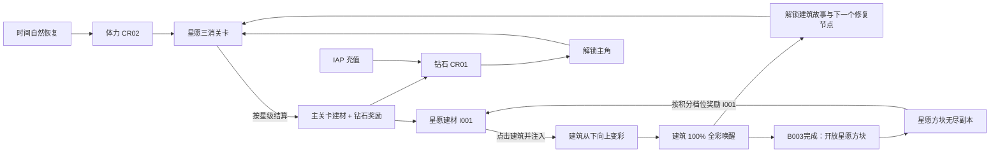
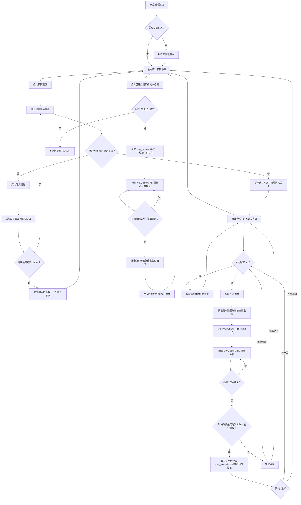

# 《星愿小镇》游戏核心玩法与系统策划案

> 版本定位：面向女性玩家、以“灰阶小镇重新着色”为核心包装的可爱竖屏三消关卡游戏。

## 项目概览

| 项目 | 定义 |
| --- | --- |
| 游戏名称 | 星愿小镇 |
| 游戏品类 | 竖屏三消关卡 + 小镇修复 |
| 玩家身份 | 星愿小镇镇长 |
| 核心目标 | 通关收集建材，为灰阶建筑上色并唤醒整座小镇 |
| 核心机制 | 限时积分三消、建筑由下至上的百分比上色、主角技能选择 |
| 副本玩法 | 星愿方块：无尽下落方块消行，按最终积分档位奖励建筑材料 |
| 核心资源 | 星愿建材（`I001`） |
| 主角系统 | 5 名可选主角；1 名无技能，4 名拥有固定技能 |
| 操作方式 | 单指点按与滑动（Tap & Drag） |
| 美术风格 | 可爱女性向 2D 绘本、Q 版角色、玩具屋式小镇、柔和糖果色 |
| 变现模式 | 无广告；钻石通过关卡星级奖励与 IAP 充值获得 |
| 发布平台 | 移动端竖屏 |
| 新手引导 | 需要；首次进入时使用 3 步轻引导 |

## 一、核心玩法与操作机制

### 1.1 基础操作框架

- 本作采用竖屏单指点按与滑动操作（Tap & Drag），专为单手休闲体验设计。
- 消除判定窗口为 `150ms`，拖拽连线与元素交换反馈时延小于 `50ms`，带来清爽丝滑的消除触感。

### 1.2 核心创新机制：灰阶小镇着色

**机制名称：** 小镇色彩唤醒系统（Color Revival System）。

#### 局外：小镇唤醒

- **灰阶小镇：** 星愿小镇初始为珍珠灰、浅雾粉与铅笔线稿构成的低饱和状态，象征小镇失去了愿望色彩。整体仍保持明亮可爱，不使用阴森、压抑或恐怖表达。
- **建材收集：** 玩家通过三消关卡获得唯一的建材资源“星愿建材”（`I001`）。
- **建筑点击与修缮弹窗：** 主界面读取 `buildings` 配置表展示建筑名称、修复顺序和前置关系。点击任意满足前置条件且未完工的建筑后，场景相机缓动拉近至目标建筑，同时弹出【建筑修缮弹窗】；弹窗内读取该建筑的建材消耗、注入进度和当前上色进度。
- **百分比垂直填充上色：** 玩家在弹窗中点击【注入建材】后，随着建造进度从 `0%` 提升至 `100%`，建筑在主界面与弹窗预览中均通过垂直动态遮罩，从最底部向上逐步恢复马卡龙色彩。例如，进度达到 `50%` 时，建筑下半部分恢复梦幻彩色并带有星光特效，上半部分仍为灰阶，直至 `100%` 完全焕发彩色光彩。
- **完成反馈：** 建筑达到 `100%` 后播放完成动画，解锁对应建筑故事、装饰展示与下一个待修复节点。建筑修复不提供局内数值、时间或积分加成。

### 1.3 局内关卡模式

#### 棋盘与基础消除

- **棋盘规格：** 标准关卡使用 `8 × 8` 棋盘。全局基础元素库包含星星糖、蝴蝶结糖、花朵糖、月亮糖、爱心糖和水晶糖，共 `6` 种元素。
- **关卡元素配置：** 每关通过 `element_types` 配置实际使用的元素列表，并通过 `element_type_count` 配置元素种类数。创建棋盘与补充新元素时，只能从该关的 `element_types` 中抽取；加载关卡时必须校验 `element_type_count == element_types.length`。
- **交换规则：** 玩家滑动一个元素，与上、下、左、右相邻元素交换。交换后能够形成三连及以上消除才视为有效操作；无效交换在 `0.2s` 内回弹。
- **连续下落：** 每次消除后，上方元素下落并补充新元素。若自动形成新的消除，继续结算连锁，直至棋盘稳定后再接受输入。
- **元素类型：** 元素库只包含关卡配置的基础元素，不生成炸弹、火箭、彩球等特殊元素。
- **无有效交换：** 不触发自动洗牌或重排，继续倒计时，玩家改换其他相邻元素即可。

#### 关卡时间

- 每关通过 `time_limit_sec` 配置基础局内时长，进入关卡并完成 `1.0s` 开场动画后开始倒计时；出战 C004 时在基础时长上增加 `30` 秒。
- 倒计时只在【暂停界面】打开时停止；元素交换、下落、连续消除和主角技能播放期间均继续计时。
- 剩余时间达到 `0` 时立即锁定新的输入。若已有一组消除正在结算，则完成该组消除及其连续下落计分后，再进入胜负判定。
- 提前达到 1 星、2 星或 3 星分数线均不会提前结束关卡，必须等待倒计时结束后统一结算。

#### 计分、胜负与评星

| 项目 | 规则 |
| --- | --- |
| 基础计分 | 每消除 `1` 个基础元素获得 `10` 分；C002 每个元素额外 `+1` 分 |
| 操作加分 | C003 出现单次操作多消除时额外 `+10` 分 |
| 计分来源 | 玩家交换、连续下落和主角技能造成的基础元素消除均按实际数量计分，符合 C003 条件的操作另加 `10` 分 |
| 总分公式 | `FinalScore = EliminatedElementCount × (10 + SkillScoreBonusPerElement) + OperationBonusScore` |
| 判定时机 | 当前关卡倒计时结束，且已触发的最后一组消除完成结算后 |
| 失败 | `FinalScore < EffectiveStar1Score`，不获得星级和通关奖励 |
| 1 星 | `EffectiveStar1Score ≤ FinalScore < EffectiveStar2Score` |
| 2 星 | `EffectiveStar2Score ≤ FinalScore < EffectiveStar3Score` |
| 3 星 | `FinalScore ≥ EffectiveStar3Score` |

每关的 `star_1_score`、`star_2_score` 和 `star_3_score` 均独立配置，且必须满足 `star_1_score < star_2_score < star_3_score`。出战 C005 时，三档分数线按技能参数降低并向下取整，得到 `EffectiveStar1Score`～`EffectiveStar3Score`；其他主角直接使用配置值。每个星级还分别配置星愿建材与钻石奖励；结算只发放本局最终星级对应的一档奖励，不累计叠加低星奖励。达到至少 1 星即通关；失败后只能选择【重新开始】或【返回选关】，重新开始视为新一局并再次消耗 `1` 点体力。

“单次操作多消除”指一次有效交换的完整结算过程中形成两组及以上消除，包含同一操作引发的连续下落连锁；C003 每次满足条件的操作只结算一次 `+10` 分。

#### 前三关配置示例

| 关卡 | 元素配置 | 时间 | 1 星：分数 / 建材 / 钻石 | 2 星：分数 / 建材 / 钻石 | 3 星：分数 / 建材 / 钻石 |
| --- | --- | ---: | --- | --- | --- |
| `L001` | 4 种：星星、蝴蝶结、花朵、爱心 | 30 秒 | 30 / 30 / 3 | 180 / 45 / 5 | 300 / 60 / 8 |
| `L002` | 5 种：星星、蝴蝶结、花朵、爱心、月亮 | 45 秒 | 300 / 40 / 4 | 500 / 60 / 7 | 700 / 80 / 10 |
| `L003` | 6 种：星星、蝴蝶结、花朵、爱心、月亮、水晶 | 60 秒 | 450 / 50 / 5 | 700 / 75 / 9 | 950 / 100 / 13 |

### 1.4 单关流程

1. 玩家以“星愿小镇镇长”的身份接取修复小镇的任务。
2. 每关消耗 `1` 点体力（`CR02`）进入消除关卡。
3. 系统读取关卡配置中的元素列表、元素种类数、基础局内时长和 1～3 星分数线，并应用当前主角对时间或星级要求的修正，生成本关棋盘并开始倒计时。
4. 玩家通过相邻交换和连续消除获得分数，已出战主角的技能按各自规则生效。
5. 倒计时结束后，根据最终分数匹配最高星级；达到 1 星即胜利，并发放该星级独立配置的星愿建材与钻石，否则失败。

### 1.5 资源循环



核心闭环：**挑战三消关卡 → 获得星愿建材 → 为建筑上色 → 解锁建筑故事与新修复节点 → 继续挑战后续关卡。**

### 1.6 数据存档机制（Save System）

- **存档节点：** 主关卡实时暂存分数、剩余时间与棋盘状态；星愿方块实时暂存积分、行数、连击、速度等级与棋盘状态。每次资源变动或建筑上色进度更新时即时本地加密存档。
- **订单与货币：** 钻石充值结果以平台订单校验为准。订单校验成功后再发放钻石，并使用订单号去重；取消、失败或重复订单均不发放。
- **本地数据：** 关卡进度、建材、货币和建筑上色进度在每次变动后即时存档；进入主界面与结算时额外写入一次完整快照。

### 1.7 副本玩法：星愿方块

#### 开放与入口

- **副本定位：** 《星愿小镇》的无尽下落方块玩法。玩家持续放置方块、消除整行并挑战更高积分，直到方块堆到顶部。
- **开放条件：** `B003` 观星塔修复完成后开放；入口由 `buildings` 配置表中的 `side_mode_unlock_ids` 字段驱动。
- **资源规则：** 副本不消耗 `CR02` 体力，不使用新的货币；结算奖励只发放 `I001` 星愿建材，不发放钻石。
- **主角规则：** 副本不读取 `selected_character_id`，不注册 C001～C005 的任何技能；C002 的加分、C003 的多消加分、C004 的时间加成和 C005 的星级减负均不在副本生效。
- **奖励规则：** 根据本局最终积分匹配 `score_reward_tiers`，只发放达到的最高积分档位对应的建筑材料数量，不叠加各档奖励；每次结束均可按本局积分领取，奖励不受次数限制。

#### 棋盘与操作

- **棋盘规格：** 竖屏 `8 × 16` 棋盘，方块由 `4` 个基础格组成；形状读取 `piece_types` 配置，使用 I、O、T、S、Z、J、L 七种基础方块，按 `seven_bag` 随机规则发放，避免长时间不出某种形状。
- **单指操作：** 左右滑动移动方块，向下滑动加速下落，点按棋盘旋转方块；方块落地后固定。
- **消行规则：** 一行被基础格完全填满后消除；同一次落块消除多行时按行数结算，连续落块均消行时追加连击分。
- **无特殊元素：** 副本不生成炸弹、火箭、彩球、怪物或障碍；方块本身是副本唯一操作对象。

#### 无尽进程与结束条件

- **持续进行：** 副本没有关卡倒计时和固定目标，玩家可持续下落方块，直到主动结束或棋盘无法生成下一块。
- **速度提升：** 每累计达到 `lines_per_speed_level` 行，速度等级提升 `1` 级；下落间隔按 `FallIntervalSec = max(minimum_fall_interval_sec, initial_fall_interval_sec - fall_interval_step_sec × (SpeedLevel - 1))` 计算，当前分别配置为 `10` 行、`0.12` 秒、`0.8` 秒和 `0.04` 秒，最高速度等级读取配置。
- **正常结束：** 玩家点击【结束本局】后，完成当前方块落地结算，再进入奖励结算。
- **堆顶结束：** 新方块无法在出生区生成时锁定棋盘，立即进入奖励结算；该局不进入失败界面。
- **异常退出：** 应用中断或闪退时保存当前未结算对局；再次进入星愿方块时从该棋盘继续，未生成 `settlement_id` 前不发放建材。

#### 积分与建筑材料奖励

- 单行、双行、三行、四行同时消除的基础分分别为 `80`、`200`、`350`、`600` 分。
- 连击分：连续落块均发生消行时，每次追加 `20` 分；未消行则连击归零。
- 局内累计积分记录在 `EndlessBlockContext.Score`；本局结束时冻结为 `EndlessBlockResult.FinalScore`，再读取 `score_reward_tiers`。
- 每次结束均按本局最终积分结算；未达到首档时本局奖励为 `0`，达到首档后可重复领取对应建材。

| 本局最终积分 | 本局发放建材 | 档位说明 |
| ---: | ---: | --- |
| `0～499` | `0` | 未达到首档，仍记录本局积分 |
| `500～999` | `5` | 星芽档 |
| `1000～1999` | `10` | 月光档 |
| `2000～3499` | `20` | 流光档 |
| `3500～4999` | `35` | 星河档 |
| `5000～7999` | `55` | 观星档 |
| `≥8000` | `80` | 星愿档 |

每局只领取积分达到的最高档位，不叠加其他档位；`EndlessBlockProfile.HighScore` 和最近一次结算结果即时存档。

#### 副本循环

`完成 B003 观星塔 → 进入星愿方块 → 持续下落与消行 → 主动结束或方块堆顶 → 按最终积分领取 I001 → 返回小镇修复建筑。`

## 二、视听表现与美术风格

### 2.1 视觉基调

- **受众与情绪：** 面向偏好治愈、装扮与收集体验的女性玩家。整体强调可爱、精致、柔软和明亮，不使用阴森怪诞、重度战斗或高压末日表达。
- **角色比例：** 主角采用 `2.5～3` 头身 Q 版比例，圆润轮廓、大眼睛和轻盈裙装；表情反馈活泼但不过度幼儿化。
- **小镇造型：** 建筑参考玩具屋、糖霜甜点与绘本花园，使用圆形窗、蝴蝶结雨棚、花朵招牌、星星灯串等女性向装饰细节。
- **灰阶未唤醒区：** 使用珍珠灰、雾粉灰和浅紫灰的彩色铅笔线稿，保留少量暖光与腮红色点缀，使未修复状态依然亲和可爱。
- **全彩唤醒区：** 使用樱花粉、珊瑚红、薄荷绿、奶油黄与薰衣草紫。色彩由下至上如糖浆般平滑填充，并伴随星屑、花瓣和丝带粒子。
- **UI 材质：** 白色珐琅、半透明果冻、软糖按钮与金色细边，图标采用贴纸式高光；避免大面积深色面板和厚重金属质感。
- **美术风格：** 可爱女性向 2D 绘本手绘，兼顾商业手游所需的清晰层级与可读性。

### 2.2 音频设计规范（Audio Design）

| 场景 | 设计规范 | 资源文件 |
| --- | --- | --- |
| 主界面 BGM | 舒缓治愈的八音盒与轻柔钢琴曲，`105 BPM`；小镇修复进度提升时叠加小提琴与木琴声部 | 待定 |
| 建造/上色 | 液体流淌与星花绽放的魔法叮当声 | `building_color_up.wav` |
| UI 按钮 | 清脆的水滴星光音 | `ui_star_click.wav` |
| 失败/警告 | 温和柔和的木质低音提醒 | `ui_error_soft.wav` |
| 基础消除 | 清脆的星光叮当声 | `pop_star.wav` |
| Combo 连击 | 音调逐级升高的魔法音阶 | `star_combo_01.wav`～`star_combo_08.wav` |

## 三、核心界面与交互逻辑（UI/UX）

### 3.0 通用视觉与资产输出规范

以下规范适用于本节全部高保真界面提示词：

- 画面采用可爱女性向 2D 绘本风格，以樱花粉、珊瑚红、薄荷绿、奶油黄和薰衣草紫为主色；角色与装饰使用圆润轮廓、贴纸高光、花朵、蝴蝶结和星星元素。
- 先输出完整竖屏 UI 效果图，再额外输出 `1` 张无 UI 的场景纯净底图，以及 `1` 张保持原位坐标的透明底或纯白底 UI 资产图。
- UI 资产图移除普通数字 `0～9`，保留独立艺术标题字；面板、按钮、图标和功能组之间保留安全裁切间距，不重叠、不连体。
- 所有资产保留完整材质、描边和光影，边缘清晰，无背景残留、溢色或半透明毛边。

### 3.1 主界面

| 属性 | 说明 |
| --- | --- |
| 界面类型 | 独立全屏界面，游戏外枢纽与灰阶小镇 |
| 视口布局 | 顶部状态栏 `10%`；小镇与建筑区 `65%`；底部操作区 `25%` |
| 层级与遮罩 | `Z-Order: 100`；底层主 UI，无遮罩 |

#### 高保真界面生成提示词

```text
A cute female-oriented mobile game main screen in a polished 2D storybook style. Show a bright dollhouse-like wish town with five clearly readable buildings: the pearl-gray '星愿喷泉', '星光花房', '观星塔', '甜心面包屋' and '蝴蝶结礼服店'. Use rounded candy roofs, flower windows, ribbon awnings, cherry pink, coral, mint, cream yellow and lavender with white enamel and jelly UI materials. Place the Chinese logo '星愿小镇' at the top center, a settings icon at top left, diamond and stamina counters at top right. Keep all five buildings visible as the central visual focus, with restored lower sections shown in color and unfinished upper sections in pearl-gray. Place a large pink '开始游戏' button at bottom center. Vertical mobile layout, soft daylight, cute refined atmosphere, clear commercial game UI hierarchy.
```

#### 文本线框图

```text
+----------------------------------------+
| [设置]           [钻石: 999] [体力: 5] |
|                                        |
|             【 星愿小镇 】             |
|                                        |
|     +----------------------------+     |
|     | (点击未完工建筑唤醒弹窗)   |     |
|     |   [灰阶建筑: 喷泉 花房 塔] |     |
|     | [面包屋] [礼服店] (共5座)  |     |
|     | ~~~~~~~~~~~~~~~~~~~~~~~~~~ |     |
|     |   (底部已注入上色 50%)     |     |
|     +----------------------------+     |
|                                        |
|                [开始游戏]              |
|                                        |
|                                        |
+----------------------------------------+
```

#### 组件刷新规则

- **建筑地图显示：** 读取 `buildings` 配置表生成建筑列表，按 `repair_order` 沿小镇主路陈列；每座建筑绑定 `TownBuilding.Progress`，根据进度插值显示垂直渲染遮罩，并按 `prerequisite_building_id` 显示前置锁定状态。
- **副本入口标记：** 当建筑的 `side_mode_unlock_ids` 不为空且建筑进度达到 `100%` 时，在建筑上显示【星愿方块】入口标记；入口名称与积分奖励档位读取 `side_modes` 配置表。
- **钻石与体力文本：** 绑定 `PlayerProfile`，监听事件并即时刷新。

#### 交互事件

- **未完工灰阶建筑：** Tap。点击 `buildings` 配置表中未达到 `100%` 且满足前置条件的建筑，播放相机聚焦镜头动画，并在 `Z-Order: 350` 唤出【建筑修缮弹窗】。
- **已开放副本建筑：** Tap。点击已完成且配置了 `side_mode_unlock_ids` 的建筑，直接打开对应副本；当前版本由 `B003` 开放【星愿方块】无尽模式。
- **开始游戏：** Tap。按下后在 `0.1s` 内缩放至 `0.95`，抬起后跳转至【选关界面】；处于 `Step_101` 时直接扣除 `1` 点体力并进入教学关 `L001`。

### 3.2 建筑修缮弹窗

| 属性 | 说明 |
| --- | --- |
| 界面类型 | 覆盖型弹窗，父级为主界面；核心上色交互 |
| 视口布局 | Center 居中，占屏幕 `75% × 60%` |
| 层级与遮罩 | `Z-Order: 350`；`Mask Alpha = 0.6`；点击遮罩空白区域可关闭 |

#### 高保真界面生成提示词

```text
A cute female-oriented building restoration popup for a 2D storybook mobile game. Use a translucent lavender mask and a white enamel panel decorated with tiny flowers, ribbons and gold star trim. The Chinese title is '建筑修缮'. Center a dollhouse building preview with the bottom 40% restored in candy colors and the top 60% in soft pearl-gray pencil line art. Show '上色进度 40%' and '持有星愿建材 x150'. Place two clear jelly-pink buttons '注入建材' and '一键注入' at the bottom. Soft sparkles, cozy handcrafted detail, clean vertical composition.
```

#### 文本线框图

```text
+----------------------------------------+
|########################################|
|##      +----------------------+      ##|
|##      |  修缮: 【星愿喷泉】  |      ##|
|##      |                      |      ##|
|##      |  +----------------+  |      ##|
|##      |  | (顶层60% 灰阶) |  |      ##|
|##      |  |~~~~~~~~~~~~~~~ |  |      ##|
|##      |  | (底层40% 彩色) |  |      ##|
|##      |  +----------------+  |      ##|
|##      |   上色进度: [40%]    |      ##|
|##      |   需要建材: 150      |      ##|
|##      |   拥有建材: 150      |      ##|
|##      |                      |      ##|
|##      |     [一键注入]       |      ##|
|##      +----------------------+      ##|
|########################################|
+----------------------------------------+
```

#### 组件刷新规则

- **建筑配置与进度：** 打开弹窗时读取 `buildings` 中当前建筑的 `total_material_cost`、`material_cost_per_injection`、`progress_per_injection` 和 `prerequisite_building_id`；运行时进度存入 `BuildingData.CurrentProgress`。
- **进度条与百分比文本：** 绑定 `BuildingData.CurrentProgress`。注入建材后，在 `0.8s` 内采用贝塞尔缓动插值由当前值推移至新值（Lerp），同时同步提升进度条填充度。
- **建材持有量文本：** 绑定 `PlayerProfile.Item_I001`，扣减时播放数字滚动变化。
- **建筑预览垂直色彩遮罩：** 绑定 `BuildingData.CurrentProgress`，预览图内部 Shader 遮罩实时更新 `Y` 轴切割高度。

#### 交互事件

- **注入建材：** Tap。读取当前建筑的 `material_cost_per_injection`，校验 `Item_I001 >= material_cost_per_injection`。
  - 成功：扣除指定建材，播放 `building_color_up.wav` 与金色星光粒子；建筑预览与主界面实体同步在 `0.8s` 内向上填充颜色。若达到 `100%`，触发“全彩唤醒庆祝”动画，并展示已解锁的建筑故事与下一个修复节点。
  - 失败：触发 Toast“星愿建材不足，快去通关获取吧！”，按钮横向震动 `0.2s`。
- **一键注入：** Tap。校验 `Item_I001 > 0`，将玩家持有的建材最大化注入至当前建筑进度上限，并播放平滑连续的上色特效。

### 3.3 核心战斗界面

| 属性 | 说明 |
| --- | --- |
| 界面类型 | 独立全屏界面，局内底层 |
| 视口布局 | 顶部 `12%`；棋盘核心 `68%`；底部主角状态 `20%` |
| 层级与遮罩 | `Z-Order: 200`；无遮罩 |

#### 高保真界面生成提示词

```text
A cute female-oriented timed match-3 level screen in a polished 2D storybook style, vertical mobile layout. Use a bright candy garden background with flowers, ribbons and tiny star lights. At the top place a pause icon on the left, Chinese timer '剩余时间 45秒' in the center, and live score '分数 320' on the right. Below it show a compact three-star progress bar with score markers '1星 300', '2星 500', '3星 700'. The center contains a stable 8x8 board using exactly five basic candy piece types for this level: stars, bows, flowers, hearts and moons. Place the selected protagonist portrait beside the board with a small Chinese skill-status label. Cherry pink, coral, mint, cream yellow and lavender palette, white enamel and jelly UI materials, highly readable commercial mobile game interface.
```

#### 文本线框图

```text
+----------------------------------------+
| [暂停]       时间: 45s       分数: 320 |
|   1星:300    2星:500    3星:700        |
|   +--------------------------------+   |
|   | [★]  [○]  [♦]  [★]  [○]  [♦]   |   |
|   | [♦]  [★]  [○]  [♦]  [★]  [○]   |   |
|   | [○]  [♦]  [★]  [○]  [♦]  [★]   |   |
|   | [★]  [○]  [♦]  [★]  [○]  [♦]   |   |
|   | [♦]  [★]  [○]  [♦]  [★]  [○]   |   |
|   | [○]  [♦]  [★]  [○]  [♦]  [★]   |   |
|   +--------------------------------+   |
|                                        |
| [主角: 莉莉]  [技能: 无技能]           |
+----------------------------------------+
```

#### 组件刷新规则

- **倒计时：** 绑定 `BattleContext.RemainingTimeSec`，以 `0.1s` 精度更新，界面显示向上取整后的整数秒；基础值读取 `time_limit_sec`，出战 C004 时加 `30` 秒；剩余 `10` 秒时切换为珊瑚红并每秒轻跳一次。
- **分数文本：** 绑定 `BattleContext.Score`，每次基础元素被消除后立即累计，并在 `0.2s` 内滚动至新值。
- **星级进度条：** 界面开启时读取 `star_1_score`、`star_2_score` 和 `star_3_score`；出战 C005 时按 `star_score_discount_percent` 计算有效分数线；实时按当前分数点亮已达到的星级，但不提前结束关卡。
- **元素集合：** 创建棋盘前读取 `element_types` 与 `element_type_count`，仅加载并投放列表内的元素；两者数量不一致时阻止进入并记录配置错误。
- **主角状态：** 绑定 `PlayerProfile.SelectedCharacterId`，开局读取主角技能并显示技能名称；无技能主角显示“无技能”。
- **棋盘：** 仅在所有下落与连续消除结算结束后恢复可交互状态；时间归零后保持锁定。

#### 交互事件

- **暂停：** Tap。无需校验，触发暂停并弹出【暂停界面】。
- **元素交换：** Swipe。仅允许与正交相邻元素交换；有效消除后进入下落结算，无效交换在 `0.2s` 内回弹。

### 3.4 暂停界面

| 属性 | 说明 |
| --- | --- |
| 界面类型 | 覆盖型弹窗，父级为战斗界面 |
| 视口布局 | Center 居中，占屏幕 `60% × 40%` |
| 层级与遮罩 | `Z-Order: 400`；`Mask Alpha = 0.6`；不可点击遮罩关闭 |
| 刷新规则 | 按 `BattleContext.ModeType` 切换退出按钮文案与行为 |

#### 高保真界面生成提示词

```text
A cute female-oriented pause popup for the vertical 2D storybook mobile game '星愿小镇'. Use a translucent lavender mask and a white enamel panel decorated with ribbons, flowers and tiny gold stars. The Chinese title is '游戏暂停'. Place two large jelly buttons vertically: '继续游戏' and a mode-dependent exit button. In a match-3 level it reads '返回主界面'; in '星愿方块' it reads '结束并结算'. Keep the underlying match-3 or falling-block board softly visible, with a clean, gentle and highly readable composition.
```

#### 文本线框图

```text
+----------------------------------------+
|########################################|
|##      +----------------------+      ##|
|##      |       游戏暂停       |      ##|
|##      |                      |      ##|
|##      |      [ 继续游戏 ]    |      ##|
|##      |                      |      ##|
|##      |   [返回/结束并结算]  |      ##|
|##      +----------------------+      ##|
|########################################|
+----------------------------------------+
```

#### 交互事件

- **继续游戏：** Tap。关闭弹窗；主关卡恢复倒计时，星愿方块恢复当前速度等级的自动下落。
- **返回主界面 / 结束并结算：** Tap。主关卡显示【返回主界面】，确认后销毁本局且不发奖励；星愿方块显示【结束并结算】，确认后将当前块自动直落并完成消行，再进入【星愿方块结算界面】。

### 3.5 设置界面

| 属性 | 说明 |
| --- | --- |
| 界面类型 | 覆盖型弹窗，父级为主界面或暂停界面 |
| 视口布局 | Center 居中，占屏幕 `60% × 40%` |
| 层级与遮罩 | `Z-Order: 450`；`Mask Alpha = 0.6`；点击遮罩可关闭 |

#### 高保真界面生成提示词

```text
A cute female-oriented settings popup for a vertical 2D storybook mobile game. Use a translucent lavender mask and a white enamel jewelry-box panel with flower corners, ribbon dividers and small gold stars. Show the Chinese title '游戏设置', two clear jelly toggle switches labeled '背景音乐' and '音效开关', and a coral-pink button '关闭' at the bottom. Cherry pink, mint and lavender accents, soft daylight, clean readable layout.
```

#### 文本线框图

```text
+----------------------------------------+
|########################################|
|##      +----------------------+      ##|
|##      |       游戏设置       |      ##|
|##      |                      |      ##|
|##      |  背景音乐:   [ ON ]  |      ##|
|##      |  音效开关:   [ ON ]  |      ##|
|##      |                      |      ##|
|##      |        [ 关闭 ]      |      ##|
|##      +----------------------+      ##|
|########################################|
+----------------------------------------+
```

#### 组件刷新规则

- **开关文本：** 实时切换 `ON` / `OFF`。

#### 交互事件

- **音乐开关：** Tap。翻转静音状态，并修改音频控制器。

### 3.6 选关界面

| 属性 | 说明 |
| --- | --- |
| 界面类型 | 独立全屏界面，父级为主界面 |
| 视口布局 | 顶部 `10%`；地图区 `78%`；当前主角条 `12%` |
| 层级与遮罩 | `Z-Order: 250`；无遮罩 |

#### 高保真界面生成提示词

```text
A cute female-oriented level map for a vertical 2D storybook mobile game. Show a winding ribbon path through a dollhouse-like wish town with flower shops, tiny bridges, candy roofs and star lanterns. Use pearl-gray buildings in locked areas and colorful restored buildings in completed areas. Place the Chinese back button '返回' at top left, title '星愿关卡' at top center, stamina at top right, and numbered nodes '关卡 1', '关卡 2', '关卡 3' with clear three-star ratings. At the bottom add a compact current-protagonist strip with five small cards '莉莉、艾拉、芙萝、贝拉、诺拉', showing locked, owned and selected states within the level map. Cherry pink, coral, mint, cream yellow and lavender palette, soft daylight, elegant readable spacing.
```

#### 文本线框图

```text
+----------------------------------------+
| < 返回                  【星愿关卡】   |
|                                        |
|          (o) 关卡 3 [☆☆☆]              |
|             \                          |
|              \                         |
|               (o) 关卡 2 [☆☆☆]         |
|              /                         |
|             /                          |
|          (●) 关卡 1 [★★☆] (当前)       |
| 当前主角: [莉莉] [艾拉] [芙萝] [贝拉]  |
|             [诺拉]                     |
+----------------------------------------+
```

#### 组件刷新规则

- **星级：** 根据通关历史点亮。
- **当前主角条：** 读取 `characters` 中的 `C001～C005`，显示拥有、锁定和当前出战状态；点击已拥有角色直接更新 `selected_character_id`，锁定角色显示解锁所需钻石。
- **副本入口：** 读取已完成建筑的 `side_mode_unlock_ids`；B003 完成后只显示一个【星愿方块】入口，不生成副本关卡节点。

#### 交互事件

- **关卡节点：** Tap。校验关卡已解锁且体力 `≥ 1`，通过后扣除体力并进入战斗。
- **主角卡：** Tap。已拥有角色可在进入下一关前切换出战；锁定角色点击后校验钻石并完成永久解锁，解锁结果即时存档。
- **星愿方块入口：** Tap。校验 `SB001` 已由 `B003` 解锁后直接进入无尽副本；不读取或切换主角，不扣除体力。

### 3.7 结算界面

| 属性 | 说明 |
| --- | --- |
| 界面类型 | 覆盖型弹窗，父级为战斗界面；星级奖励结算 |
| 视口布局 | Center 居中，占屏幕 `65% × 50%` |
| 层级与遮罩 | `Z-Order: 500`；`Mask Alpha = 0.6`；不可点击遮罩关闭 |

#### 高保真界面生成提示词

```text
A cheerful female-oriented victory popup for a vertical 2D storybook match-3 game. Use a translucent lavender mask and a white enamel celebration panel with ribbons, flowers, gold stars and soft confetti. The Chinese title is '关卡完成！'. Show three large star-rating icons, the final score, and the current star tier rewards '星愿建材 x60' and '钻石 x7'. Place two jelly buttons at the bottom: primary coral-pink '下一关' and secondary mint '回到小镇'. Cute, refined, bright and highly readable.
```

#### 文本线框图

```text
+----------------------------------------+
|########################################|
|##      +----------------------+      ##|
|##      |       关卡完成！     |      ##|
|##      |       [★] [★] [☆]    |      ##|
|##      |      最终分数: 520   |      ##|
|##      |                      |      ##|
|##      | 本档奖励:            |      ##|
|##      | 建材 x60 / 钻石 x7   |      ##|
|##      |                      |      ##|
|##      | [下一关] [回到小镇]  |      ##|
|##      +----------------------+      ##|
|########################################|
+----------------------------------------+
```

#### 组件刷新规则

- **最终分数：** 绑定 `BattleResult.FinalScore`，弹窗打开后在 `0.5s` 内从 `0` 滚动至最终值。
- **星星动画：** 本界面仅用于主关卡，读取 `levels` 的三档 `star_*_score`；出战 C005 时应用技能修正。
- **奖励明细：** 读取当前主关卡 `levels.star_rewards`，只显示并发放最终星级对应的一档奖励；星愿方块使用独立的【星愿方块结算界面】。
- **奖励入库：** 主关卡创建结算结果时立即原子发放建材与钻石，并使用本局 `settlement_id` 去重；弹窗按钮只负责跳转，不重复发奖。

#### 交互事件

- **下一关：** Tap。校验下一关已解锁且体力 `≥ 1`，满足时扣除体力并进入下一关。
- **回到小镇：** Tap。返回【主界面】，方便玩家继续修复建筑。

### 3.8 失败界面

| 属性 | 说明 |
| --- | --- |
| 界面类型 | 覆盖型弹窗，父级为战斗界面 |
| 视口布局 | Center 居中，占屏幕 `65% × 50%` |
| 层级与遮罩 | `Z-Order: 500`；`Mask Alpha = 0.6` |

#### 高保真界面生成提示词

```text
A gentle female-oriented defeat popup for a vertical 2D storybook match-3 game. Use a translucent lavender mask and a cream paper panel with a slightly wilted flower, sleepy star stickers and soft coral accents. The Chinese title is '挑战失败', with subtext '时间结束，未达到一星分数'. Show the final score and the one-star target score, plus two clear jelly buttons: primary coral-pink '重新开始' and secondary white '返回选关'. Do not show advertisements, video icons or revival offers. Cute, calm and encouraging rather than punishing.
```

#### 文本线框图

```text
+----------------------------------------+
|########################################|
|##      +----------------------+      ##|
|##      |       挑战失败       |      ##|
|##      |  时间结束，未达到一星|      ##|
|##      |  分数: 20 / 一星: 30 |      ##|
|##      |                      |      ##|
|##      |      [ 重新开始 ]    |      ##|
|##      |      [ 返回选关 ]    |      ##|
|##      +----------------------+      ##|
|########################################|
+----------------------------------------+
```

#### 组件刷新规则

- **分数对比：** 最终分数绑定 `BattleResult.FinalScore`；一星要求读取主关卡的有效 `EffectiveStar1Score`，弹窗打开时一次性刷新。星愿方块堆顶或主动结束均不进入失败界面。

#### 交互事件

- **重新开始：** Tap。校验体力 `≥ 1`，满足时扣除 `1` 点体力并重新载入当前主关卡。
- **返回选关：** Tap。结束当前对局，不发放通关奖励，并返回【选关界面】。

### 3.9 星愿方块无尽模式界面

| 属性 | 说明 |
| --- | --- |
| 界面类型 | 独立全屏界面，由 B003 建筑交互进入 |
| 视口布局 | 顶部状态栏 `13%`；棋盘区 `72%`；操作区 `15%` |
| 层级与遮罩 | `Z-Order: 220`；无遮罩 |

#### 高保真界面生成提示词

```text
A cute female-oriented endless falling-block screen for the vertical 2D storybook mobile game '星愿小镇'. Set it inside a bright restored observatory with lavender night windows, soft star lamps, ribbons and candy-colored accents. Place a pause icon at top left and the Chinese title '星愿方块' at top center. Show a compact live HUD with '分数 1320', '速度 5', '行数 38' and '连击 2', plus one next-piece preview, the next reward threshold and today's material progress. Center a tall 8x16 playfield containing clean four-cell geometric blocks in cherry pink, mint, cream yellow and lavender; use no monsters, power pieces, timers, level goals or star ratings. Add a small coral '结束本局' command and subtle gesture icons for move, rotate and fast drop. Use white enamel and jelly UI materials, clear hierarchy, refined commercial casual-game finish.
```

#### 文本线框图

```text
+----------------------------------------+
| [暂停]          【星愿方块】           |
| 分数:1320  速度:5  行数:38  连击:2     |
| 下一块:[■]  下一档:2000分/20建材       |
|   +----------------------------+       |
|   |            [■]             |       |
|   |         [■][■][■]          |       |
|   |                            |       |
|   |          方块下落区        |       |
|   |                            |       |
|   |   [■][■][■][■]             |       |
|   +----------------------------+       |
| 左右滑动移动  点按旋转  下滑加速       |
| [结束本局]        不带入主角技能       |
+----------------------------------------+
```

#### 组件刷新规则

- **副本配置：** 进入界面时按 `mode_id = SB001` 读取 `side_modes` 的棋盘规格、方块类型、`seven_bag` 随机规则、预览块数量、下落速度、速度上限、消行得分和积分奖励档位；不读取关卡时长、星级或主角配置。
- **分数文本：** 绑定 `EndlessBlockContext.Score`，每次消行与连击结算后在 `0.2s` 内滚动至新值。
- **下一块预览：** 按 `preview_piece_count` 显示待生成方块；当前值为 `1`，仅用于预判，不允许暂存或交换方块。
- **速度等级：** 绑定 `EndlessBlockContext.SpeedLevel`；每累计达到配置的 `lines_per_speed_level` 行后提升一级，并按配置缩短自动下落间隔。
- **行数与连击：** 分别绑定 `EndlessBlockContext.ClearedLines` 和 `ComboChainCount`；当前落块未消行时连击立即归零。
- **奖励档位预览：** 根据当前积分实时显示已达到的最高建材档位和下一档所需积分；该提示只预览，不在局内发奖。
- **棋盘：** 绑定 `EndlessBlockContext.BoardState`；新方块无法在出生区生成时锁定输入，并跳转至【星愿方块结算界面】。

#### 交互事件

- **左右移动：** Swipe。校验方块横向移动后不越过棋盘边界且不与已固定方块重叠；成功后播放 `0.08s` 位移动画，失败时轻微回弹。
- **旋转方块：** Tap。校验旋转后的方块不越过边界且不与已固定方块重叠；成功后播放 `0.1s` 旋转动画，失败时保持原方向。
- **快速下落：** Swipe Down。按住下滑期间提高下落速度，松手后恢复当前速度等级的自动下落间隔；不直接改变分数。
- **暂停：** Tap。打开【暂停界面】并停止方块自动下落；返回后从当前棋盘状态继续。
- **结束本局：** Tap。二次确认后等待当前方块完成落地与消行结算，随后进入【星愿方块结算界面】；取消确认则继续本局。

### 3.10 星愿方块结算界面

| 属性 | 说明 |
| --- | --- |
| 界面类型 | 覆盖型弹窗，父级为星愿方块界面；积分档位结算 |
| 视口布局 | Center 居中，占屏幕 `72% × 58%` |
| 层级与遮罩 | `Z-Order: 500`；`Mask Alpha = 0.6`；不可点击遮罩关闭 |

#### 高保真界面生成提示词

```text
A polished female-oriented endless-mode result popup for the vertical 2D storybook game '星愿小镇'. Use a translucent lavender mask and a white enamel observatory panel with tiny stars, ribbons and soft confetti. The Chinese title is '本局结束'. Show '最终积分 3560', '消除行数 76', '最高速度 8' and a highlighted reward row '星愿建材 x35'. Do not show stars, diamonds, failure wording, ads or character skills. Place two clear jelly buttons at the bottom: coral-pink '再来一局' and mint '回到小镇'. Cute, calm, rewarding and highly readable.
```

#### 文本线框图

```text
+----------------------------------------+
|########################################|
|##      +----------------------+      ##|
|##      |       本局结束       |      ##|
|##      |   最终积分: 3560     |      ##|
|##      |   消除行数: 76       |      ##|
|##      |   最高速度: 8        |      ##|
|##      |                      |      ##|
|##      |   星愿建材: x35      |      ##|
|##      |                      |      ##|
|##      | [再来一局][回到小镇] |      ##|
|##      +----------------------+      ##|
|########################################|
+----------------------------------------+
```

#### 组件刷新规则

- **对局统计：** 最终积分、消除行数和最高速度分别绑定 `EndlessBlockResult.FinalScore`、`ClearedLines` 与 `HighestSpeedLevel`；同时更新历史最高积分。
- **档位匹配：** 在 `score_reward_tiers` 中筛选 `FinalScore >= score_threshold` 的档位，只取分数门槛最高的一档；未达到首档时本局奖励为 `0`。
- **建材奖励：** 只发放匹配档位的 `building_material_amount`，不发放钻石且不叠加低档奖励；每局结算都可正常发放。
- **奖励入库：** 创建结算结果时使用本局 `settlement_id` 原子发放并去重；按钮只负责跳转，不重复发奖。

#### 交互事件

- **再来一局：** Tap。重置副本棋盘、积分、行数、连击和速度等级，重新载入 `SB001`；不扣除体力，可重复挑战并领取对应建材。
- **回到小镇：** Tap。返回【主界面】，刷新 `I001` 持有量和历史最高积分。

## 四、主角、建筑与资源

### 4.1 五名主角

#### C001：星愿精灵·莉莉

- **解锁状态：** 初始拥有，解锁费用 `0` 钻石。
- **外观：** 樱花粉层叠短裙、蝴蝶结星芒发饰和金色星星魔法棒。
- **技能：** 无。
- **定位：** 无额外规则的标准主角，用于新手熟悉基础三消与计分。

#### C002：晨曦少女·艾拉

- **解锁费用：** `100` 钻石。
- **外观：** 奶油黄短斗篷、珊瑚粉贝雷帽和太阳花胸针。
- **技能 ID：** `SK_C002`
- **技能名称：** 额外+1分。
- **技能效果：** 每消除 `1` 个基础元素额外获得 `1` 分，交换消除、连续下落和其他主角技能造成的消除均生效；不改变星级分数线。

#### C003：花园精灵·芙萝

- **解锁费用：** `200` 钻石。
- **外观：** 薄荷绿花瓣裙、白色园艺手套和雏菊发箍。
- **技能 ID：** `SK_C003`
- **技能名称：** 多消加分。
- **技能效果：** 每次有效操作在完整结算中形成两组及以上消除（包含连锁）时，额外获得 `10` 分；同一次操作只加分一次。

#### C004：甜点工匠·贝拉

- **解锁费用：** `300` 钻石。
- **外观：** 草莓奶油围裙、巧克力色短发和糖霜工具包。
- **技能 ID：** `SK_C004`
- **技能名称：** 时光加长。
- **技能效果：** 每局开始时，在关卡配置的 `time_limit_sec` 基础上额外增加 `30` 秒。

#### C005：星光舞者·诺拉

- **解锁费用：** `500` 钻石。
- **外观：** 薰衣草紫舞裙、银色星链和月牙舞鞋。
- **技能 ID：** `SK_C005`
- **技能名称：** 星级减负。
- **技能效果：** 当前关卡三档星级分数要求降低 `10%`，结果向下取整后用于胜负和评星判定；奖励档位不变。

### 4.2 解锁与出战规则

- 玩家同时只能选择 `1` 名主角出战，字段为 `selected_character_id`。
- `C001` 默认拥有；`C002～C005` 使用钻石永久解锁，解锁费用读取各自主角配置。
- 四个技能均为固定数值，不升级、不叠加，也不修改关卡元素种类数和星级分数线；选关界面底部的主角条负责切换与解锁。
- 更换主角只在下一次进入关卡时生效，不影响正在进行的对局。

### 4.3 建筑

以下条目与 JSON 的 `buildings` 配置表保持一致，运行时以配置表字段为唯一数值来源；本节文字仅用于说明建筑主题与完成反馈。

#### B001：星愿喷泉

- **修复规则：** 总计消耗 `100` 星愿建材；每次注入 `25`，增加 `25%` 进度。
- **完成结果：** 解锁喷泉故事卡与 `B002`，不提供局内加成。

#### B002：星光花房

- **修复规则：** 总计消耗 `150` 星愿建材；每次注入 `30`，增加 `20%` 进度。
- **完成结果：** 解锁花房故事卡与 `B003`，不提供局内加成。

#### B003：观星塔

- **修复规则：** 总计消耗 `225` 星愿建材；每次注入 `45`，增加 `20%` 进度。
- **完成结果：** 解锁观星塔故事卡与 `B004`，同时开放 `SB001` 星愿方块无尽副本，不提供局内数值加成。

#### B004：甜心面包屋

- **修复规则：** 总计消耗 `300` 星愿建材；每次注入 `60`，增加 `20%` 进度，共需 `5` 次注入。
- **完成结果：** 解锁面包屋故事卡与 `B005`，不提供局内加成。

#### B005：蝴蝶结礼服店

- **修复规则：** 总计消耗 `400` 星愿建材；每次注入 `80`，增加 `20%` 进度，共需 `5` 次注入；前置建筑为 `B004`。
- **完成结果：** 解锁礼服店故事卡与小镇终章展示，不提供局内加成。

### 4.4 货币与资源

| 唯一 ID | 名称 | 功能描述 | 获取途径 |
| --- | --- | --- | --- |
| `CR01` | 钻石 | 解锁主角 | 关卡星级奖励、IAP 充值 |
| `CR02` | 体力 | 挑战关卡时消耗；上限 `5` 点，每 `10` 分钟恢复 `1` 点 | 时间自然恢复 |
| `I001` | 星愿建材 | 注入建筑并提升上色进度 | 关卡星级奖励、星愿方块积分档位 |

### 4.5 核心美术资产设定集提示词

```text
A high-quality female-oriented game asset sheet for the cute 2D storybook mobile game '星愿小镇', arranged in a precise adaptive grid on a pure white background. Use cherry pink, coral, mint, cream yellow and lavender, with rounded silhouettes, sticker highlights, white enamel, translucent candy glass and delicate gold star trim. Include five full-body 2.5-head-tall chibi heroines in separate cells: '星愿精灵·莉莉' in a layered pink ribbon dress, '晨曦少女·艾拉' in a cream-yellow cape and coral beret, '花园精灵·芙萝' in a mint flower-petal dress, '甜点工匠·贝拉' in a strawberry-cream apron, and '星光舞者·诺拉' in a lavender dance dress. Also include the dollhouse buildings '星愿喷泉', '星光花房', '观星塔', '甜心面包屋' and '蝴蝶结礼服店' in unfinished and restored forms, plus icons for '钻石' and '星愿建材'. Keep every asset in its own independent black-framed cell with extra-wide cutting margins. No overlap, connected objects, cropped silhouettes, text labels, blur, color spill or semi-transparent fringe.
```

## 五、新手引导流程（Onboarding & Tutorial）

### 5.1 触发与进度

- **触发条件：** 首次完成资源加载并进入主界面（`OnMainSceneLoaded`），且 `tutorial_step_id == 0` 时触发。
- **进度存储：** 使用 `tutorial_step_id` 记录当前步骤。每完成一步立即存档；中途退出后从当前步骤重新显示，不回退已完成步骤。

### 5.2 视觉表现与遮罩

- **全局遮罩：** `Alpha = 0.55` 的深紫半透明遮罩，拦截非目标区域点击。
- **高亮指示：** 目标控件完全镂空，显示 `0.5s` 周期的手指缩放动画 `hand_pointer.prefab`。
- **提示原则：** 每步只显示一句不超过 `18` 个汉字的提示；玩法规则通过首次关卡中的手指高亮完成。

### 5.3 三步轻引导

1. **`Step_101`：开始第一关**
   - **目标：** 主界面【开始游戏】按钮。
   - **提示：** “先去收集星愿建材吧！”
   - **流转：** 点击后跳过选关页，直接进入教学关 `L001`，并将 `tutorial_step_id` 更新为 `102`。
2. **`Step_102`：完成一次三消**
   - **目标：** 棋盘预设的两个相邻元素。
   - **提示：** “滑动交换，连起三个星星！”
   - **流转：** 玩家按指示滑动后至少获得 `30` 分，完成一星要求；随后关闭强制遮罩，让玩家自由消除至 `30` 秒倒计时结束。结算至少发放 `30` 星愿建材与 `3` 钻石，返回主界面时自动打开 `B001` 的【建筑修缮弹窗】，并将 `tutorial_step_id` 更新为 `103`。
3. **`Step_103`：为建筑上色**
   - **目标：** 【建筑修缮弹窗】内的【注入建材】按钮。
   - **提示：** “注入建材，让喷泉变漂亮！”
   - **流转：** 扣除 `25` 星愿建材并播放 `0.8s` 上色动画，将 `B001` 进度提升至 `25%`；关闭引导遮罩并设置 `tutorial_step_id = 999`。

### 5.4 跳过与异常处理

- **跳过机制：** 三步引导期间右上角常驻【跳过引导】。点击后将 `tutorial_step_id` 设为 `999`，不额外修改关卡、建材或建筑进度。
- **防卡死：** 目标控件在 `2.0s` 内未成功加载时，关闭当前遮罩并记录异常；玩家可继续正常操作，下一次进入对应界面时再尝试显示该步。连续失败 `2` 次后自动将该步标记为完成。

## 六、商业化设计

### 6.1 纯 IAP 付费点

游戏不接入 IAA，不包含激励视频、插屏广告、Banner、看广告复活或广告双倍奖励。

| SKU | 定价 | 内容 |
| --- | ---: | --- |
| `SKU_DIA_060` | ¥6 | 钻石（`CR01`）×60 |
| `SKU_DIA_330` | ¥30 | 钻石（`CR01`）×330 |
| `SKU_DIA_720` | ¥68 | 钻石（`CR01`）×720 |

钻石仅用于永久解锁主角，不直接购买星愿建材、评星或建筑进度。充值通过平台支付入口触发，订单校验成功后发放钻石并按订单号去重。

## 七、全局与实体核心配置（JSON）

### 7.1 数值成长模型

单局最终分数：

$$
\text{FinalScore} = (\text{ScorePerElement} + \text{SkillScoreBonusPerElement}) \times \text{EliminatedElementCount} + \text{OperationBonusScore}
$$

其中 `ScorePerElement` 读取全局配置 `score_per_eliminated_element`，当前为 `10`；`SkillScoreBonusPerElement` 读取出战主角技能参数，C001 及 C003～C005 为 `0`，C002 为 `1`；C003 每次满足多消条件时令 `OperationBonusScore += 10`；C004 不改变分数；C005 不改变分数，只降低有效星级分数线；`EliminatedElementCount` 为本局实际消除的基础元素总数。

出战 C004 时：`EffectiveTimeLimitSec = time_limit_sec + 30`。

出战 C005 时：`EffectiveStarScore = floor(star_score × (1 - star_score_discount_percent / 100))`，其中 `star_score_discount_percent` 读取主角配置，当前为 `10`。

星愿方块无尽模式得分与速度：

$$
\text{SideScore} = \sum \text{LineClearScore}(n) + \text{ComboBonusPerChain} \times \text{ComboChainCount}
$$

$$
\text{SpeedLevel} = \min(\text{SpeedLevelCap}, 1 + \lfloor \text{ClearedLines} / \text{LinesPerSpeedLevel} \rfloor)
$$

$$
\text{FallIntervalSec} = \max(\text{MinimumFallIntervalSec}, \text{InitialFallIntervalSec} - \text{FallIntervalStepSec} \times (\text{SpeedLevel} - 1))
$$

其中 `n` 为同一次落块消除的行数，`LineClearScore(1～4)` 分别为 `80`、`200`、`350`、`600`；`ComboChainCount` 为连续落块均发生消行的追加次数，未消行时归零。副本不读取任何主角技能参数。

副本结算按 `FinalScore` 在 `score_reward_tiers` 中匹配门槛最高的一档，只发放该档 `building_material_amount`，不叠加低档奖励，也不发放钻石；每局结算均可发放对应建材。

建筑修复成本不使用全局增长公式，每座建筑独立读取 `total_material_cost`、`material_cost_per_injection` 和 `progress_per_injection`。当前五座建筑的配置成本分别为 `100`、`150`、`225`、`300`、`400` 星愿建材。

关卡奖励不使用全局公式。每关必须在 `star_rewards` 中独立配置 1～3 星的 `building_material_amount` 与 `diamond_amount`，结算时只读取最终星级对应的一档。

### 7.2 字段说明

| 字段 | 含义 |
| --- | --- |
| `global_configs` | 全局参数，包括棋盘规格、单元素分数、体力、变现模式和引导步骤数 |
| `characters` | 五名主角的解锁费用、技能类型、固定技能参数与说明 |
| `buildings` | 建筑修复顺序、建材消耗、单次进度、前置建筑和副本解锁关系 |
| `items` | 货币与资源的类型、堆叠上限、产出和用途 |
| `store_skus` | IAP 钻石商品及平台价格 |
| `levels` | 前三个关卡的元素配置、时长、1～3 星分数线，以及各星级建材和钻石奖励 |
| `side_modes` | 星愿方块无尽副本的棋盘、方块类型、速度成长、消行得分和积分奖励档位 |

### 7.3 核心数据

```json
{
  "global_configs": {
    "game_name": "星愿小镇",
    "version": "1.9.0",
    "screen_orientation": "portrait",
    "board_rows": 8,
    "board_columns": 8,
    "score_per_eliminated_element": 10,
    "initial_stamina": 5,
    "stamina_max": 5,
    "stamina_recovery_minutes": 10,
    "monetization_mode": "iap_only",
    "tutorial_step_count": 3,
    "default_character_id": "C001"
  },
  "characters": [
    {
      "entity_id": "C001",
      "name": "星愿精灵·莉莉",
      "is_default_unlocked": true,
      "unlock_cost_diamonds": 0,
      "skill_id": null,
      "skill_name": null,
      "skill_type": "none",
      "skill_description": "无技能",
      "skill_params": {}
    },
    {
      "entity_id": "C002",
      "name": "晨曦少女·艾拉",
      "is_default_unlocked": false,
      "unlock_cost_diamonds": 100,
      "skill_id": "SK_C002",
      "skill_name": "额外+1分",
      "skill_type": "score_bonus_per_element",
      "skill_description": "每消除1个基础元素额外获得1分",
      "skill_params": {
        "score_bonus_per_element": 1
      }
    },
    {
      "entity_id": "C003",
      "name": "花园精灵·芙萝",
      "is_default_unlocked": false,
      "unlock_cost_diamonds": 200,
      "skill_id": "SK_C003",
      "skill_name": "多消加分",
      "skill_type": "multi_clear_operation_bonus_score",
      "skill_description": "单次操作造成两组及以上消除时额外获得10分",
      "skill_params": {
        "minimum_clear_groups_per_operation": 2,
        "bonus_score": 10
      }
    },
    {
      "entity_id": "C004",
      "name": "甜点工匠·贝拉",
      "is_default_unlocked": false,
      "unlock_cost_diamonds": 300,
      "skill_id": "SK_C004",
      "skill_name": "时光加长",
      "skill_type": "level_time_bonus",
      "skill_description": "每局基础时间额外增加30秒",
      "skill_params": {
        "bonus_time_sec": 30
      }
    },
    {
      "entity_id": "C005",
      "name": "星光舞者·诺拉",
      "is_default_unlocked": false,
      "unlock_cost_diamonds": 500,
      "skill_id": "SK_C005",
      "skill_name": "星级减负",
      "skill_type": "star_score_discount_percent",
      "skill_description": "三档星级分数要求降低10%并向下取整",
      "skill_params": {
        "star_score_discount_percent": 10
      }
    }
  ],
  "buildings": [
    {
      "building_id": "B001",
      "name": "星愿喷泉",
      "repair_order": 1,
      "total_material_cost": 100,
      "material_cost_per_injection": 25,
      "progress_per_injection": 25,
      "prerequisite_building_id": null,
      "side_mode_unlock_ids": []
    },
    {
      "building_id": "B002",
      "name": "星光花房",
      "repair_order": 2,
      "total_material_cost": 150,
      "material_cost_per_injection": 30,
      "progress_per_injection": 20,
      "prerequisite_building_id": "B001",
      "side_mode_unlock_ids": []
    },
    {
      "building_id": "B003",
      "name": "观星塔",
      "repair_order": 3,
      "total_material_cost": 225,
      "material_cost_per_injection": 45,
      "progress_per_injection": 20,
      "prerequisite_building_id": "B002",
      "side_mode_unlock_ids": ["SB001"]
    },
    {
      "building_id": "B004",
      "name": "甜心面包屋",
      "repair_order": 4,
      "total_material_cost": 300,
      "material_cost_per_injection": 60,
      "progress_per_injection": 20,
      "prerequisite_building_id": "B003",
      "side_mode_unlock_ids": []
    },
    {
      "building_id": "B005",
      "name": "蝴蝶结礼服店",
      "repair_order": 5,
      "total_material_cost": 400,
      "material_cost_per_injection": 80,
      "progress_per_injection": 20,
      "prerequisite_building_id": "B004",
      "side_mode_unlock_ids": []
    }
  ],
  "items": [
    {
      "item_id": "CR01",
      "name": "钻石",
      "type": "premium_currency",
      "acquisition": "level_star_reward_or_iap_purchase",
      "usage": "unlock_characters",
      "max_stack": 99999
    },
    {
      "item_id": "CR02",
      "name": "体力",
      "type": "stamina",
      "acquisition": "time_recovery",
      "usage": "start_level",
      "max_stack": 5
    },
    {
      "item_id": "I001",
      "name": "星愿建材",
      "type": "building_material",
      "acquisition": "level_star_reward_or_endless_block_score_tier",
      "usage": "restore_buildings",
      "max_stack": 99999
    }
  ],
  "store_skus": [
    {
      "sku_id": "SKU_DIA_060",
      "price_cny": 6,
      "diamond_amount": 60
    },
    {
      "sku_id": "SKU_DIA_330",
      "price_cny": 30,
      "diamond_amount": 330
    },
    {
      "sku_id": "SKU_DIA_720",
      "price_cny": 68,
      "diamond_amount": 720
    }
  ],
  "levels": [
    {
      "level_id": "L001",
      "element_type_count": 4,
      "element_types": [
        "pink_star",
        "ribbon_bow",
        "flower_candy",
        "heart_candy"
      ],
      "time_limit_sec": 30,
      "star_1_score": 30,
      "star_2_score": 180,
      "star_3_score": 300,
      "star_rewards": [
        {
          "star": 1,
          "building_material_amount": 30,
          "diamond_amount": 3
        },
        {
          "star": 2,
          "building_material_amount": 45,
          "diamond_amount": 5
        },
        {
          "star": 3,
          "building_material_amount": 60,
          "diamond_amount": 8
        }
      ]
    },
    {
      "level_id": "L002",
      "element_type_count": 5,
      "element_types": [
        "pink_star",
        "ribbon_bow",
        "flower_candy",
        "heart_candy",
        "moon_candy"
      ],
      "time_limit_sec": 45,
      "star_1_score": 300,
      "star_2_score": 500,
      "star_3_score": 700,
      "star_rewards": [
        {
          "star": 1,
          "building_material_amount": 40,
          "diamond_amount": 4
        },
        {
          "star": 2,
          "building_material_amount": 60,
          "diamond_amount": 7
        },
        {
          "star": 3,
          "building_material_amount": 80,
          "diamond_amount": 10
        }
      ]
    },
    {
      "level_id": "L003",
      "element_type_count": 6,
      "element_types": [
        "pink_star",
        "ribbon_bow",
        "flower_candy",
        "heart_candy",
        "moon_candy",
        "crystal_candy"
      ],
      "time_limit_sec": 60,
      "star_1_score": 450,
      "star_2_score": 700,
      "star_3_score": 950,
      "star_rewards": [
        {
          "star": 1,
          "building_material_amount": 50,
          "diamond_amount": 5
        },
        {
          "star": 2,
          "building_material_amount": 75,
          "diamond_amount": 9
        },
        {
          "star": 3,
          "building_material_amount": 100,
          "diamond_amount": 13
        }
      ]
    }
  ],
  "side_modes": [
    {
      "mode_id": "SB001",
      "name": "星愿方块",
      "mode_type": "endless_falling_block",
      "unlock_building_id": "B003",
      "character_skill_enabled": false,
      "stamina_cost": 0,
      "reward_item_id": "I001",
      "board_columns": 8,
      "board_rows": 16,
      "piece_types": [
        "i_shape",
        "o_shape",
        "t_shape",
        "s_shape",
        "z_shape",
        "j_shape",
        "l_shape"
      ],
      "piece_randomizer": "seven_bag",
      "preview_piece_count": 1,
      "initial_fall_interval_sec": 0.8,
      "minimum_fall_interval_sec": 0.12,
      "fall_interval_step_sec": 0.04,
      "lines_per_speed_level": 10,
      "speed_level_cap": 20,
      "line_clear_scores": {
        "1": 80,
        "2": 200,
        "3": 350,
        "4": 600
      },
      "combo_bonus_per_chain": 20,
      "reward_resolution": "highest_reached_tier_only",
      "score_reward_tiers": [
        {
          "score_threshold": 500,
          "building_material_amount": 5
        },
        {
          "score_threshold": 1000,
          "building_material_amount": 10
        },
        {
          "score_threshold": 2000,
          "building_material_amount": 20
        },
        {
          "score_threshold": 3500,
          "building_material_amount": 35
        },
        {
          "score_threshold": 5000,
          "building_material_amount": 55
        },
        {
          "score_threshold": 8000,
          "building_material_amount": 80
        }
      ]
    }
  ]
}
```

## 八、游戏核心流程图（Flowchart）


