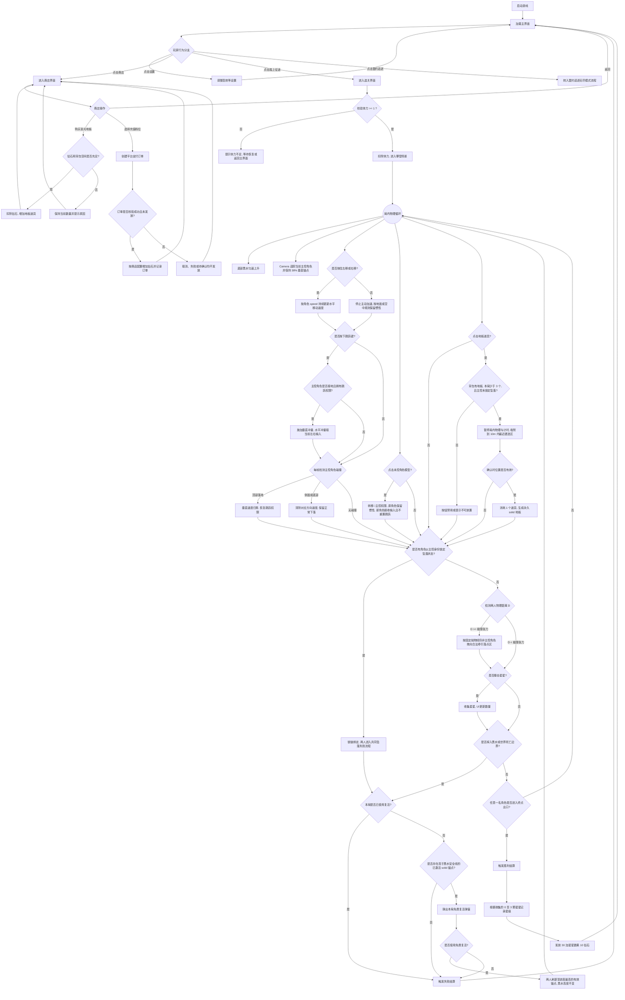
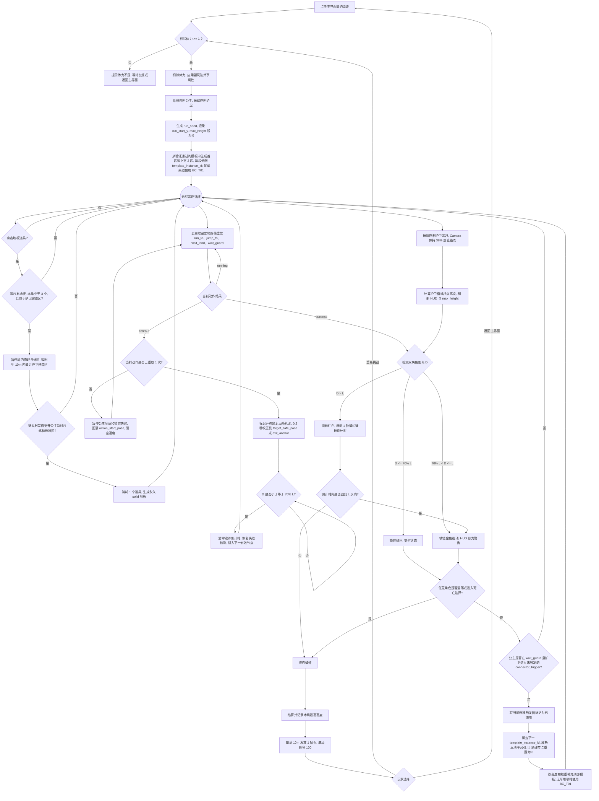

# 游戏核心玩法与系统策划案：《勇士盟约》

## 项目概览

|项目|内容|
|---|---|
|名称|勇士盟约|
|品类|双角色协同纵向攀岩 / 物理解谜|
|主玩法|非对称跳跃 + 锁链自动牵引|
|副玩法|盟约追逐：无尽攀升 + 距离追赶|
|局外系统|钻石商店：充值或玩法结算获得钻石，购买局内可放置的圣光地板|
|题材|Q 版神圣史诗与深渊逃亡|
|平台|移动端竖屏|
|视觉关键词|浮空白色遗迹、深渊黑水、金色实体光链|
|新手引导|不使用文字教程，由前期地图教学|

## 一、核心玩法与操作机制

### 操作与镜头

- **移动**：底部固定【左移】【右移】【跳跃】，仅控制当前主控角色。
- **切换**：仅主玩法可点击角色模型切换主控权，地面与空中均可切换；副玩法固定由玩家控制护卫。
- **空中切换**：原主控角色失去输入但保留当前速度、重力和碰撞；新主控角色立即接收移动输入。切换不重置接地状态或跳跃次数，空中的新主控角色不能再次起跳。
- **坠落锁定**：每名角色独立记录最近接地平台。角色以主控身份越过坠落判定距离后立即锁定共同失败，切换角色不能清除该状态。
- **镜头**：跟随主控角色，垂直锚点为屏幕自下而上 38%；切换角色时平滑过渡。
- **离屏提示**：非主控角色离屏时显示方向、距离和锁链张力。

### 角色能力

|角色|优势|弱点|主要地形|
|---|---|---|---|
|公主|移速快、水平远跳|垂直跳跃低|宽沟、远距离平台|
|护卫|垂直高跳|移速慢、水平距离短|高台、窄阶梯|

主玩法根据地形切换角色：公主处理宽沟，护卫处理高台。

### 跳跃与碰撞

- 仅接地时可跳跃，无二段跳；起跳方向取左 / 右输入，空中只能小幅修正。
- 顶部落地：垂直速度归零并恢复跳跃。
- 侧面碰撞：清除朝墙水平速度，不攀墙或反弹。
- 底部碰撞：清除上升速度并下落。
- 角色之间不产生碰撞、推挤或位置分离，可互相穿过和重叠。
- `solid`：完整实体；`fragile`：顶部落地后 5 秒破碎。
- 必要落点需清晰可见，保留角色宽度与两侧余量；禁止隐形碰撞和像素级落点。

### 锁链与自动牵引

- 主控角色进入坠落状态后，锁链拖拽非主控角色共同坠落并判定失败；主控角色不能被反向牵引救回。
- 非主控角色未进入黑水或世界死亡边界时，仍可由距离牵引救回。
- 主玩法锁链上限为 `Max_L = 15m`。两人处于正常状态且距离达到上限时，仅将非主控角色沿抛物线拉向主控角色所在平台。
- 坠落状态优先于距离牵引：主控角色低于最近接地平台顶部 `controlled_fall_trigger_offset` 且仍在下落时，立即进入共同坠落流程，不再检测牵引。

|牵引项|规则|
|---|---|
|轨迹|固定抛物线；最高点为起终点较高值加 `pull_arc_height`，时长为 `pull_duration`|
|落点|优先选择主控平台朝向同伴一侧的最近合法位置；角色可重叠|
|碰撞|保留场景实体碰撞；侧面或底部碰撞终止牵引并下落；顶部可提前落地|
|净空|轨迹包络内不得有必然碰撞；落点至少保留一个角色宽度与边距|
|星星|可放在稳定轨迹内，并与障碍保持至少一个角色半径|
|编辑器|显示锁链范围、轨迹包络和落点区，并校验阻挡、有效落点与镜头范围|

### 主玩法循环与结算

观察地形 → 选择公主远跳或护卫高跳 → 跨越障碍 → 牵引同伴 → 收集星星 → 任意角色进入出口。

|结果|条件|
|---|---|
|胜利|任意角色进入终点出口|
|失败|主控角色进入坠落状态，或任意角色进入黑水 / 世界死亡边界|
|复活|每局限 1 次免费复活；仅当存在高于黑水安全线的已激活 `solid` 锚点时可用。双角色回到进度最高的有效锚点，黑水高度不变；没有有效锚点则直接失败|
|星级|地图固定 3 颗星星；收集数量即 0～3 星；0 星也可通关|
|钻石|通关获得 30 钻石，每收集 1 颗星星追加 10 钻石|

### 资源

体力上限为 30。主、副玩法每次开始新一局消耗 1 点体力；失败后的【重新挑战】也视为新一局，必须重新校验并扣除体力。体力每 300 秒恢复 1 点，离线期间正常恢复，但不超过上限。

钻石用于商店购买地板道具，通过充值与玩法结算获得。主玩法通关奖励 `30 + 星星数 × 10` 钻石；副玩法按本局最高高度每满 10m 奖励 1 钻石，单局最多 100 钻石。

### 商店与圣光地板

商店常驻出售【圣光地板】，单价 100 钻石，每次购买获得 1 个，背包上限 99 个。钻石不足或背包已满时不能购买。充值页签提供 60、300、680 钻石三个档位；支付成功并完成平台订单校验后发放钻石，取消或失败不发放。

|项目|规则|
|---|---|
|使用范围|主、副玩法均可使用；主玩法由当前主控角色放置，副玩法固定由护卫放置|
|使用上限|每局最多成功放置 3 个；背包数量为 0 时按钮禁用|
|放置方式|点击地板按钮进入预览并暂停局内物理与计时；地板吸附到角色 10m 内最近的 `floor_build_zone`；预览为绿色时再次确认放置，取消不消耗道具|
|有效条件|地板整体位于建造区和镜头内；不与角色、场景实体、出口、连接区或死亡区域重叠；主控角色尚未锁定坠落状态|
|生成结果|放置成功后扣除 1 个道具，生成水平 `solid` 平台；宽 8m、高 1m，保留到本局结束|
|主玩法作用|可作为角色落点；顶部去除两侧 0.5m 后作为自动牵引落点区，但不能激活为复活锚点|
|副玩法限制|只能放在护卫建造区，不得进入 `princess_route_clearance`，不改变公主自动路线|
|复活与结算|主玩法复活不移除已放置地板；重新挑战、通关或退出时清除本局地板，道具不返还|

放置失败不扣道具。主控角色进入坠落锁定、任意角色进入死亡边界或游戏暂停后，不再接受放置操作。

### 副玩法：盟约追逐（无尽模式）

关闭自动牵引和上涨黑水。系统始终控制公主沿模板路线领跑，玩家始终控制护卫追赶。地图由 10 个模板随机向上拼接，没有固定终点；系统提前生成当前模板和上方 2 个模板，双方在连接点会合后进入已生成的下一段，直至失败。

副玩法不使用主玩法的角色能力差异。公主与护卫统一读取 `bond_chase_shared_stats`，基础移速、跳跃冲量、质量和碰撞体尺寸一致；公主执行 `run_to` 时的目标速度为共享移速的 `princess_auto_speed_scale`，初始值 0.75。

|角色状态|规则|
|---|---|
|系统公主|按当前模板的 `princess_auto_route` 动作节点领跑，不接收玩家输入；到达连接点后原地等待|
|玩家护卫|使用左 / 右 / 跳跃追赶公主；镜头始终跟随护卫|
|模板连接点|护卫进入公主所在的连接区后，启用已预生成的下一模板，并在队列顶部补充一个随机模板；控制权不交换|
|高度计分|HUD 实时显示护卫相对本局起点的垂直高度；结算记录本局最高高度|

|距离状态|表现与结果|
|---|---|
|`D ≤ 70% L`|绿色锁链，安全|
|`70% L < D ≤ L`|金色锁链、震动和 HUD 警告|
|`D > L`|启动 1 秒破碎倒计时；回到范围内则取消，否则失败|

`D` 为公主与护卫锁链挂点之间的二维欧氏距离。公主处于路线异常处理状态时暂停距离倒计时；异常处理完成且 `D ≤ 70% L` 后恢复正常检测。

跟随公主 → 控制锁链距离 → 在连接点会合 → 进入已生成模板 → 队列顶部补充随机模板 → 持续攀升。

|结果|条件|
|---|---|
|失败|超距持续 1 秒，或任意角色坠落 / 进入死亡边界|
|复活|无局内复活；选择【重新挑战】后重新校验并消耗 1 点体力|
|结算|无胜利和星级；记录护卫相对起点达到的最高高度|
|钻石|按 `min(floor(max_height / endless_height_step) × endless_diamond_per_step, endless_diamond_cap_per_run)` 发放|

公主到达连接点后必须等待，不得继续拉长距离。护卫进入连接区后，公主解除等待并进入已生成的下一模板。

### 竖屏多屏地图通用设计规范

#### 制图单位与变量命名

|项目|规范|
|---|---|
|屏幕单位|`1SH = screen_height_world`；主玩法地图高度 `N = map_height_screens`；副玩法距离上限 `L = bond_limit`|
|挑战段|主玩法每 `0.8～1.2SH` 设置一个挑战段；副玩法每个模板固定 `1SH`|
|镜头|主控锚点为屏幕下方 38%；必要落点起跳前可见；禁止盲跳|
|角色距离|`max_chain_limit`、`bond_limit` 均不大于 `0.7SH`；离屏角色显示方向与距离|
|星星|仅主玩法配置，前、中、后段各 1 颗：基础路线、核心机制、风险支路|
|建议高度|主玩法前期 `3～4SH`、后期 `5～7SH`；副玩法单模板 `1SH`，运行时总高度不设上限|

以上高度用于灰盒起步，最终按目标时长和测试数据调整。

#### 主玩法地图设计要点

|项目|规范|
|---|---|
|段落结构|能力判断 → 主控突破 → 牵引同伴 → 双人落地|
|主控坠落线|每个挑战段校验最近接地平台下方 `controlled_fall_trigger_offset` 范围内没有合法落点；主控越线且下落时直接失败|
|复活锚点|每 `1～1.5SH` 至少一个永久 `solid` 平台。角色首次落地后激活；复活时仅保留平台顶部高于 `dark_water_y + revive_water_clearance` 的已激活锚点，并选择其中进度最高者|
|黑水|按关卡配置 `water_speed_scale`；到达下一锚点的时间 ≥ 平均通过时间的 1.5 倍；复活后高度不变|
|防跳关|牵引不得穿过封闭地形、越过完整挑战段或直接触发出口；不使用隐形墙修补|
|星星|标准跳跃、稳定牵引轨迹、可返回的风险支路各 1 颗|
|终点|位于最终稳定平台；公主与护卫均有合理到达方式|
|地板建造区|每个挑战段配置 0～2 个 `floor_build_zone`；不得连通封闭区域、跳过完整挑战段或直接到达出口|

#### 副玩法地图设计要点

|项目|规范|
|---|---|
|模板池|固定配置 10 个模板；每个模板高 `1SH`，运行时按权重随机向上拼接|
|平台限制|副玩法所有模板只能使用永久 `solid` 平台，不配置 `fragile` 或其他会破碎、消失的平台|
|统一接口|所有模板入口为局部坐标 `(50, 0)`，出口连接点为 `(50, 1SH)`；平台与路线不得越出模板边界|
|首尾连接|将上一模板的 `exit_anchor` 与下一模板的 `entry_anchor` 完全重合；复用上一模板出口平台，禁止出现重叠平台、缝隙或高度跳变|
|出口收束|模板最后 `0.2SH` 必须收束到永久连接平台，公主和护卫都能稳定落地|
|入口展开|下一模板的首个落点必须从连接平台可见、可达，且起步后双角色距离不超过 `70% bond_limit`|
|路线续接|公主路线终点必须落在 `exit_anchor`，下一模板路线从 `entry_anchor` 起步；护卫进入连接区后公主解除等待|
|模板实例|每次拼接生成唯一 `template_instance_id`；路线中的本地平台 ID 只能在当前模板实例内解析，重复模板不得共享运行时平台引用|
|随机规则|开局生成当前段及上方 2 段；会合时启用下一段并在队列顶部补充 1 段；同一模板不得连续出现；按已攀升高度逐步解锁中、高难模板|
|公主自动路线|每个模板配置一条连续、无分叉的 `princess_auto_route`；由固定物理帧动作控制起跑、起跳、落地确认和连接点等待|
|护卫路线|每个模板配置仅用于校验的 `guard_reference_route`，代表标准操作输入；与公主路线同步烘焙，常态距离保持在 `70% bond_limit` 内，全程不得超过 `bond_limit`|
|角色属性|两人使用相同副玩法属性；地图不得依赖主玩法的远跳 / 高跳差异|
|连接点|使用一次性矩形 `connector_trigger`，以护卫脚底中心检测；仅当公主处于 `wait_guard` 且护卫进入触发区时生效。触发后先锁定本连接点，再绑定下一模板实例、重置路线节点并补充队列顶部模板|
|速度预算|`princess_auto_speed_scale` 初始值 0.75，按护卫安全路线测试结果调节|
|高度计分|`current_height = max(0, guard_y - run_start_y)`；结算值为本局 `max_height`|
|失败边界|模板底部以下保留 `0.5SH` 回收区；任意角色坠入回收区或锁链超距即结算|
|地板建造区|写入护卫 `guard_layout`；不得与公主路线包络、连接区或模板边界重叠，放置后仍需满足锁链距离规则|

10 个模板应分别覆盖基础阶梯、交错平台、Z 字攀升、宽台落差、连续短台、错层折返、窄道追逐、双层路线、连续高台和综合压力。模板内部允许更换平台组合，但入口、出口、尺寸和路线校验标准必须一致。

拼接时只平移下一模板整体，不修改模板内物件坐标：`next_origin = previous_origin + exit_anchor - entry_anchor`。

#### 公主自动领跑实现规范

公主不使用动态寻路，也不在局内临场选择落点。每个模板人工配置一条局部坐标动作路线，并使用正式角色控制器按固定物理帧烘焙；运行时只重放已经验证通过的动作序列。所有路线坐标以角色脚底中心为基准，使用模板局部坐标。

|动作|执行规则|
|---|---|
|`run_to`|从 `source_platform_id` 移动至安全起跳区；进入容差范围后制动。必须配置动作起始姿态和 `max_frames`|
|`jump_to`|按配置方向和固定输入帧数起跳；必须配置来源平台、目标平台、落地区间、保底落点姿态和 `max_frames`|
|`wait_land`|检测脚底是否进入目标平台落地区间；成功后执行下一动作，必须配置 `max_frames`|
|`wait_guard`|在 `exit_anchor` 等待护卫进入 `connector_trigger`；该动作允许无限等待，不参与卡住判定|

每个非 `wait_guard` 动作只有 `running`、`success`、`timeout` 三种结果。达到目标立即返回 `success`；超过 `max_frames` 未完成时返回 `timeout`，禁止继续无限循环。

#### 路线异常处理

1. 首次 `timeout`：进入 `route_fault`，暂停公主的坠落失败和锁链超距倒计时；将公主回滚到该动作的 `action_start_pose`，清空速度后按相同固定帧输入重放一次。
2. 同一动作第二次 `timeout`：将当前模板标记为本局故障模板并移出后续随机池。公主以 0.2 秒圣光校正移动到 `target_safe_pose`；若目标平台不存在，则移动到当前模板 `exit_anchor` 并进入 `wait_guard`。
3. 校正完成后公主保持等待，直到 `D ≤ 70% L`；随后清零破碎倒计时并恢复正常路线和距离检测。异常处理不能触发玩家失败。
4. 记录 `run_seed`、`template_instance_id`、路线 ID、节点索引和失败原因，用于复现问题。

以上异常流程只处理资源或运行时错误，不参与正常难度设计，也不允许关卡依赖该流程通关。

`wait_land` 超时时回到它之前的 `jump_to` 节点重放，不单独重放等待动作。

#### 路线资源与校验

- 每个模板资源必须包含本地平台列表、双角色出生姿态、公主完整 `route_nodes`、护卫 `guard_reference_route`、地板建造区和连接触发区。
- 路线中的 `source_platform_id`、`target_platform_id` 均为本地 ID；运行时解析为 `template_instance_id + local_platform_id`。目标不存在、不是 `solid` 或校验值不一致时，不得启动该模板。
- 路线烘焙统一使用固定物理帧率，不允许按渲染帧计时。公主路线与护卫参考路线从入口同时开始，连续模拟到连接点。
- 编辑器连续模拟不少于 3 次。平台缺失、路径受阻、动作超时、落点越界、公主坠落、常态距离超过 `70% bond_limit` 或最大距离超过 `bond_limit`，均判定验证失败。
- 对每个 `floor_build_zone` 分别模拟放置地板后再次执行公主路线；地板与路线包络、落地区间或连接区发生接触时，建造区验证失败。
- `layout_validation_hash` 同时覆盖平台、路线、护卫参考路线、连接触发区和地板建造区。未通过验证的模板不能发布或进入随机池。
- 随机抽取后若模板加载失败，立即丢弃并重抽；当前高度没有可用模板时固定使用已验证的 `fallback_template_id`。

#### 地图编辑器与自动校验

- **显示**：屏幕分段、镜头范围、38% 锚点、跳跃包络、锁链范围、主玩法牵引轨迹、模板边界、公主自动路线、连接点、地板建造区和主玩法星星。
- **主玩法校验**：单步可达、牵引净空、有效落点、出口捷径、复活安全、黑水预算和地板建造区防跳关。
- **副玩法校验**：禁止 `fragile`、模板接口对齐、本地平台引用有效、动作超时字段完整、连接触发器一次性、双路线固定帧烘焙通过、布局校验值一致、地板建造区避让公主路线、全程距离余量和难度解锁高度。
- **流式加载**：副玩法始终保留当前模板、上方 2 个预生成模板和下方 1 个模板；包含角色或锁链的模板不得卸载。

## 二、美术风格与视觉表现

### 整体基调

美术定位为“Q 版神圣史诗”（Chibi Epic Fantasy）：白色大理石遗迹、金色圣光与紫黑深渊形成对比。采用竖屏纵向卷轴，主控角色保持在画面下方约 38%。

牵引表现：锁链转为白炽光，被牵引角色拖出金色残影；落地触发短促屏幕震动。

## 三、界面与交互（UI/UX）

### 通用生成要求

- 竖屏移动游戏界面；背景图与 UI 切图分层输出。
- 切图保持原始坐标与像素级遮罩，不改变线框图布局。
- 装饰素材不生成数字；HUD 数字由程序绘制。
- 中文必须使用各界面列出的准确文案。

### 1\. 【主界面】

#### 生成提示词

Portrait epic-fantasy main menu. White marble ruins rise toward a starry sky above purple abyss water. Top-left stamina HUD and top-right diamond counter; centered gold title “勇士盟约”; primary button “踏上征途”; secondary button “盟约追逐”; bottom buttons “商店” and “设置”.

#### 线框图

```Plain Text
+------------------------------------------+
|  [体力: 30/30]              [钻石: 350] |
|                                          |
|                                          |
|             勇 士 盟 约                  |
|                                          |
|                                          |
|                                          |
|                                          |
|           +------------------+           |
|           |    踏上征途      |           |
|           +------------------+           |
|                                          |
|           [    盟约追逐    ]             |
|                                          |
|          [ 商 店 ]      [ 设 置 ]        |
|                                          |
+------------------------------------------+
```

### 2\. 【选关界面】

#### 生成提示词

Portrait level selection. Vertical parchment over a magical altar; gold paths connect ascending level nodes. Nodes display 0–3 stars or a lock. Text: “登神阶梯”“返回”.

#### 线框图

```Plain Text
+------------------------------------------+
|  [< 返回]        登神阶梯                |
|------------------------------------------|
|                                          |
|             [第 3 阶] (挑战)             |
|               /                          |
|              /                           |
|          [第 2 阶] ★★☆                   |
|            /                             |
|           /                              |
|      [第 1 阶] ★★★                       |
|                                          |
|      (排版自下而上，暗示攀登)            |
|                                          |
+------------------------------------------+
```

该选关界面仅用于主玩法。点击主界面的【盟约追逐】后，完成体力校验即直接进入无尽模式，不设置副玩法选关和星级记录。

### 3\. 【主玩法局内界面】

#### 生成提示词

Portrait vertical-platformer HUD. Floating marble platforms above rising purple water. Guard and Princess are linked by a gold chain; the crown marks the controlled character at the 38% camera anchor. Top-left pause, top-right stars “0/3”, bottom controls “左移”“地板 x2”“跳跃”“右移”.

#### 线框图

```Plain Text
+------------------------------------------+
|  [ II ]                    [ ⭐ 1/3 ]    |
|    ------                                      |
|         👑(当前主控/重力锚点)            |
|          [皇家护卫]                 ------     |
|          ------ (悬崖边缘的石块)         |
|             \                            |
|              \ (绷紧的光链)              |
|               \           [⭐星星]       |
|              [公主] (跟随/被拽状态)      |
|     ------                  ------                   |
|                                          |
|  ~~~~~~~~~~~~~~~~~~~~~~~~~~~~~~~~~~~~~~  |
|  (底部不断上涨的黑水边界)                |
|                                          |
| [<左移] [地板x2] [跳跃 ^] [右移>]       |
|                                          |
+------------------------------------------+
```

### 4\. 【盟约追逐无尽模式局内界面】

#### 生成提示词

Portrait endless chase-mode HUD without rising water. Top-center “盟约距离” meter is green when safe, gold near the limit, and red after exceeding it; top-right displays the Guard's vertical height from the run start, such as “高度 128m”. The system-controlled Princess follows the current template route toward a glowing “连接点” and carries an “自动” label. Crown marks the player-controlled Guard; off-screen Princess uses a direction marker. Bottom controls include “左移”“地板 x2”“跳跃”“右移”. Below the controls, show “距离过远，盟约锁链将会断裂”.

#### 线框图

```Plain Text
+------------------------------------------+
| [ II ]  [盟约距离 8.4/12m]   [高度 128m]|
|         [████████░░ 警告]                |
|                                          |
|                 [ 连接点 ]               |
|                     ↑                    |
|                 [自动·公主]              |
|              --------                    |
|                    \                     |
|                     \ (金色张力锁链)      |
|                👑[皇家护卫]              |
|             --------                     |
|                                          |
| [<左移] [地板x2] [跳跃 ^] [右移>]       |
|       距离过远，盟约锁链将会断裂         |
+------------------------------------------+
```

距离 HUD：安全区为绿色；`70%～100% L` 为金色【警告】；超过 `L` 后转为红色并显示 1 秒破碎倒计时。高度 HUD 实时显示 `current_height`，失败结算显示 `max_height`。副玩法失败弹窗只提供【重新挑战】与【返回主界面】，无局内复活。

点击【地板 xN】后进入放置预览：有效建造区显示绿色地板轮廓，无效位置显示红色。再次点击地板按钮确认，点击【取消】退出预览。成功放置后立即更新数量并恢复局内运行。

### 5\. 【主玩法失败复活弹窗】（局内仅限 1 次）

仅在本局尚未复活且存在有效复活锚点时显示该弹窗；没有高于黑水安全线的已激活 `solid` 锚点时，直接进入失败结算。

#### 生成提示词

Portrait defeat modal over dark purple energy. A broken gold chain sinks into black water. Text: “盟约破碎”“坠入深渊，是否重连？”; primary button “圣光复活”; secondary button “放弃结算”.

#### 线框图

```Plain Text
+------------------------------------------+
|                                          |
|       +--------------------------+       |
|       |       盟 约 破 碎        |       |
|       |                          |       |
|       |     坠入深渊，是否重连？ |       |
|       |                          |       |
|       |    [ 圣光复活 (1/1) ]    |       |
|       |                          |       |
|       |       [ 放弃结算 ]       |       |
|       +--------------------------+       |
|                                          |
+------------------------------------------+
```

### 6\. 【商店界面】

#### 生成提示词

Portrait fantasy game shop. Top-left back button, top-right diamond counter “钻石 350”, centered title “商店”, tabs “道具” and “充值”. The item tab shows a glowing white-and-gold platform icon, name “圣光地板”, inventory “持有 2/99”, price “100”, quantity stepper, and diamond purchase button “购买”. The recharge tab shows 60, 300, and 680 diamond products.

#### 线框图

```Plain Text
+------------------------------------------+
| [< 返回]          商 店       [钻石:350] |
|------------------------------------------|
|             [道具]  [充值]               |
|                                          |
| [地板图标]  圣光地板        持有 2/99   |
|             局内放置永久道路             |
|                                          |
|             [-]  1  [+]                 |
|             [钻石 100 · 购买]            |
|                                          |
| 充值页：[60钻石] [300钻石] [680钻石]     |
+------------------------------------------+
```

购买数量不得超过钻石可支付数量和背包剩余空间。道具购买成功后刷新钻石与持有数量。充值必须以服务端或平台订单校验成功为准，同一订单只能发放一次；取消、失败或待确认状态不增加钻石。

## 四、主角与道具配置表

### 4\.1 核心角色

|ID|角色|定位与外观|质量|移速|垂直冲量|水平冲量|
|---|---|---|---:|---:|---:|---:|
|H_001|神圣公主|水平远跳；白袍、金色权杖|50|5.0 m/s|8|28|
|G_001|皇家护卫|垂直高跳；金色板甲、圣光大盾|350|3.5 m/s|25|6|

以上属性仅用于主玩法。副玩法中公主与护卫统一使用 `bond_chase_shared_stats`。

### 4\.2 简单实体（道具）

|ID|名称|功能描述|获取途径|
|---|---|---|---|
|PROP\_01|道具星星|悬浮在主线或可选风险区域。每张地图固定刷新 3 颗，收集数量直接对应 0～3 星评价。|局内撞击收集。|
|PROP\_02|圣光地板|消耗型局内建造道具；在有效建造区生成宽 8m、高 1m 的永久 `solid` 平台。|商店使用 100 钻石购买 1 个。|
|CUR\_01|体力|上限 30；每次开始新一局消耗 1 点，耗尽无法出战。|每 300 秒恢复 1 点，支持离线恢复。|
|CUR\_02|钻石|商店货币；无持有上限。|充值、主玩法通关结算及副玩法最高高度结算。|

## 五、核心配置表 \(JSON 格式\)

### 1\. 字段含义说明

#### `game_modes`

|字段|含义|
|---|---|
|`mode_id`|`main` 主玩法；`bond_chase` 盟约追逐|
|`auto_pull_enabled`|是否启用自动牵引|
|`dark_water_enabled`|是否启用上涨黑水|
|`star_count`|仅主玩法使用，每图固定 3 颗星星|
|`controlled_fall_trigger_offset`|主玩法主控角色相对最近接地平台的坠落判定距离|
|`revive_water_clearance`|复活锚点顶部必须高于黑水的安全距离|
|`bond_limit`|副玩法距离上限 `L`|
|`tension_warning_ratio`|张力警告比例，默认 0.7|
|`break_countdown`|超距失败倒计时（秒）|
|`system_char_id / player_char_id`|副玩法固定为公主 H_001 / 护卫 G_001|
|`bond_chase_shared_stats`|副玩法两名角色共用的物理属性|
|`princess_auto_speed_scale`|自动公主相对共享移速倍率，初始值 0.75|
|`height_source_char_id`|高度 HUD 和结算的计分角色，固定为玩家护卫 G_001|
|`template_pool_size`|无尽模板数量，固定为 10|
|`preload_template_count`|当前模板上方预生成数量，默认 2|
|`no_repeat_window`|随机抽取时禁止重复的最近模板数，默认 1|
|`route_fault_max_retries`|同一动作超时后允许的固定帧重放次数，默认 1|
|`route_fault_correction_duration`|第二次超时后圣光校正到保底姿态的时长|
|`route_fault_resume_ratio`|异常处理后恢复距离检测所需的 `D / L` 比例，默认 0.7|
|`route_fault_suppress_failures`|路线异常处理期间是否暂停公主坠落与锁链失败|

#### `global_physics`

|字段|含义|
|---|---|
|`screen_height_world`|`1SH` 对应的世界高度|
|`camera_vertical_anchor_ratio`|主控角色垂直锚点，默认 0.38|
|`max_chain_limit`|主玩法自动牵引距离|
|`dark_water_speed`|黑水每秒上升速度|
|`pull_arc_height`|牵引抛物线附加高度|
|`pull_duration`|牵引时长（秒）|
|`pull_collision_padding`|轨迹包络安全边距|

#### `resources`

|字段|含义|
|---|---|
|`stamina_max`|体力上限，固定为 30|
|`stamina_cost_per_run`|每次开始新一局消耗的体力，固定为 1|
|`stamina_recovery_interval`|恢复 1 点体力所需的真实时间，默认 300 秒|
|`offline_recovery_enabled`|是否计算离线期间的体力恢复|
|`diamond_balance_initial`|新玩家初始钻石|
|`main_clear_diamond / diamond_per_star`|主玩法基础通关钻石与每颗星星追加钻石|
|`endless_height_step / endless_diamond_per_step`|副玩法每达到一段高度发放的钻石|
|`endless_diamond_cap_per_run`|副玩法单局钻石奖励上限|

#### `shop_items`

|字段|含义|
|---|---|
|`item_id`|商店商品对应的道具 ID|
|`price_currency / unit_price`|购买货币与单个商品价格|
|`purchase_amount`|单次购买增加的道具数量|
|`inventory_max`|道具背包持有上限|

#### `recharge_products`

|字段|含义|
|---|---|
|`product_id`|内部充值商品 ID|
|`platform_product_id`|应用商店后台配置的商品 ID|
|`diamond_amount`|支付校验成功后发放的钻石数量|
|`display_price`|界面展示价格；实际支付价格以平台订单为准|
|`grant_once_per_order`|同一平台订单是否只允许发放一次|

#### `placeable_floor`

|字段|含义|
|---|---|
|`item_id`|放置时消耗的地板道具 ID|
|`platform_type`|生成平台类型，固定为 `solid`|
|`width / height`|生成地板的世界尺寸|
|`max_uses_per_run`|每局成功放置数量上限|
|`placement_mode`|放置位置来源，固定为关卡预设建造区|
|`placement_max_distance`|角色与目标建造区之间允许的最大距离|
|`placement_pauses_game`|放置预览期间是否暂停局内物理与计时|
|`consume_on_success`|仅成功生成地板后消耗道具|
|`persist_until_run_end`|地板保留到本局结束|
|`persists_through_revive`|主玩法复活时是否保留已放置地板|
|`can_be_revive_anchor`|能否作为复活锚点，固定为否|
|`can_be_pull_landing`|能否作为主玩法自动牵引落点|
|`pull_landing_padding`|地板顶部牵引落点区的两侧安全边距|

#### `character_ctrl`

|字段|含义|
|---|---|
|`char_id`|角色 ID|
|`speed`|地面移速|
|`jump_impulse_y`|垂直冲量|
|`jump_impulse_x`|水平冲量|
|`collider_width / collider_height`|角色碰撞体尺寸|

#### `levels`

|字段|含义|
|---|---|
|`mode_id`|关卡所属玩法|
|`map_height_screens`|仅主玩法使用；地图高度 `N`，实际高度为 `N × screen_height_world`|
|`target_clear_time`|仅主玩法使用；目标通关时长|
|`water_speed_scale`|主玩法黑水速度倍率|
|`safe_anchor_stone_ids`|主玩法复活候选平台 ID；运行时还需满足已激活、`solid` 且高于黑水安全线|
|`exit_trigger`|主玩法出口矩形区域；任意角色进入即过关|
|`star_spawns`|仅主玩法使用；3 颗星星坐标|
|`stones`|平台坐标、尺寸、类型及可选 `pull_landing_zone`|
|`floor_build_zones`|允许地板吸附和生成的矩形区域|
|`princess_route_clearance`|副玩法公主路线包络与玩家地板之间的最小净空|
|`run_start_y`|无尽模式本局高度计分起点|
|`template_height_world`|单个无尽模板高度，固定为 `1SH`|
|`template_pool`|无尽模式的 10 个候选模板|
|`allowed_platform_types`|副玩法允许的平台类型，固定仅 `solid`|
|`run_seed`|本局模板随机序列种子，用于复现无尽路线|
|`template_instance_id`|模板每次生成时的运行时唯一 ID|
|`entry_anchor / exit_anchor`|模板局部入口与出口连接点；所有模板坐标必须一致|
|`connector_trigger`|护卫触发模板切换的一次性矩形区域及触发条件|
|`template_stitch`|按上一模板出口对齐下一模板入口，并复用连接平台的首尾拼接规则|
|`world_offset_formula`|计算下一模板整体世界坐标偏移，不单独移动模板内物件|
|`fallback_template_id`|当前高度没有可用模板或加载失败时使用的已验证模板|
|`min_height`|模板进入随机池所需的最低已攀升高度|
|`weight`|模板解锁后的随机权重|
|`princess_auto_route_id`|公主在模板内的自动路线资源 ID|
|`guard_reference_route_id`|仅用于烘焙校验的标准护卫操作路线 ID|
|`princess_route_schema`|自动路线坐标系、动作类型、超时与寻路开关|
|`route_nodes`|按顺序执行的 `run_to`、`jump_to`、`wait_land`、`wait_guard` 动作节点|
|`source_platform_id / target_platform_id`|动作来源和目标平台的模板本地 ID|
|`action_start_pose / target_safe_pose`|动作首次执行姿态与二次超时后的保底姿态|
|`route_tick_rate`|自动路线烘焙与运行时重放使用的固定物理帧率|
|`takeoff_range / landing_range`|公主起跳与落地允许的模板局部坐标区间|
|`input_frames / max_frames`|跳跃方向输入持续帧数与动作允许的最大物理帧数|
|`position_tolerance / validation_passes`|到点容差与路线连续模拟验证次数|
|`layout_validation_hash`|平台布局与自动路线共同生成的校验值，防止运行时加载不匹配资源|
|`guard_layout_id`|护卫可操作平台布局资源 ID|

平台类型：主玩法可使用 `solid` 和 `fragile`；副玩法只能使用 `solid`。


### 2\. 完整配置结构示例

```json
{
  "game_modes": [
    {
      "mode_id": "main",
      "auto_pull_enabled": true,
      "dark_water_enabled": true,
      "star_count": 3,
      "controlled_fall_trigger_offset": 8.0,
      "revive_water_clearance": 3.0
    },
    {
      "mode_id": "bond_chase",
      "auto_pull_enabled": false,
      "dark_water_enabled": false,
      "endless_mode": true,
      "bond_limit": 12.0,
      "tension_warning_ratio": 0.7,
      "break_countdown": 1.0,
      "system_char_id": "H_001",
      "player_char_id": "G_001",
      "height_source_char_id": "G_001",
      "template_pool_size": 10,
      "preload_template_count": 2,
      "no_repeat_window": 1,
      "route_fault_max_retries": 1,
      "route_fault_correction_duration": 0.2,
      "route_fault_resume_ratio": 0.7,
      "route_fault_suppress_failures": true,
      "princess_auto_speed_scale": 0.75,
      "bond_chase_shared_stats": {
        "mass": 100.0,
        "speed": 4.0,
        "jump_impulse_y": 16.0,
        "jump_impulse_x": 16.0,
        "collider_width": 1.4,
        "collider_height": 2.1
      }
    }
  ],
  "resources": {
    "stamina_max": 30,
    "stamina_cost_per_run": 1,
    "stamina_recovery_interval": 300,
    "offline_recovery_enabled": true,
    "diamond_balance_initial": 0,
    "main_clear_diamond": 30,
    "diamond_per_star": 10,
    "endless_height_step": 10.0,
    "endless_diamond_per_step": 1,
    "endless_diamond_cap_per_run": 100
  },
  "shop_items": [
    {
      "item_id": "PROP_02",
      "name": "Holy Floor",
      "price_currency": "diamond",
      "unit_price": 100,
      "purchase_amount": 1,
      "inventory_max": 99
    }
  ],
  "recharge_products": [
    {
      "product_id": "DIAMOND_060",
      "platform_product_id": "diamond_060",
      "diamond_amount": 60,
      "display_price": "6 CNY",
      "grant_once_per_order": true
    },
    {
      "product_id": "DIAMOND_300",
      "platform_product_id": "diamond_300",
      "diamond_amount": 300,
      "display_price": "30 CNY",
      "grant_once_per_order": true
    },
    {
      "product_id": "DIAMOND_680",
      "platform_product_id": "diamond_680",
      "diamond_amount": 680,
      "display_price": "68 CNY",
      "grant_once_per_order": true
    }
  ],
  "placeable_floor": {
    "item_id": "PROP_02",
    "platform_type": "solid",
    "width": 8.0,
    "height": 1.0,
    "max_uses_per_run": 3,
    "placement_mode": "authored_build_zones",
    "placement_max_distance": 10.0,
    "placement_pauses_game": true,
    "consume_on_success": true,
    "persist_until_run_end": true,
    "persists_through_revive": true,
    "can_be_revive_anchor": false,
    "can_be_pull_landing": true,
    "pull_landing_padding": 0.5
  },
  "global_physics": [
    {
      "screen_height_world": 75.0,
      "camera_vertical_anchor_ratio": 0.38,
      "max_chain_limit": 15.0,
      "dark_water_speed": 1.2,
      "pull_arc_height": 6.0,
      "pull_duration": 0.65,
      "pull_collision_padding": 0.5
    }
  ],
  "character_ctrl": [
    {
      "char_id": "H_001",
      "name": "Princess",
      "speed": 5.0,
      "jump_impulse_y": 8.0,
      "jump_impulse_x": 28.0,
      "collider_width": 1.2,
      "collider_height": 2.0
    },
    {
      "char_id": "G_001",
      "name": "Royal Guard",
      "speed": 3.5,
      "jump_impulse_y": 25.0,
      "jump_impulse_x": 6.0,
      "collider_width": 1.6,
      "collider_height": 2.2
    }
  ],
  "levels": [
    {
      "level_id": 1,
      "mode_id": "main",
      "map_height_screens": 4.0,
      "target_clear_time": 75.0,
      "water_speed_scale": 1.0,
      "safe_anchor_stone_ids": ["S_001", "S_002", "S_004"],
      "exit_trigger": {
        "x": 50.0,
        "y": 300.0,
        "width": 12.0,
        "height": 6.0
      },
      "star_spawns": [
        [30.0, 50.0],
        [60.0, 120.0],
        [35.0, 190.0]
      ],
      "floor_build_zones": [
        {
          "zone_id": "FBZ_001",
          "x": 30.0,
          "y": 45.0,
          "width": 12.0,
          "height": 6.0
        },
        {
          "zone_id": "FBZ_002",
          "x": 65.0,
          "y": 185.0,
          "width": 12.0,
          "height": 6.0
        }
      ],
      "stones": [
        {
          "stone_id": "S_001",
          "type": "solid",
          "x": 50.0,
          "y": 10.0,
          "width": 40.0,
          "height": 5.0
        },
        {
          "stone_id": "S_002",
          "type": "solid",
          "x": 20.0,
          "y": 80.0,
          "width": 15.0,
          "height": 4.0,
          "pull_landing_zone": {
            "offset_x": 0.0,
            "width": 8.0
          }
        },
        {
          "stone_id": "S_003",
          "type": "fragile",
          "x": 80.0,
          "y": 150.0,
          "width": 15.0,
          "height": 3.0,
          "pull_landing_zone": {
            "offset_x": 0.0,
            "width": 8.0
          }
        },
        {
          "stone_id": "S_004",
          "type": "solid",
          "x": 50.0,
          "y": 220.0,
          "width": 30.0,
          "height": 5.0,
          "pull_landing_zone": {
            "offset_x": 0.0,
            "width": 14.0
          }
        }
      ]
    },
    {
      "level_id": "BC_ENDLESS",
      "mode_id": "bond_chase",
      "run_start_y": 0.0,
      "template_height_world": 75.0,
      "allowed_platform_types": ["solid"],
      "floor_build_zone_source": "guard_layout",
      "princess_route_clearance": 2.0,
      "run_seed": "runtime_generated",
      "fallback_template_id": "BC_T01",
      "height_formula": "max(0, G_001.y - run_start_y)",
      "settlement_metric": "max_height",
      "template_stitch": {
        "rule": "previous.exit_anchor -> next.entry_anchor",
        "world_offset_formula": "previous.origin + exit_anchor - entry_anchor",
        "entry_anchor": [50.0, 0.0],
        "exit_anchor": [50.0, 75.0],
        "template_instance_id_format": "{run_seed}:{sequence}:{template_id}",
        "platform_ref_scope": "template_instance",
        "connector_trigger": {
          "center": [50.0, 75.0],
          "width": 12.0,
          "height": 6.0,
          "required_princess_action": "wait_guard",
          "entering_char_id": "G_001",
          "one_shot_per_instance": true
        },
        "connector_platform": {
          "type": "solid",
          "width": 24.0,
          "height": 5.0
        },
        "junction_policy": "reuse_previous_exit_platform",
        "preload_count": 2,
        "keep_behind_count": 1,
        "no_repeat_window": 1
      },
      "template_pool": [
        {
          "template_id": "BC_T01",
          "name": "基础阶梯",
          "difficulty": "easy",
          "min_height": 0.0,
          "weight": 1.2,
          "princess_auto_route_id": "ROUTE_T01",
          "guard_reference_route_id": "GUARD_REF_T01",
          "guard_layout_id": "LAYOUT_T01",
          "layout_validation_hash": "BC_T01_V1"
        },
        {
          "template_id": "BC_T02",
          "name": "交错平台",
          "difficulty": "easy",
          "min_height": 0.0,
          "weight": 1.2,
          "princess_auto_route_id": "ROUTE_T02",
          "guard_reference_route_id": "GUARD_REF_T02",
          "guard_layout_id": "LAYOUT_T02",
          "layout_validation_hash": "BC_T02_V1"
        },
        {
          "template_id": "BC_T03",
          "name": "Z字攀升",
          "difficulty": "easy",
          "min_height": 75.0,
          "weight": 1.0,
          "princess_auto_route_id": "ROUTE_T03",
          "guard_reference_route_id": "GUARD_REF_T03",
          "guard_layout_id": "LAYOUT_T03",
          "layout_validation_hash": "BC_T03_V1"
        },
        {
          "template_id": "BC_T04",
          "name": "宽台落差",
          "difficulty": "normal",
          "min_height": 150.0,
          "weight": 1.0,
          "princess_auto_route_id": "ROUTE_T04",
          "guard_reference_route_id": "GUARD_REF_T04",
          "guard_layout_id": "LAYOUT_T04",
          "layout_validation_hash": "BC_T04_V1"
        },
        {
          "template_id": "BC_T05",
          "name": "连续短台",
          "difficulty": "normal",
          "min_height": 225.0,
          "weight": 0.9,
          "princess_auto_route_id": "ROUTE_T05",
          "guard_reference_route_id": "GUARD_REF_T05",
          "guard_layout_id": "LAYOUT_T05",
          "layout_validation_hash": "BC_T05_V1"
        },
        {
          "template_id": "BC_T06",
          "name": "错层折返",
          "difficulty": "normal",
          "min_height": 300.0,
          "weight": 0.9,
          "princess_auto_route_id": "ROUTE_T06",
          "guard_reference_route_id": "GUARD_REF_T06",
          "guard_layout_id": "LAYOUT_T06",
          "layout_validation_hash": "BC_T06_V1"
        },
        {
          "template_id": "BC_T07",
          "name": "窄道追逐",
          "difficulty": "hard",
          "min_height": 450.0,
          "weight": 0.8,
          "princess_auto_route_id": "ROUTE_T07",
          "guard_reference_route_id": "GUARD_REF_T07",
          "guard_layout_id": "LAYOUT_T07",
          "layout_validation_hash": "BC_T07_V1"
        },
        {
          "template_id": "BC_T08",
          "name": "双层路线",
          "difficulty": "hard",
          "min_height": 600.0,
          "weight": 0.8,
          "princess_auto_route_id": "ROUTE_T08",
          "guard_reference_route_id": "GUARD_REF_T08",
          "guard_layout_id": "LAYOUT_T08",
          "layout_validation_hash": "BC_T08_V1"
        },
        {
          "template_id": "BC_T09",
          "name": "连续高台",
          "difficulty": "hard",
          "min_height": 750.0,
          "weight": 0.7,
          "princess_auto_route_id": "ROUTE_T09",
          "guard_reference_route_id": "GUARD_REF_T09",
          "guard_layout_id": "LAYOUT_T09",
          "layout_validation_hash": "BC_T09_V1"
        },
        {
          "template_id": "BC_T10",
          "name": "综合压力",
          "difficulty": "expert",
          "min_height": 900.0,
          "weight": 0.6,
          "princess_auto_route_id": "ROUTE_T10",
          "guard_reference_route_id": "GUARD_REF_T10",
          "guard_layout_id": "LAYOUT_T10",
          "layout_validation_hash": "BC_T10_V1"
        }
      ],
      "princess_route_schema": {
        "coordinate_space": "template_local",
        "position_origin": "character_feet_center",
        "runtime_pathfinding": false,
        "actions": ["run_to", "jump_to", "wait_land", "wait_guard"],
        "action_results": ["running", "success", "timeout"],
        "max_frames_required_for": ["run_to", "jump_to", "wait_land"],
        "wait_guard_timeout_enabled": false,
        "route_tick_rate": 50,
        "validation_passes": 3,
        "position_tolerance": 0.25
      },
      "template_asset_example": {
        "template_id": "BC_T01",
        "layout_validation_hash": "BC_T01_V1",
        "princess_spawn_pose": [50.0, 0.0],
        "guard_spawn_pose": [50.0, 0.0],
        "local_platforms": [
          {
            "local_platform_id": "ENTRY_PLATFORM",
            "type": "solid",
            "x": 50.0,
            "y": -2.5,
            "width": 24.0,
            "height": 5.0
          },
          {
            "local_platform_id": "P02",
            "type": "solid",
            "x": 50.0,
            "y": 35.5,
            "width": 16.0,
            "height": 5.0
          },
          {
            "local_platform_id": "EXIT_PLATFORM",
            "type": "solid",
            "x": 50.0,
            "y": 72.5,
            "width": 24.0,
            "height": 5.0
          }
        ],
        "floor_build_zones": [],
        "connector_trigger_ref": "template_stitch.connector_trigger"
      },
      "princess_route_example": {
        "route_id": "ROUTE_T01",
        "layout_validation_hash": "BC_T01_V1",
        "route_nodes": [
          {
            "action": "run_to",
            "source_platform_id": "ENTRY_PLATFORM",
            "action_start_pose": [50.0, 0.0],
            "target": [40.0, 0.0],
            "target_safe_pose": [40.0, 0.0],
            "position_tolerance": 0.25,
            "max_frames": 100
          },
          {
            "action": "jump_to",
            "source_platform_id": "ENTRY_PLATFORM",
            "action_start_pose": [40.0, 0.0],
            "takeoff_range": [39.75, 40.25],
            "input_x": 1.0,
            "input_frames": 18,
            "target_platform_id": "P02",
            "landing_range": [47.0, 55.0],
            "target_safe_pose": [50.0, 38.0],
            "max_frames": 100
          },
          {
            "action": "wait_land",
            "source_platform_id": "ENTRY_PLATFORM",
            "target_platform_id": "P02",
            "target_safe_pose": [50.0, 38.0],
            "retry_from_node_offset": -1,
            "max_frames": 100
          },
          {
            "action": "run_to",
            "source_platform_id": "P02",
            "action_start_pose": [50.0, 38.0],
            "target": [60.0, 38.0],
            "target_safe_pose": [60.0, 38.0],
            "position_tolerance": 0.25,
            "max_frames": 100
          },
          {
            "action": "jump_to",
            "source_platform_id": "P02",
            "action_start_pose": [60.0, 38.0],
            "takeoff_range": [59.75, 60.25],
            "input_x": -1.0,
            "input_frames": 20,
            "target_platform_id": "EXIT_PLATFORM",
            "landing_range": [42.0, 58.0],
            "target_safe_pose": [50.0, 75.0],
            "max_frames": 100
          },
          {
            "action": "wait_land",
            "source_platform_id": "P02",
            "target_platform_id": "EXIT_PLATFORM",
            "target_safe_pose": [50.0, 75.0],
            "retry_from_node_offset": -1,
            "max_frames": 100
          },
          {
            "action": "wait_guard",
            "source_platform_id": "EXIT_PLATFORM",
            "trigger": "connector_trigger",
            "timeout_enabled": false
          }
        ]
      },
      "guard_reference_route_example": {
        "route_id": "GUARD_REF_T01",
        "validation_only": true,
        "layout_validation_hash": "BC_T01_V1",
        "route_nodes": [
          {
            "action": "run_to",
            "source_platform_id": "ENTRY_PLATFORM",
            "target": [40.0, 0.0],
            "max_frames": 120
          },
          {
            "action": "jump_to",
            "source_platform_id": "ENTRY_PLATFORM",
            "input_x": 1.0,
            "input_frames": 18,
            "target_platform_id": "P02",
            "landing_range": [47.0, 55.0],
            "max_frames": 120
          },
          {
            "action": "wait_land",
            "source_platform_id": "ENTRY_PLATFORM",
            "target_platform_id": "P02",
            "max_frames": 120
          },
          {
            "action": "run_to",
            "source_platform_id": "P02",
            "target": [60.0, 38.0],
            "max_frames": 120
          },
          {
            "action": "jump_to",
            "source_platform_id": "P02",
            "input_x": -1.0,
            "input_frames": 20,
            "target_platform_id": "EXIT_PLATFORM",
            "landing_range": [42.0, 58.0],
            "max_frames": 120
          },
          {
            "action": "wait_land",
            "source_platform_id": "P02",
            "target_platform_id": "EXIT_PLATFORM",
            "max_frames": 120
          }
        ]
      }
    }
  ]
}
```

## 六、游戏核心流程图（Flowchart）

### 1\. 主玩法流程图



### 2\. 副玩法流程图：盟约追逐无尽模式


